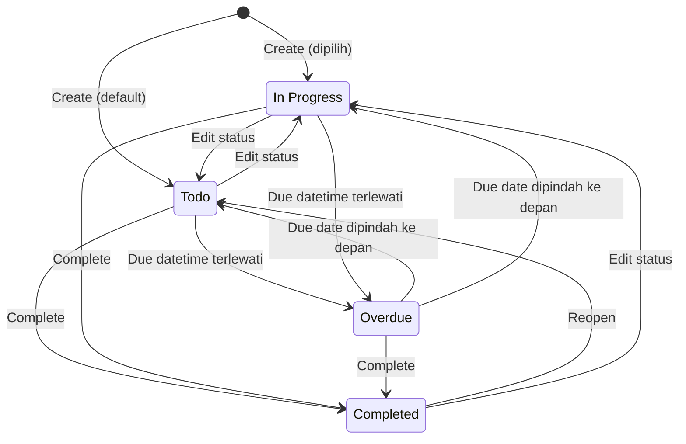
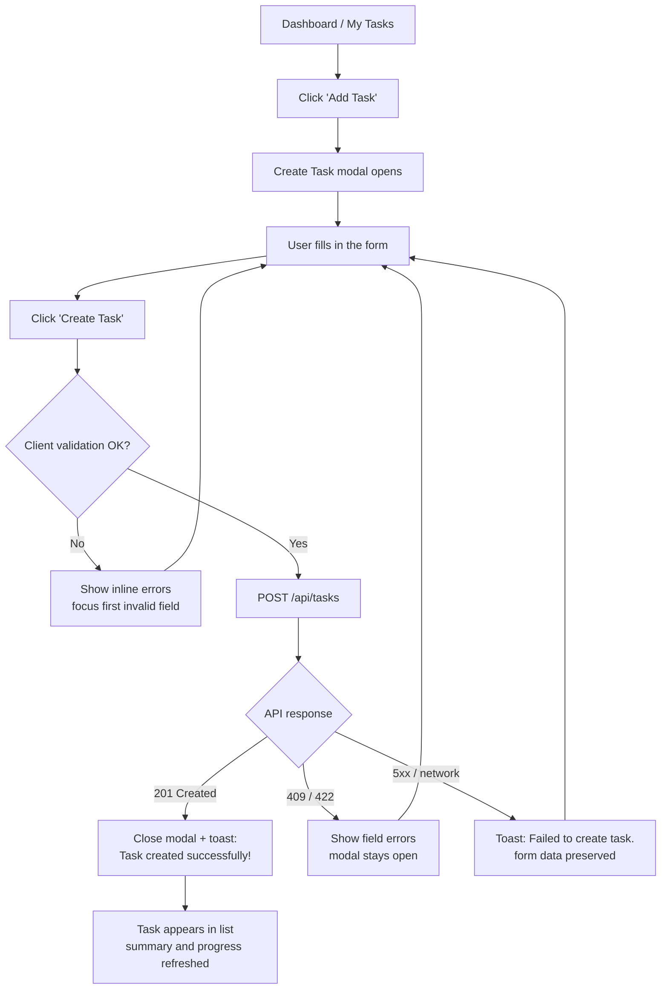
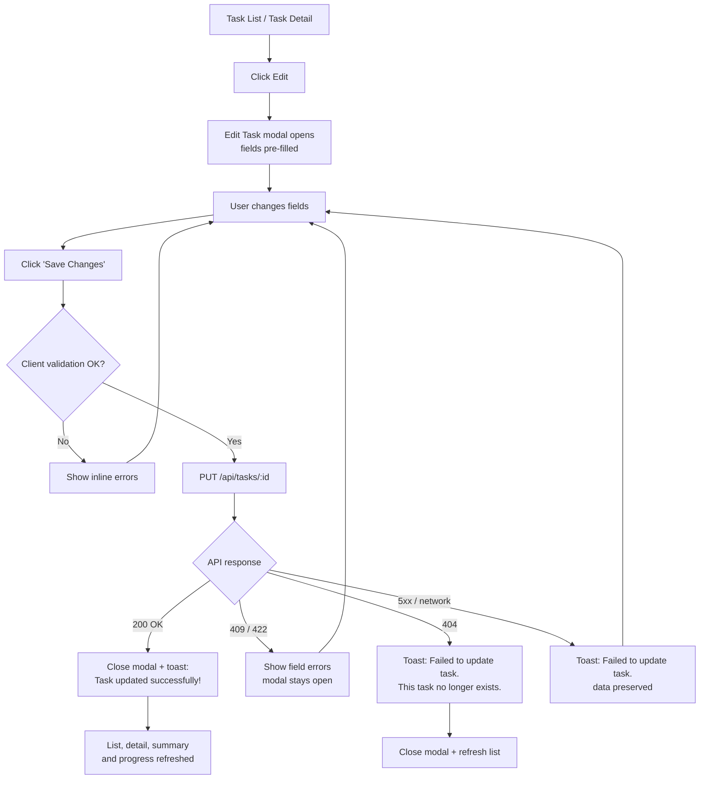
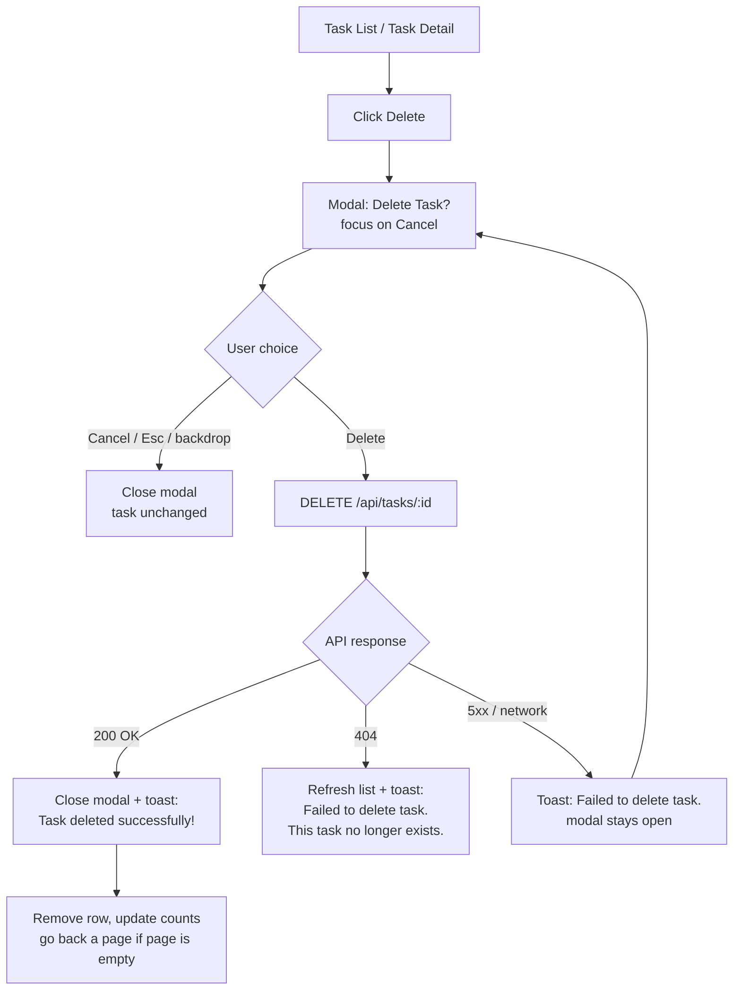
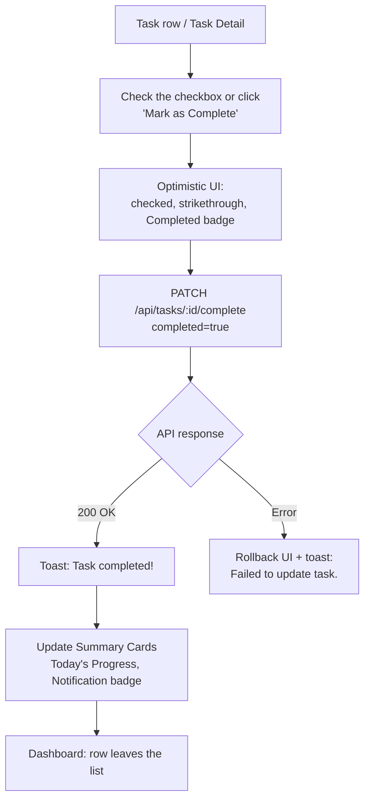
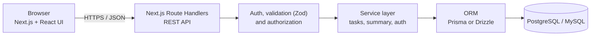
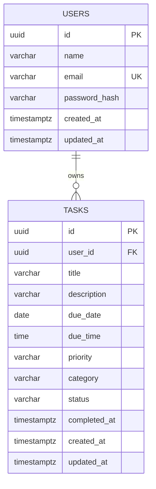

[Lewati ke konten](#content)

TaskMate PRD v1.0

- [1. Document Information](#1-document-information)
- [2. Product Overview](#2-product-overview)
- [3. Background](#3-background)
- [4. Problem Statement](#4-problem-statement)
- [5. Product Vision](#5-product-vision)
- [6. Target Users](#6-target-users)
- [7. User Persona](#7-user-persona)
- [8. User Needs](#8-user-needs)
- [9. Product Goals](#9-product-goals)
- [10. Product Scope](#10-product-scope)
- [11. Information Architecture](#11-information-architecture)
- [12. Feature Requirements](#12-feature-requirements)
- [13. Dashboard Requirements](#13-dashboard-requirements)
- [14. CRUD Requirements](#14-crud-requirements)
- [15. Task Management](#15-task-management)
- [16. Search & Filter](#16-search--filter)
- [17. User Stories](#17-user-stories)
- [18. Use Cases](#18-use-cases)
- [19. User Flow](#19-user-flow)
- [20. Acceptance Criteria](#20-acceptance-criteria)
- [21. Error & Edge Cases](#21-error--edge-cases)
- [22. UX Requirements](#22-ux-requirements)
- [23. Accessibility](#23-accessibility)
- [24. Non-Functional Requirements](#24-non-functional-requirements)
- [25. Data Model](#25-data-model)
- [26. API Requirements](#26-api-requirements)
- [27. Database Requirements](#27-database-requirements)
- [28. Design System](#28-design-system)
- [29. Responsive Requirements](#29-responsive-requirements)
- [30. MVP Definition](#30-mvp-definition)
- [31. Future Development](#31-future-development)
- [32. Success Metrics](#32-success-metrics)
- [33. Product Roadmap](#33-product-roadmap)
- [34. Requirement Traceability](#34-requirement-traceability)
- [35. Conclusion](#35-conclusion)

# TaskMate — Product Requirements Document (PRD)

> **"Organize your tasks. Get things done."**

**Web-based Productivity / Task Management Application untuk Mahasiswa** Versi 1.0 · 30 September 2026 · Status: Final Draft — siap handoff pengembangan

---

## Daftar Isi

| Bagian | Bagian |
| --- | --- |
| [1. Document Information](#1-document-information) | [19. User Flow](#19-user-flow) |
| [2. Product Overview](#2-product-overview) | [20. Acceptance Criteria](#20-acceptance-criteria) |
| [3. Background](#3-background) | [21. Error & Edge Cases](#21-error--edge-cases) |
| [4. Problem Statement](#4-problem-statement) | [22. UX Requirements](#22-ux-requirements) |
| [5. Product Vision](#5-product-vision) | [23. Accessibility](#23-accessibility) |
| [6. Target Users](#6-target-users) | [24. Non-Functional Requirements](#24-non-functional-requirements) |
| [7. User Persona](#7-user-persona) | [25. Data Model](#25-data-model) |
| [8. User Needs](#8-user-needs) | [26. API Requirements](#26-api-requirements) |
| [9. Product Goals](#9-product-goals) | [27. Database Requirements](#27-database-requirements) |
| [10. Product Scope](#10-product-scope) | [28. Design System](#28-design-system) |
| [11. Information Architecture](#11-information-architecture) | [29. Responsive Requirements](#29-responsive-requirements) |
| [12. Feature Requirements](#12-feature-requirements) | [30. MVP Definition](#30-mvp-definition) |
| [13. Dashboard Requirements](#13-dashboard-requirements) | [31. Future Development](#31-future-development) |
| [14. CRUD Requirements](#14-crud-requirements) | [32. Success Metrics](#32-success-metrics) |
| [15. Task Management](#15-task-management) | [33. Product Roadmap](#33-product-roadmap) |
| [16. Search & Filter](#16-search--filter) | [34. Requirement Traceability](#34-requirement-traceability) |
| [17. User Stories](#17-user-stories) | [35. Conclusion](#35-conclusion) |
| [18. Use Cases](#18-use-cases) |  |

---

## 1. Document Information

### 1.1 Metadata Dokumen

| Atribut | Keterangan |
| --- | --- |
| Judul Dokumen | Product Requirements Document (PRD) — TaskMate |
| Produk | TaskMate — CRUD To-Do List + Productivity Dashboard untuk mahasiswa |
| Versi | 1.0 |
| Status | Final Draft — Ready for Development Handoff |
| Tanggal | 30 September 2026 |
| Pemilik Dokumen | Product Manager TaskMate |
| Pembaca | UI/UX Designer, Frontend Developer, Backend Developer, QA Tester, Stakeholder |
| Acuan Desain | Konsep dan mockup UI/UX TaskMate (Dashboard, Task List, Create/Edit Task, Task Detail, Delete Confirmation, Empty State, Dark Mode, layout Desktop/Tablet/Mobile) |
| Bahasa | Dokumen: Bahasa Indonesia. Teks antarmuka (UI copy): Bahasa Inggris, sesuai mockup |
| Arah Teknis | Next.js, React, TypeScript, Tailwind CSS, REST API, PostgreSQL/MySQL |

### 1.2 Riwayat Revisi

| Versi | Tanggal | Penulis | Perubahan |
| --- | --- | --- | --- |
| 1.0 | 30 Sep 2026 | Product Team | PRD lengkap pertama berdasarkan konsep dan mockup TaskMate |

### 1.3 Konvensi Dokumen

**Skema ID.** Setiap requirement memiliki ID unik agar dapat ditelusuri dari mockup sampai ke pengujian (lihat §34).

| Prefix | Arti | Contoh |
| --- | --- | --- |
| FR | Functional Requirement | FR-016 |
| NFR | Non-Functional Requirement | NFR-001 |
| UX | UX Requirement | UX-001 |
| ACC | Accessibility Requirement | ACC-001 |
| RSP | Responsive Requirement | RSP-001 |
| UN | User Need | UN-01 |
| G / KPI | Product Goal / Key Performance Indicator | G-01 / KPI-01 |
| US | User Story | US-001 |
| UC | Use Case | UC-001 |
| AC | Acceptance Criteria | AC-001 |
| ERR | Error & Edge Case | ERR-001 |
| ES | Empty State | ES-01 |
| API | API Endpoint | API-001 |
| A | Asumsi | A-01 |

**Prioritas (MoSCoW).**

| Prioritas | Definisi | Konsekuensi rilis |
| --- | --- | --- |
| Must Have | Tanpa fitur ini produk tidak layak dirilis | Wajib selesai untuk MVP |
| Should Have | Penting, tetapi ada workaround sementara | Dikerjakan di MVP bila kapasitas cukup |
| Could Have | Nilai tambah, dampak kecil bila ditunda | Dikerjakan hanya bila ada sisa waktu |
| Won't Have | Sengaja tidak dikerjakan pada rilis ini | Masuk backlog fase berikutnya |

### 1.4 Asumsi dan Batasan

| ID | Asumsi / Batasan | Bagian terkait |
| --- | --- | --- |
| A-01 | **Acuan visual.** Komponen UI pada PRD diturunkan dari konsep dan deskripsi mockup TaskMate. Jika file mockup final (mis. Figma) berbeda, tata letak dan gaya visual mengikuti mockup, sedangkan perilaku dan aturan bisnis mengikuti PRD; perbedaan dicatat melalui change request. | Semua bagian |
| A-02 | Teks antarmuka berbahasa Inggris (sesuai mockup dan pesan toast). Lokalisasi ke Bahasa Indonesia termasuk Future Development. | §22, §31 |
| A-03 | Zona waktu tunggal per deployment: `APP_TIMEZONE` (default `Asia/Jakarta`, UTC+7) dipakai untuk menghitung "hari ini", Overdue, dan "bulan ini". Zona waktu per pengguna termasuk Future Development. | §14, §15, §27 |
| A-04 | Autentikasi email + password disertakan sebagai kebutuhan pendukung (model data memiliki User dan setiap task dimiliki satu pengguna). Halaman Login/Register tidak dirinci pada mockup dan mengikuti Design System. | §12, §26 |
| A-05 | Status Overdue bersifat turunan (derived) dan tidak disimpan di database. | §15.1, §25 |
| A-06 | Kategori tetap lima nilai: College, Assignment, Personal, Project, Exam. Kategori kustom berada di luar MVP. | §15.3 |
| A-07 | Ikon Notification adalah indikator deadline in-app yang diturunkan dari data task. Pengingat terjadwal (email/push) berada di luar MVP. | FR-009 |
| A-08 | Task bersifat personal (satu pemilik). Berbagi dan kolaborasi berada di luar MVP. | §25 |
| A-09 | Target performa dihitung untuk hingga 1.000 task per pengguna dan 10.000 pengguna terdaftar pada MVP. | §24 |
| A-10 | Navigasi mobile memakai hamburger drawer (seluruh 7 menu) ditambah tombol floating Add Task. Bottom navigation dapat menggantikannya bila mockup final menggunakannya. | §29 |
| A-11 | Dukungan browser: dua versi stabil terbaru Chrome, Edge, Firefox, dan Safari (desktop), serta Safari iOS dan Chrome Android. | §24 |

### 1.5 Glosarium

| Istilah | Definisi |
| --- | --- |
| Task | Satu item pekerjaan milik pengguna dengan title, due date, priority, category, dan status |
| Due datetime | Gabungan due date dan due time; bila due time kosong dianggap pukul 23:59:59 pada due date |
| Active task | Task yang belum berstatus Completed |
| Status tersimpan | Nilai `status` di database: Todo, In Progress, Completed |
| Display status | Status yang ditampilkan: Completed, Overdue, In Progress, atau Todo (dengan aturan prioritas pada §15.1) |
| Overdue | Task belum Completed yang due datetime-nya sudah lewat (turunan, tidak disimpan) |
| Hari ini | Tanggal saat ini pada `APP_TIMEZONE` |
| Upcoming | Task belum Completed dengan due date setelah hari ini |
| Toast | Notifikasi singkat non-blocking untuk hasil sebuah aksi |
| Empty state | Tampilan saat tidak ada data, berisi ilustrasi, judul, deskripsi, dan CTA |
| CRUD | Create, Read, Update, Delete |

---

## 2. Product Overview

### 2.1 Ringkasan Produk

| Atribut | Deskripsi |
| --- | --- |
| Nama Produk | **TaskMate** |
| Tagline | *"Organize your tasks. Get things done."* |
| Jenis Produk | Web-based Productivity / Task Management Application |
| Target Pengguna | Mahasiswa yang mengelola tugas kuliah, deadline, proyek, ujian, dan aktivitas pribadi |
| Tujuan Utama | Membantu mahasiswa membuat, melihat, mengubah, menyelesaikan, dan menghapus tugas secara sederhana, cepat, dan terorganisir |
| Konsep Utama | CRUD To-Do List + Productivity Dashboard |
| Platform | Web responsif (desktop, tablet, browser mobile) |
| Model Pengguna | Individual; setiap pengguna hanya melihat task miliknya |
| Arah Teknis | Next.js, React, TypeScript, Tailwind CSS, REST API, PostgreSQL/MySQL |

### 2.2 Kemampuan Inti

1. **Dashboard produktivitas** — kartu ringkasan (Total Tasks, Completed, In Progress, Overdue), Today's Progress, dan daftar task aktif.
2. **Manajemen task penuh** — create, read, update, delete, dan tandai selesai dengan konfirmasi serta umpan balik jelas.
3. **Pengorganisasian** — Priority (Low/Medium/High), Category (College, Assignment, Personal, Project, Exam), dan Status (Todo, In Progress, Completed, Overdue).
4. **Tampilan berbasis waktu** — halaman Today, Upcoming, dan Completed.
5. **Pencarian, filter, dan pengurutan** yang dapat digabungkan dan tersimpan di URL.
6. **Kesadaran deadline** — status Overdue otomatis dan indikator Notification in-app.
7. **Kenyamanan visual** — Dark Mode dan layout responsif Desktop, Tablet, Mobile.
8. **Aksesibel dan konsisten** — Design System berbasis token dan target WCAG 2.1 AA.

---

## 3. Background

Mahasiswa mengelola banyak kewajiban sekaligus: tugas berbagai mata kuliah, laporan praktikum, proyek kelompok, ujian, dan kegiatan pribadi. Informasi tugas biasanya tersebar di chat grup, platform e-learning, catatan ponsel, dan ingatan pribadi. Tanpa satu tempat terpusat, mahasiswa sulit melihat gambaran menyeluruh dan lebih mudah melewatkan tenggat.

### 3.1 Permasalahan dan Solusi TaskMate

| No | Permasalahan | Dampak bagi mahasiswa | Solusi TaskMate | Ref |
| --- | --- | --- | --- | --- |
| 1 | Banyak tugas dari berbagai mata kuliah | Beban mental tinggi, ada tugas terlewat | Daftar task terpusat dengan Category | FR-018, FR-035 |
| 2 | Deadline berbeda-beda | Sulit melihat mana yang paling mendesak | Due date dan due time, halaman Today dan Upcoming, sort by due date | FR-016, FR-027, FR-028, FR-043 |
| 3 | Sulit menentukan prioritas | Salah urutan pengerjaan | Priority Low/Medium/High berbadge warna, filter dan sort by priority | FR-034, FR-040, FR-043 |
| 4 | Lupa mengerjakan tugas | Keterlambatan dan penurunan nilai | Status Overdue otomatis, kartu Overdue, Notification in-app | FR-033, FR-011, FR-009 |
| 5 | Tidak ada sistem pencatatan terorganisir | Catatan tercecer dan tidak konsisten | Form CRUD terstruktur dan pencarian | FR-016, FR-020, FR-038 |
| 6 | Sulit mengetahui progress | Tidak tahu sisa beban kerja | Summary cards, Today's Progress, progress per task | FR-011, FR-013, FR-036 |
| 7 | Informasi tugas tersebar di banyak platform | Mencari informasi memakan waktu | Satu tempat dengan pencarian di title, description, category | FR-038 |

### 3.2 Peluang Produk

- Mahasiswa sudah terbiasa dengan aplikasi web, tetapi banyak aplikasi to-do terlalu umum atau terlalu kompleks untuk kebutuhan akademik.
- Konsep sederhana (CRUD + dashboard) dapat divalidasi cepat sebelum menambah fitur lanjutan seperti reminder, integrasi kalender, dan AI assistant.
- Data task yang terstruktur (priority, category, due date) menjadi fondasi untuk statistik produktivitas pada fase berikutnya.

---

## 4. Problem Statement

### 4.1 Pernyataan Masalah

> Mahasiswa membutuhkan cara yang sederhana dan cepat untuk mencatat, memprioritaskan, dan memantau tugas beserta tenggatnya. Tanpa itu, mereka berisiko melewatkan deadline, salah menentukan prioritas, dan kehilangan gambaran progres belajar mereka.

### 4.2 How Might We

1. Bagaimana membuat pencatatan tugas cukup cepat sehingga mahasiswa mau melakukannya setiap hari (target median ≤ 30 detik, KPI-12)?
2. Bagaimana membuat mahasiswa langsung tahu apa yang harus dikerjakan hari ini dan apa yang sudah terlambat?
3. Bagaimana membantu mahasiswa memutuskan prioritas tanpa perlu berpikir panjang?
4. Bagaimana memperlihatkan progres agar mahasiswa merasa terbantu, bukan terbebani?

### 4.3 Definisi Keberhasilan

Masalah dianggap teratasi bila pada 3 bulan pertama setelah rilis: pengguna baru langsung aktif (activation ≥ 70%, KPI-10), task diselesaikan tepat waktu (≥ 70%, KPI-02), dan proporsi task Overdue tetap rendah (≤ 15%, KPI-11). Detail metrik dan cara pengukuran ada pada §32.

---

## 5. Product Vision

### 5.1 Pernyataan Visi

> Menjadi "mate" andalan mahasiswa dalam mengelola tugas — membantu mereka tahu apa yang harus dikerjakan sekarang, apa yang berikutnya, dan seberapa jauh progres mereka — melalui pengalaman yang sederhana, modern, dan menyenangkan.

### 5.2 Prinsip Produk

| Prinsip | Makna | Implikasi pada requirement | Ref |
| --- | --- | --- | --- |
| Simple | Setiap layar punya satu tujuan dan satu aksi utama | Form Create/Edit hanya 7 field dengan Title, Due Date, dan Category wajib; satu tombol primer per layar | UX-003, FR-016 |
| Modern | Tampilan bersih, konsisten, berbasis token, mendukung Dark Mode | Design System dan tema Light/Dark/System | FR-052, §28 |
| Intuitive | Pengguna memahami alur tanpa panduan | Navigasi 7 menu berikon + label, konfirmasi sebelum hapus, umpan balik toast | UX-001, UX-005, UX-006 |
| Responsive | Nyaman di laptop maupun smartphone | Tiga breakpoint, target sentuh ≥ 44 px | RSP-001, FR-057 |
| Easy to Use | Aksi umum selesai dalam ≤ 3 langkah | Create: Add Task, isi form, Create Task; Complete: satu klik checkbox | UX-002, FR-023 |
| Productivity-oriented | Membantu pengguna fokus pada hal terpenting | Today/Upcoming, priority, progress harian, status Overdue | FR-013, FR-027, FR-034 |

### 5.3 Manfaat bagi Mahasiswa

- Melihat seluruh tugas, deadline, dan prioritas di satu tempat.
- Mengetahui dalam hitungan detik apa yang harus dikerjakan hari ini dan apa yang sudah terlambat.
- Mendapat rasa kemajuan dari progress harian dan riwayat task selesai.
- Mengurangi risiko lupa deadline melalui status Overdue dan indikator Notification.
- Memakai aplikasi yang sama dengan nyaman di laptop, smartphone, siang maupun malam.

---

## 6. Target Users

### 6.1 Segmentasi Pengguna

| Segmen | Deskripsi | Prioritas |
| --- | --- | --- |
| Primer | Mahasiswa aktif S1/D3 dari semua jurusan dengan banyak tugas dan deadline berbeda (Persona 1 — Alex) | Utama |
| Sekunder | Mahasiswa tingkat akhir dan aktif organisasi yang mengelola skripsi/proyek dan kegiatan (Persona 2 — Nadia) | Kedua |
| Di luar target MVP | Dosen/asisten, tim proyek, siswa sekolah, dan pekerja profesional. Kebutuhan mereka (kolaborasi, peran, penugasan) belum dicakup | Tidak dilayani |

### 6.2 Konteks Penggunaan dan Implikasinya

| Karakteristik pengguna | Implikasi pada produk |
| --- | --- |
| Berpindah antara laptop (belajar) dan smartphone (cek cepat) | Layout responsif dan sesi persisten 7 hari (FR-002, FR-057) |
| Sering bekerja pada malam hari | Dark Mode (FR-052) |
| Waktu terbatas di sela kuliah | Aksi cepat: checkbox, tombol floating, halaman Today (FR-023, FR-010, FR-027) |
| Deadline sering berubah (dimajukan atau ditunda dosen) | Edit cepat dan status Overdue otomatis (FR-020, FR-033) |
| Terbiasa dengan aplikasi modern | Design System konsisten dan animasi halus (§28, UX-012) |
| Data akademik bersifat pribadi | Isolasi data per pengguna (FR-004, NFR-011) |

---

## 7. User Persona

### Persona 1 — Mahasiswa Aktif: Alex

**Profil:** 20 tahun · mahasiswa S1 semester 5 · memakai laptop dan smartphone.

**Karakteristik**

- Memiliki banyak tugas dari berbagai mata kuliah.
- Deadline berbeda-beda dan kadang berubah.
- Menggunakan laptop untuk mengerjakan tugas dan smartphone untuk cek cepat.
- Membutuhkan pengingat deadline.
- Membutuhkan sistem prioritas.

**Goals:** tidak ada tugas yang terlewat · tahu apa yang dikerjakan malam ini · melihat progres minggu ini.

**Pain points:** sering lupa deadline · tugas tercecer di chat grup · bingung menentukan mana yang dikerjakan lebih dulu.

**Skenario:** Kamis malam, Alex membuka TaskMate di laptop. Kartu Overdue menunjukkan 1 task, Today's Progress menunjukkan "2 of 4 tasks completed". Ia mencentang tugas yang selesai, mengubah due date kuis yang dimajukan dosen, lalu menambahkan tugas laporan dengan priority High.

**Kutipan:** *"Aku bukan malas, cuma sering lupa mana yang paling mepet."*

| Kebutuhan Alex | Fitur TaskMate |
| --- | --- |
| Pengingat deadline | Notification bell, status Overdue (FR-009, FR-033) |
| Sistem prioritas | Priority badge, filter dan sort by priority (FR-034, FR-040, FR-043) |
| Banyak tugas lintas mata kuliah | Category, search, filter (FR-035, FR-038–FR-042) |
| Dua perangkat | Layout responsif dan sesi persisten (FR-057, FR-002) |

### Persona 2 — Mahasiswa Tingkat Akhir dan Organisasi: Nadia

**Profil:** 22 tahun · mahasiswa S1 semester 7 · mengerjakan skripsi dan aktif di organisasi · smartphone sebagai perangkat utama.

**Karakteristik**

- Membagi waktu antara bimbingan skripsi, kegiatan organisasi, dan urusan pribadi.
- Sering bekerja pada malam hari di kos.
- Ingin melihat rencana beberapa hari ke depan, bukan hanya hari ini.

**Goals:** memecah pekerjaan skripsi menjadi task terjadwal · melihat tenggat pekan depan · merasa progresnya nyata.

**Pain points:** catatan skripsi dan organisasi bercampur di chat · layar terang mengganggu saat malam · sulit melihat apa yang sudah diselesaikan bulan ini.

**Skenario:** Malam hari Nadia membuka TaskMate di smartphone dengan Dark Mode, membuka Upcoming untuk melihat tenggat pekan depan, lalu menambahkan task dengan tombol floating. Di halaman Completed ia melihat "You completed 8 tasks this month."

| Kebutuhan Nadia | Fitur TaskMate |
| --- | --- |
| Nyaman di malam hari | Dark Mode (FR-052) |
| Penggunaan di smartphone | Layout mobile, tombol floating Add Task (FR-057, FR-010) |
| Rencana ke depan | Halaman Upcoming (FR-028) |
| Memisahkan skripsi dan organisasi | Category Project, Personal, halaman Categories (FR-030, FR-031) |
| Merasa progres nyata | Halaman Completed dan pesan bulanan (FR-029) |

---

## 8. User Needs

Kebutuhan berikut diturunkan dari elemen mockup dan persona. UN-01 sampai UN-14 adalah kebutuhan inti; UN-15 sampai UN-19 adalah kebutuhan pendukung yang muncul dari persona dan komponen header/dashboard.

| ID | Kebutuhan pengguna | Elemen mockup terkait | Requirement |
| --- | --- | --- | --- |
| UN-01 | Membuat task baru dengan cepat | Tombol Add Task, Create Task modal | FR-010, FR-016, FR-017 |
| UN-02 | Melihat daftar dan detail task | Task List (Dashboard, My Tasks), Task Detail | FR-014, FR-018, FR-019 |
| UN-03 | Mengubah task saat detail atau deadline berubah | Ikon Edit, Edit Task modal | FR-020 |
| UN-04 | Menghapus task yang tidak relevan dengan aman | Ikon Delete, modal "Delete Task?" | FR-021, FR-022 |
| UN-05 | Menandai task selesai (dan membatalkannya bila keliru) | Checkbox, tombol Mark as Complete | FR-023, FR-024 |
| UN-06 | Melihat task yang jatuh tempo hari ini | Halaman Today | FR-027 |
| UN-07 | Melihat task mendatang untuk perencanaan | Halaman Upcoming | FR-028 |
| UN-08 | Melihat task yang sudah selesai | Halaman Completed | FR-029 |
| UN-09 | Mencari task dengan kata kunci | Search bar di header | FR-038 |
| UN-10 | Memfilter task berdasarkan status, priority, category | Kontrol filter | FR-039, FR-040, FR-041, FR-042 |
| UN-11 | Mengurutkan task sesuai kebutuhan | Kontrol sort | FR-043 |
| UN-12 | Memantau progress pengerjaan | Summary Cards, Today's Progress, progress bar task | FR-011, FR-013, FR-036 |
| UN-13 | Menentukan tingkat prioritas task | Priority selector dan badge | FR-034 |
| UN-14 | Mengelompokkan task ke dalam kategori | Category selector, halaman Categories | FR-030, FR-031, FR-035 |
| UN-15 | Melihat ringkasan status (Total, Completed, In Progress, Overdue) sekilas | Summary Cards | FR-011, FR-012, FR-033 |
| UN-16 | Diingatkan tentang deadline yang mendesak (in-app) | Ikon Notification | FR-009, FR-033 |
| UN-17 | Nyaman memakai aplikasi pada malam hari | Dark Mode di Settings | FR-052 |
| UN-18 | Memakai aplikasi yang sama di laptop dan smartphone | Layout Desktop/Tablet/Mobile, tombol floating | FR-057, FR-010 |
| UN-19 | Data tugas bersifat pribadi dan aman | Login, Profile menu | FR-001, FR-002, FR-003, FR-004 |

---

## 9. Product Goals

| ID | Tujuan | Sasaran terukur | KPI dan target (lihat §32) | Fitur pendukung |
| --- | --- | --- | --- | --- |
| G-01 | Mempermudah pengguna mengelola tugas | Pengguna baru membuat task pertama dengan cepat tanpa bantuan | KPI-10 activation ≥ 70%; KPI-12 median waktu membuat task ≤ 30 detik; KPI-17 skor SUS ≥ 75 | FR-010, FR-016, FR-017, FR-023 |
| G-02 | Mengurangi risiko lupa deadline | Task diselesaikan sebelum tenggat dan task Overdue tetap sedikit | KPI-02 on-time completion ≥ 70%; KPI-11 overdue rate ≤ 15% | FR-009, FR-027, FR-028, FR-033 |
| G-03 | Memberikan visualisasi progress | Pengguna melihat progres dari Dashboard dan angkanya akurat | KPI-15 dashboard view rate ≥ 80% sesi; akurasi angka Summary dan Today's Progress 100% terhadap data (diuji QA, AC-007, AC-012) | FR-011, FR-013, FR-036 |
| G-04 | Mempermudah menentukan prioritas | Pengguna memanfaatkan priority, filter, dan sort | KPI-16 ≥ 40% task ber-priority non-default; KPI-09 adopsi filter ≥ 35% dan sort ≥ 25% dari WAU | FR-034, FR-040, FR-043 |
| G-05 | Pengalaman cepat, stabil, dan intuitif | Halaman termuat cepat dan aksi jarang gagal | KPI-14 LCP p75 ≤ 2,5 detik; KPI-13 error rate ≤ 1% | NFR-001, NFR-003, FR-049 |
| G-06 | Membangun kebiasaan penggunaan rutin | Pengguna kembali dan menyelesaikan task secara berkala | KPI-01, KPI-03, KPI-04, KPI-05, KPI-06, KPI-07, KPI-08 (target pada §32) | FR-013, FR-029 |

> **Catatan.** Karena TaskMate produk baru, belum ada baseline. Seluruh target adalah hipotesis awal untuk 3 bulan pertama dan divalidasi selama beta terbatas sebelum dijadikan komitmen.

**Bukan tujuan MVP:** TaskMate tidak dimaksudkan sebagai alat kolaborasi tim, manajemen proyek penuh (Kanban/Gantt), pengganti kalender, atau aplikasi catatan.

---

## 10. Product Scope

### 10.1 In Scope (MVP)

| Fitur | Deskripsi singkat | Requirement | Prioritas |
| --- | --- | --- | --- |
| Dashboard | Summary cards, Today's Progress, daftar task aktif | FR-011–FR-015 | Must Have |
| Task Management (CRUD) | Create, Read, Update, Delete dengan validasi, deteksi duplikat, dan pencegahan double-submit | FR-016–FR-026 | Must Have |
| Task Detail | Informasi lengkap dengan aksi Edit Task, Mark as Complete, Delete Task | FR-019 | Must Have |
| Complete Task | Checkbox dan Mark as Complete, ditambah reopen | FR-023, FR-024 | Must Have |
| Completed Tasks | Halaman Completed dengan pesan bulanan | FR-029 | Must Have |
| Today dan Upcoming | Tampilan task berbasis waktu | FR-027, FR-028 | Must Have |
| Search | Pencarian pada title, description, category | FR-038 | Must Have |
| Filter | Status, priority, category (digabung dengan AND) | FR-039–FR-042 | Must Have |
| Sorting | Due date, priority, created date, status | FR-043 | Must Have |
| Priority | Low, Medium, High | FR-034 | Must Have |
| Category | Lima kategori tetap dan halaman Categories | FR-030, FR-031, FR-035 | Must Have |
| Status | Todo, In Progress, Completed, dan Overdue (turunan) | FR-032, FR-033 | Must Have |
| Progress Tracking | Today's Progress dan progress per task | FR-013, FR-036 | Must / Should Have |
| Toast Notification | Pesan sukses dan gagal | FR-046, FR-047 | Must Have |
| Empty State | Tujuh kondisi (ES-01–ES-07) | FR-048 | Must Have |
| Confirmation Modal | "Delete Task?" | FR-022 | Must Have |
| Dark Mode | Light, Dark, System | FR-052 | Must Have |
| Responsive Design | Desktop, Tablet, Mobile | FR-057 | Must Have |
| *Supporting:* Autentikasi | Register, login, logout, proteksi route | FR-001–FR-004 | Must Have |
| *Supporting:* Notification bell | Indikator deadline in-app | FR-009 | Should Have |
| *Supporting:* Settings dan profil | Halaman Settings, ubah nama | FR-051, FR-053 | Must / Should Have |
| *Supporting:* Pagination dan URL state | 10 task per halaman, state di URL | FR-044, FR-045 | Should Have |

### 10.2 Out of Scope (bukan fokus MVP)

| Fitur | Alasan berada di luar MVP | Rencana | Requirement |
| --- | --- | --- | --- |
| Integrasi Google Calendar | Memerlukan OAuth, sinkronisasi dua arah, dan penanganan konflik. Baru bernilai setelah alur task inti tervalidasi | Fase 2 | FR-058 |
| Integrasi WhatsApp | Memerlukan WhatsApp Business API (biaya, verifikasi, template pesan) dan tidak dibutuhkan untuk alur CRUD | Dievaluasi setelah reminder | FR-059 |
| AI Task Assistant | Memerlukan infrastruktur dan biaya LLM serta kajian privasi; butuh data task yang cukup terlebih dahulu | Fase 3 | FR-060 |
| Real-time collaboration | Memerlukan sinkronisasi real-time serta model berbagi dan izin akses; MVP untuk pengguna individual | Fase 3 | FR-061 |
| Team management | Memerlukan peran, undangan, dan izin; di luar persona individual | Fase 3 | FR-062 |
| Payment system | Belum ada model monetisasi; menambah kompleksitas kepatuhan dan integrasi gateway | Setelah product-market fit | FR-063 |
| Scheduled reminders (email/push) | Memerlukan scheduler, layanan email/push, dan preferensi notifikasi; MVP hanya indikator in-app | Fase 2 | FR-064 |
| Recurring tasks | Memerlukan aturan pengulangan dan pembuatan instance; menambah kompleksitas model data | Fase 2 | FR-065 |
| Custom categories dan tags | MVP memakai lima kategori tetap agar filter dan statistik konsisten | Fase 2 | FR-066 |
| Subtasks dan attachments | Memerlukan struktur hierarki dan penyimpanan file | Fase 3 | FR-067 |
| Forgot / reset password | Memerlukan layanan email | Fase 2 | FR-005 |

### 10.3 Pengelolaan Scope

- Fitur bertanda *Supporting* dibatasi persis seperti yang tertulis dan tidak boleh memperluas MVP.
- Perubahan scope diajukan sebagai change request beserta penilaian dampak pada jadwal, requirement, dan acceptance criteria.
- Seluruh fitur Won't Have tercatat di FR-005 dan FR-058–FR-067 agar tidak hilang dari backlog.

---

## 11. Information Architecture

### 11.1 Struktur Navigasi

```
TaskMate
├── Dashboard                /dashboard
│   ├── Header (Greeting, User name, Search, Notification, Profile)
│   ├── Summary Cards (Total Tasks, Completed, In Progress, Overdue)
│   ├── Today's Progress
│   └── Task List
├── My Tasks                 /tasks
├── Today                    /today
├── Upcoming                 /upcoming
├── Completed                /completed
├── Categories               /categories
│   └── Category Detail      /categories/{key}
├── Settings                 /settings
│   ├── Profile
│   ├── Appearance (Light / Dark / System)
│   └── Account (Log out)
├── Overlay: Create Task, Edit Task, Task Detail (/tasks/{id}), Delete Confirmation, Toast
└── Auth (Supporting): /login, /register
```

### 11.2 Daftar Halaman

| Halaman | Route | Tujuan | Komponen utama | Aksi utama |
| --- | --- | --- | --- | --- |
| Dashboard | `/dashboard` | Ringkasan produktivitas | Header, Summary Cards, Today's Progress, Task List | Add Task, Complete, Edit, Delete, Search |
| My Tasks | `/tasks` | Seluruh task pengguna | Toolbar (Search, Filter, Sort), Task List, Pagination | Add Task, CRUD, Complete, Filter, Sort |
| Today | `/today` | Task jatuh tempo hari ini | Judul, tanggal, hitungan, Task List | Add Task (due date = hari ini), Complete, Edit, Delete |
| Upcoming | `/upcoming` | Task mendatang | Toolbar, Task List | Add Task, Complete, Edit, Delete |
| Completed | `/completed` | Riwayat task selesai | Pesan bulanan, Task List | Reopen (hapus centang), Delete, buka Detail |
| Categories | `/categories` | Ringkasan per kategori | Lima kartu kategori | Buka Category Detail |
| Category Detail | `/categories/{key}` | Task pada satu kategori | Toolbar, Task List | Add Task (category terisi), CRUD |
| Task Detail | Modal; `/tasks/{id}` | Informasi lengkap satu task | Field info, Progress, aksi | Edit Task, Mark as Complete, Delete Task |
| Settings | `/settings` | Profil, tampilan, akun | Profile, Appearance, Account | Ubah nama, pilih tema, Log out |
| Login / Register | `/login`, `/register` | Autentikasi (Supporting) | Form | Login, Register |

### 11.3 Elemen Global

| Elemen | Perilaku |
| --- | --- |
| Sidebar | Tampil pada semua halaman terautentikasi; bentuknya mengikuti breakpoint (§29) |
| Header | Search, Notification, Profile; sisi kiri berisi Greeting (Dashboard) atau judul halaman |
| Tombol Add Task | Tombol pada toolbar halaman (desktop/tablet) dan tombol floating (mobile) |
| Modal layer | Create Task, Edit Task, Task Detail, Delete Confirmation; satu modal aktif pada satu waktu |
| Toast container | Menampung maksimum 3 toast bertumpuk |

### 11.4 Aturan Navigasi

1. Route `/` mengarahkan ke `/dashboard` bila sudah login, atau ke `/login` bila belum.
2. Menu sidebar aktif ditandai visual dan `aria-current="page"`. Judul dokumen browser berformat `TaskMate | {Nama Halaman}`.
3. Tombol Back/Forward browser mempertahankan state search, filter, sort, dan halaman karena tersimpan di URL (FR-044).
4. Task Detail dibuka sebagai modal dari daftar; URL `/tasks/{id}` yang diakses langsung atau di-refresh menampilkan halaman penuh dengan konten yang sama.
5. Halaman yang memerlukan login mengarahkan pengguna anonim ke `/login?returnTo={path}`; setelah login pengguna kembali ke path tersebut.
6. URL tidak dikenal menampilkan halaman "Page not found" dengan tautan "Back to Dashboard".

### 11.5 Konvensi Query URL

| Query | Contoh | Keterangan |
| --- | --- | --- |
| `q` | `/tasks?q=report` | Kata kunci pencarian |
| `status` | `/tasks?status=overdue` | `todo`, `in_progress`, `completed`, `overdue` |
| `priority` | `/tasks?priority=high` | `low`, `medium`, `high` |
| `category` | `/tasks?category=exam` | `college`, `assignment`, `personal`, `project`, `exam` |
| `sort`, `order` | `/tasks?sort=due_date&order=asc` | Lihat §16.3 |
| `page` | `/tasks?page=2` | Nomor halaman mulai dari 1 |

---

## 12. Feature Requirements

Prioritas mengikuti MoSCoW (§1.3). Detail perilaku dijelaskan pada §13–§16, sedangkan kriteria uji ada pada §13, §17, dan §20.

### 12.1 Authentication dan Account *(Supporting)*

| ID | Feature | Description | Priority |
| --- | --- | --- | --- |
| FR-001 | Registration | Pengguna membuat akun dengan Name (1–100 karakter), Email (format valid, unik, disimpan lowercase), dan Password (8–64 karakter, minimal 1 huruf dan 1 angka). Setelah berhasil, sesi dibuat dan pengguna diarahkan ke `/dashboard`. | Must Have |
| FR-002 | Login | Login dengan Email dan Password. Kredensial salah menampilkan pesan generik "Invalid email or password." tanpa menyebutkan bagian yang salah. Sesi berlaku 7 hari melalui cookie HTTP-only. | Must Have |
| FR-003 | Logout | Item "Log out" pada Profile menu dan Settings mengakhiri sesi lalu mengarahkan ke `/login`. | Must Have |
| FR-004 | Route protection dan data isolation | Semua halaman aplikasi dan endpoint `/api/*` (kecuali register dan login) memerlukan sesi valid. Pengguna hanya dapat membaca dan mengubah task miliknya; akses ke task milik pengguna lain menghasilkan 404. | Must Have |
| FR-005 | Forgot / reset password | Reset password melalui email. Ditunda karena memerlukan layanan email. | Won't Have |

### 12.2 Layout dan Navigasi

| ID | Feature | Description | Priority |
| --- | --- | --- | --- |
| FR-006 | Sidebar navigation | Sidebar memuat logo TaskMate dan 7 menu (Dashboard, My Tasks, Today, Upcoming, Completed, Categories, Settings), masing-masing dengan ikon dan label. Menu aktif ditandai dengan warna primary dan `aria-current="page"`. | Must Have |
| FR-007 | Header | Header pada semua halaman terautentikasi berisi Search, Notification, dan Profile. Sisi kiri menampilkan Greeting dan user name di Dashboard, atau judul halaman di halaman lain. | Must Have |
| FR-008 | Profile menu | Avatar (inisial nama) membuka dropdown berisi nama, email, "Settings", dan "Log out". | Must Have |
| FR-009 | Notification bell | Ikon lonceng menampilkan badge jumlah task belum selesai yang Overdue atau jatuh tempo hari ini (maksimum "9+"). Klik membuka dropdown berisi maksimum 5 task (Overdue lebih dulu) dan tautan "View all". Data diturunkan dari task, bukan push atau email. | Should Have |
| FR-010 | Add Task entry points | Tombol "Add Task" (Dashboard, My Tasks, Today, Upcoming, Category Detail), tombol floating pada mobile, dan CTA pada empty state; semuanya membuka Create Task modal. | Must Have |

### 12.3 Dashboard

| ID | Feature | Description | Priority |
| --- | --- | --- | --- |
| FR-011 | Summary cards | Empat kartu: Total Tasks, Completed, In Progress, Overdue. Angka dihitung dari task milik pengguna dengan definisi pada §13.3. | Must Have |
| FR-012 | Summary card navigation | Klik atau Enter pada kartu membuka My Tasks dengan filter status yang sesuai (Total Tasks tanpa filter). | Should Have |
| FR-013 | Today's Progress | Menampilkan progress bar, teks "X of Y tasks completed", persentase, dan circular progress indicator, dihitung dari task dengan due date hari ini. | Must Have |
| FR-014 | Dashboard task list | Menampilkan hingga 10 task aktif (belum Completed) terurut due date naik. Tiap baris memuat checkbox, title, description, due date, priority, category, status, Edit, dan Delete. Tautan "View all tasks" menuju My Tasks. | Must Have |
| FR-015 | Live metrics refresh | Setelah create, update, delete, atau complete berhasil, Summary Cards, Today's Progress, dan badge Notification diperbarui ≤ 1 detik tanpa reload. Status Overdue dievaluasi ulang di klien setiap 60 detik dan saat tab kembali fokus. | Must Have |

### 12.4 Task CRUD

| ID | Feature | Description | Priority |
| --- | --- | --- | --- |
| FR-016 | Create task | Modal (di mobile: sheet layar penuh) dengan field Title, Description, Due Date, Due Time, Priority, Category, Status serta tombol Create Task dan Cancel. Default: Priority Medium, Status Todo. Sukses menampilkan toast "Task created successfully!". | Must Have |
| FR-017 | Task form validation | Validasi di klien dan server: Title wajib (1–100 karakter setelah trim), Description ≤ 500 karakter, Due Date wajib dan valid, Due Time opsional dan valid (HH:mm), Priority ∈ {Low, Medium, High}, Category ∈ lima kategori, Status ∈ {Todo, In Progress, Completed}. Error tampil inline di bawah field. | Must Have |
| FR-018 | My Tasks (read all) | Halaman `/tasks` menampilkan semua task milik pengguna, default terurut due date naik, 10 per halaman, dengan toolbar Search, Filter, dan Sort. | Must Have |
| FR-019 | Task Detail | Modal (atau halaman `/tasks/{id}`) menampilkan Title, Description, Category, Priority, Status, Due date, Created date, Last updated, dan Progress, dengan aksi Edit Task, Mark as Complete, dan Delete Task. | Must Have |
| FR-020 | Update task | Ikon Edit atau tombol Edit Task membuka form terisi data saat ini. "Save Changes" menyimpan perubahan; sukses menampilkan toast "Task updated successfully!". | Must Have |
| FR-021 | Delete task | Ikon Delete atau tombol Delete Task membuka confirmation modal. Task dihapus permanen hanya setelah pengguna menekan "Delete"; sukses menampilkan toast "Task deleted successfully!". | Must Have |
| FR-022 | Confirmation modal | Modal "Delete Task?" dengan tombol Cancel dan Delete (danger). Fokus awal pada Cancel, Esc setara Cancel, dan fokus terkunci di dalam modal. | Must Have |
| FR-023 | Complete task | Checkbox atau "Mark as Complete" mengubah status menjadi Completed, mencatat `completed_at`, menampilkan toast "Task completed!", dan memperbarui progress dashboard (`PATCH /api/tasks/{id}/complete`). Update bersifat optimistic dengan rollback bila gagal. | Must Have |
| FR-024 | Reopen task | Menghapus centang (atau "Reopen Task") mengembalikan status ke Todo dan mengosongkan `completed_at`. | Should Have |
| FR-025 | Duplicate detection | Server menolak (409) task baru yang kembar dengan task non-Completed milik pengguna (Title case-insensitive setelah trim, Due Date, dan Category sama); form menampilkan pesan pada Title. | Should Have |
| FR-026 | Double-submit prevention | Tombol submit dan konfirmasi dinonaktifkan dan menampilkan spinner selama request berjalan; satu aksi pengguna menghasilkan tepat satu operasi. | Must Have |

### 12.5 Halaman Tampilan

| ID | Feature | Description | Priority |
| --- | --- | --- | --- |
| FR-027 | Today page | `/today` menampilkan task dengan due date hari ini (semua status), terurut due time naik (tanpa jam di akhir), beserta tanggal hari ini dan jumlah task. Add Task di halaman ini mengisi due date hari ini. | Must Have |
| FR-028 | Upcoming page | `/upcoming` menampilkan task belum Completed dengan due date setelah hari ini, terurut due date naik. | Must Have |
| FR-029 | Completed page | `/completed` menampilkan task Completed dengan Title, Category, Priority, dan tanggal selesai, terurut tanggal selesai terbaru, serta pesan "You completed X tasks this month." | Must Have |
| FR-030 | Categories page | `/categories` menampilkan lima kartu (College, Assignment, Personal, Project, Exam) berisi jumlah task, jumlah selesai, dan progress bar. Klik kartu membuka Category Detail. | Must Have |
| FR-031 | Category Detail | `/categories/{key}` menampilkan task pada kategori tersebut dengan Search, filter Status dan Priority, Sort, dan empty state khusus kategori. | Must Have |

### 12.6 Atribut Task

| ID | Feature | Description | Priority |
| --- | --- | --- | --- |
| FR-032 | Task status | Nilai tersimpan: Todo, In Progress, Completed. Status tampilan menambah Overdue (turunan) sesuai §15.1. | Must Have |
| FR-033 | Overdue derivation | Task belum Completed dengan due datetime (due date + due time, default 23:59:59) yang lebih awal dari waktu sekarang berstatus Overdue. Dihitung saat dibaca dan tidak disimpan. | Must Have |
| FR-034 | Priority | Low, Medium, High; default Medium. Ditampilkan sebagai badge: Low abu-abu, Medium oranye, High merah, disertai label teks dan ikon. | Must Have |
| FR-035 | Category | Lima kategori tetap, wajib dipilih, ditampilkan sebagai badge netral berikon, dan dapat difilter. | Must Have |
| FR-036 | Task progress | Progress per task diturunkan dari status tersimpan: Todo 0%, In Progress 50%, Completed 100%. Ditampilkan pada Task Detail sebagai progress bar dan persentase. | Should Have |
| FR-037 | Status, priority, category badges | Komponen Badge konsisten di seluruh halaman; makna tidak hanya disampaikan melalui warna (ada teks dan ikon). | Must Have |

### 12.7 Search, Filter, dan Sort

| ID | Feature | Description | Priority |
| --- | --- | --- | --- |
| FR-038 | Search | Pencarian tidak peka huruf besar-kecil pada Title, Description, dan Category; debounce 300 ms; tombol clear; empty state bila tidak ada hasil. | Must Have |
| FR-039 | Filter by status | Opsi: All, Todo, In Progress, Completed, Overdue. | Must Have |
| FR-040 | Filter by priority | Opsi: All, Low, Medium, High. | Must Have |
| FR-041 | Filter by category | Opsi: All, College, Assignment, Personal, Project, Exam. | Must Have |
| FR-042 | Combined filters dan reset | Search, filter, dan view digabung dengan AND. Filter aktif ditandai dan tombol "Clear filters" mengembalikan semua ke All. | Must Have |
| FR-043 | Sort | Sort by Due date, Priority, Created date, atau Status dengan arah naik/turun. Default Due date naik. | Must Have |
| FR-044 | URL state persistence | Search, filter, sort, dan halaman disimpan pada query string sehingga refresh, back, dan berbagi tautan mempertahankan tampilan. | Should Have |
| FR-045 | Pagination | 10 task per halaman (maksimum 50 lewat API) dengan navigasi Previous/Next dan indikator halaman. | Should Have |

### 12.8 Umpan Balik dan State

| ID | Feature | Description | Priority |
| --- | --- | --- | --- |
| FR-046 | Success toast | Toast untuk task created, updated, deleted, dan completed dengan pesan persis seperti §22.2. | Must Have |
| FR-047 | Error toast | Toast "Failed to create task.", "Failed to update task.", dan "Failed to delete task."; data form dipertahankan. | Must Have |
| FR-048 | Empty states | Tujuh kondisi (ES-01–ES-07) masing-masing dengan Illustration, Title, Description, dan CTA. | Must Have |
| FR-049 | Loading states | Skeleton untuk kartu dan baris task, spinner pada tombol; tidak ada layar kosong saat memuat. | Must Have |
| FR-050 | Load error state | Kegagalan memuat data menampilkan pesan dan tombol "Try again" pada area yang terdampak. | Must Have |

### 12.9 Settings dan Appearance

| ID | Feature | Description | Priority |
| --- | --- | --- | --- |
| FR-051 | Settings page | `/settings` berisi tiga bagian: Profile, Appearance, dan Account. | Must Have |
| FR-052 | Dark mode | Pilihan Light, Dark, System; berlaku seketika tanpa reload dan tersimpan di browser (localStorage). Semua komponen memenuhi kontras pada kedua tema. | Must Have |
| FR-053 | Edit profile name | Pengguna mengubah Name (1–100 karakter); email hanya-baca. | Should Have |
| FR-054 | Change password | Ubah password dengan verifikasi password lama. | Could Have |

### 12.10 Peningkatan Opsional

| ID | Feature | Description | Priority |
| --- | --- | --- | --- |
| FR-055 | Keyboard shortcuts | Tombol "/" memfokuskan Search dan "N" membuka Create Task (nonaktif saat mengetik di field). | Could Have |
| FR-056 | Offline banner | Banner "You're offline" saat koneksi terputus dan hilang saat tersambung kembali. | Could Have |

### 12.11 Responsive

| ID | Feature | Description | Priority |
| --- | --- | --- | --- |
| FR-057 | Responsive layout | Tiga layout: Desktop ≥ 1024 px, Tablet 768–1023 px, Mobile \< 768 px sesuai §29. | Must Have |

### 12.12 Di Luar Scope (Won't Have)

| ID | Feature | Description | Priority |
| --- | --- | --- | --- |
| FR-058 | Google Calendar integration | Sinkronisasi task dengan Google Calendar. | Won't Have |
| FR-059 | WhatsApp integration | Pengingat dan pembuatan task melalui WhatsApp. | Won't Have |
| FR-060 | AI Task Assistant | Asisten AI untuk memecah dan menjadwalkan task. | Won't Have |
| FR-061 | Real-time collaboration | Pengeditan task bersama secara real-time. | Won't Have |
| FR-062 | Team management | Tim, peran, dan undangan. | Won't Have |
| FR-063 | Payment system | Langganan dan pembayaran. | Won't Have |
| FR-064 | Scheduled reminders | Pengingat terjadwal lewat email atau push notification. | Won't Have |
| FR-065 | Recurring tasks | Task berulang harian, mingguan, atau bulanan. | Won't Have |
| FR-066 | Custom categories dan tags | Kategori dan tag buatan pengguna. | Won't Have |
| FR-067 | Subtasks dan attachments | Sub-task, checklist, dan lampiran file. | Won't Have |

---

## 13. Dashboard Requirements

### 13.1 Ringkasan Halaman

| Atribut | Spesifikasi |
| --- | --- |
| Route | `/dashboard`; halaman tujuan setelah login dan registrasi |
| Akses | Pengguna terautentikasi (FR-004) |
| Urutan konten (DOM) | Header, Summary Cards, Today's Progress, Task List |
| Sumber data | API-007 (summary), API-001 dengan `view=active&sort=due_date&order=asc&limit=10`, API-009 (notifikasi) |
| Pemuatan | Ketiga request berjalan paralel. Skeleton tampil sampai data tiba; kegagalan tampil sebagai error state per area dengan tombol "Try again" (FR-049, FR-050) |
| Penyegaran | Setelah aksi sukses (FR-015), saat tab kembali fokus, dan setiap 60 detik untuk evaluasi Overdue |

**Layout per breakpoint**

| Breakpoint | Layout Dashboard |
| --- | --- |
| Desktop ≥ 1024 px | Sidebar tetap 256 px. Summary Cards 4 kolom. Di bawahnya dua kolom: Task List (± 8/12 lebar) dan Today's Progress (± 4/12) di kanan. Urutan DOM tidak berubah sehingga urutan Tab dan pembaca layar tetap sesuai |
| Tablet 768–1023 px | Sidebar menciut menjadi rail ikon 72 px. Summary Cards 2×2. Today's Progress lalu Task List tersusun satu kolom |
| Mobile \< 768 px | Hamburger drawer. Summary Cards 2×2 ringkas, lalu Today's Progress, lalu Task List berbentuk kartu. Tombol floating Add Task |

### 13.2 Header

| Elemen | Spesifikasi | Ref |
| --- | --- | --- |
| Greeting | "Good morning," (05:00–11:59), "Good afternoon," (12:00–17:59), "Good evening," (18:00–04:59) berdasarkan jam lokal browser; dihitung ulang saat halaman dimuat dan saat tab kembali fokus | FR-007 |
| User name | Nama depan (kata pertama dari Name) mengikuti greeting, mis. "Good morning, Alex". Maksimum 20 karakter lalu ellipsis; nama lengkap tersedia pada atribut `title` dan Profile menu. Dirender sebagai `h1` | FR-007 |
| Search | Input dengan ikon, placeholder "Search tasks...", dan tombol clear (×) saat terisi. Debounce 300 ms. Di Dashboard memfilter Task List di tempat dan menulis `q` ke URL; di halaman tanpa daftar task (Categories, Settings) tombol Enter membuka `/tasks?q=...`. Aturan lengkap pada §16.1 | FR-007, FR-038 |
| Notification | Ikon lonceng 40×40 px. Badge angka (maksimum "9+") bila ada task belum selesai yang Overdue atau jatuh tempo hari ini, tanpa badge bila nol. `aria-label` "Notifications, N tasks need attention". Dropdown memiliki dua grup, "Overdue (n)" dan "Due today (m)", masing-masing dengan tautan "View all" (ke `/tasks?status=overdue` dan `/today`). Maksimum 5 item total dengan Overdue lebih dulu; tiap item memuat title, badge, dan due date/time, dan klik item membuka Task Detail. Kosong: "You're all caught up" | FR-009 |
| Profile | Avatar 36 px berisi inisial (maksimum 2 huruf). Dropdown berisi nama, email, "Settings", "Log out". Dapat dioperasikan dengan keyboard; Esc menutup | FR-008 |

**Acceptance Criteria — Header**

| ID | Given | When | Then |
| --- | --- | --- | --- |
| AC-001 | Pengguna membuka Dashboard pukul 09:00 waktu lokal | Halaman dimuat | Greeting "Good morning, {nama depan}" tampil. Pukul 12:00–17:59 menjadi "Good afternoon", pukul 18:00–04:59 menjadi "Good evening" |
| AC-002 | Nama depan pengguna lebih dari 20 karakter | Header dirender | Nama dipotong dengan ellipsis pada 20 karakter; nama lengkap tersedia pada tooltip dan Profile menu |
| AC-003 | Dashboard memiliki task | Pengguna mengetik "report" di Search lalu berhenti mengetik 300 ms | Task List hanya menampilkan task yang cocok, URL memuat `q=report`, dan tombol clear (×) muncul; menekan × mengembalikan daftar penuh |
| AC-004 | Ada ≥ 1 task belum selesai yang Overdue atau jatuh tempo hari ini | Header dirender | Ikon Notification menampilkan badge jumlah (maksimum "9+") dan nama aksesibelnya menyebut jumlah task; bila tidak ada task seperti itu badge tidak tampil |
| AC-005 | Pengguna menekan avatar Profile | Dropdown terbuka | Nama, email, "Settings", dan "Log out" tampil; Esc menutup dropdown; "Log out" mengakhiri sesi dan mengarahkan ke `/login` |

### 13.3 Summary Cards

| Kartu | Hitungan | Ikon dan aksen | Tujuan klik |
| --- | --- | --- | --- |
| Total Tasks | Semua task milik pengguna, semua status | list-checks, indigo | `/tasks` |
| Completed | Task dengan display status Completed | check-circle, hijau | `/tasks?status=completed` |
| In Progress | Display status In Progress (tidak termasuk yang Overdue) | loader, biru | `/tasks?status=in_progress` |
| Overdue | Display status Overdue | alert-triangle, merah | `/tasks?status=overdue` |

**Aturan**

1. Setiap kartu memuat ikon, label, dan angka bulat dengan pemisah ribuan (mis. 1,204).
2. Display status saling eksklusif sehingga Total = Todo + In Progress + Completed + Overdue. Todo tidak memiliki kartu sendiri, jadi jumlah ketiga kartu status ≤ Total.
3. Nilai nol ditampilkan sebagai "0".
4. Kartu berupa tautan yang dapat difokus dan diaktifkan dengan Enter (FR-012).
5. Saat memuat tampil skeleton; saat gagal tampil pesan error dengan tombol "Try again".

**Acceptance Criteria — Summary Cards**

| ID | Given | When | Then |
| --- | --- | --- | --- |
| AC-006 | Dashboard dimuat | Data tiba | Empat kartu muncul berurutan: Total Tasks, Completed, In Progress, Overdue, masing-masing berisi ikon, label, dan angka bulat |
| AC-007 | Pengguna memiliki 12 task: 5 Completed, 3 In Progress, 2 Todo, dan 2 Overdue | Dashboard dimuat | Kartu menampilkan Total Tasks 12, Completed 5, In Progress 3, Overdue 2 |
| AC-008 | Pengguna belum memiliki task | Dashboard dimuat | Keempat kartu menampilkan "0" (bukan kosong atau NaN) |
| AC-009 | Dashboard terbuka | Pengguna berhasil membuat, mengubah, menghapus, atau menyelesaikan task | Angka pada kartu terkait diperbarui ≤ 1 detik tanpa reload |
| AC-010 | Kartu Total, Completed, In Progress, atau Overdue tampil | Kartu diklik atau ditekan Enter | My Tasks terbuka dengan filter status yang sesuai (Total tanpa filter) |
| AC-011 | Data summary sedang dimuat atau permintaan gagal | Dashboard dirender | Empat skeleton kartu tampil saat memuat; bila gagal, area kartu menampilkan pesan error dengan tombol "Try again" |

### 13.4 Today's Progress

**Definisi**

- `total_today` = jumlah task dengan due date hari ini (semua status).
- `completed_today` = jumlah task di antaranya yang berstatus Completed.
- `percentage` = pembulatan ke bilangan bulat terdekat dari `completed_today ÷ total_today × 100`; bernilai 0 bila `total_today` = 0.

| Komponen | Spesifikasi |
| --- | --- |
| Judul | "Today's Progress" |
| Teks hitungan | "{completed_today} of {total_today} tasks completed" |
| Persentase | "{percentage}%" dengan penekanan tebal |
| Progress bar | Bar horizontal terisi sesuai persentase; `role="progressbar"` dengan `aria-valuenow`, `aria-valuemin="0"`, `aria-valuemax="100"`, dan label teks |
| Circular indicator | Cincin SVG dengan persentase di tengah; dekoratif (`aria-hidden="true"`) karena informasi yang sama tersedia pada teks dan bar |
| State tanpa task | `total_today` = 0: 0%, bar dan cincin kosong, teks "No tasks due today" |
| State selesai | Persentase 100: teks tambahan "All done for today!" |

**Acceptance Criteria — Today's Progress**

| ID | Given | When | Then |
| --- | --- | --- | --- |
| AC-012 | 5 task jatuh tempo hari ini dan 3 berstatus Completed | Dashboard dimuat | Tampil "3 of 5 tasks completed", 60%, progress bar terisi 60%, dan cincin menunjukkan 60% |
| AC-013 | Tidak ada task jatuh tempo hari ini | Dashboard dimuat | Tampil 0%, bar dan cincin kosong, serta teks "No tasks due today" |
| AC-014 | 1 dari 3 task hari ini selesai (33,33%) | Progress dihitung | Persentase dibulatkan menjadi 33% dan isi bar sama dengan nilai tersebut |
| AC-015 | Seluruh task jatuh tempo hari ini berstatus Completed | Dashboard dimuat atau diperbarui | Tampil 100% dan teks "All done for today!" |
| AC-016 | Dashboard terbuka | Pengguna menyelesaikan task yang jatuh tempo hari ini | Hitungan, persentase, bar, dan cincin diperbarui ≤ 1 detik dengan animasi ≤ 300 ms (dinonaktifkan bila pengguna memilih reduced motion) |
| AC-017 | Pembaca layar aktif | Fokus berada pada progress bar | Nilai dibacakan sebagai persentase dengan label "Today's Progress"; informasi tidak hanya disampaikan melalui warna |

### 13.5 Task List

| Elemen | Spesifikasi |
| --- | --- |
| Checkbox | Ikon 20 px dengan area sentuh ≥ 44×44 px di mobile; mencentang menyelesaikan task (FR-023); `aria-label` "Mark {title} as complete" |
| Title | 1 baris dengan ellipsis (maksimum 2 baris di mobile); klik membuka Task Detail; dicoret bila Completed |
| Description | Maksimum 1 baris (desktop) atau 2 baris (mobile) dengan ellipsis; tidak ditampilkan bila kosong |
| Due date | "Today", "Tomorrow", atau "DD MMM YYYY"; ditambah ", HH:mm" bila Due Time diisi; berwarna merah bila Overdue |
| Priority | Badge Low (abu-abu), Medium (oranye), High (merah) dengan label teks dan ikon |
| Category | Badge netral dengan ikon dan label |
| Status | Badge Todo, In Progress, Completed, atau Overdue; di Dashboard hanya Todo, In Progress, dan Overdue yang muncul |
| Edit | Tombol ikon pensil dengan tooltip dan `aria-label` "Edit {title}" |
| Delete | Tombol ikon tempat sampah dengan tooltip dan `aria-label` "Delete {title}"; aksen merah saat hover dan fokus |

**Aturan daftar**

1. Menampilkan hingga 10 task aktif (status bukan Completed) terurut due datetime naik; bila sama, priority lebih tinggi lebih dulu (FR-014).
2. Tautan "View all tasks" menuju `/tasks` tampil di bawah daftar.
3. Setelah task diselesaikan, baris keluar dari daftar (animasi ≤ 200 ms) dan daftar terisi kembali hingga 10 baris bila masih tersedia.
4. Search di header memfilter daftar ini di tempat (§16.1).
5. Daftar Dashboard tidak memiliki kontrol filter dan sort; kontrol lengkap tersedia di My Tasks.

**Acceptance Criteria — Task List**

| ID | Given | When | Then |
| --- | --- | --- | --- |
| AC-018 | Pengguna memiliki task aktif | Dashboard dimuat | Task List menampilkan hingga 10 task berstatus bukan Completed, terurut due datetime naik, dan tiap baris memuat checkbox, title, description, due date, priority, category, status, Edit, dan Delete |
| AC-019 | Title atau description lebih panjang dari ruang yang tersedia | Baris dirender | Teks dipotong dengan ellipsis tanpa merusak layout; isi lengkap dapat dilihat pada Task Detail |
| AC-020 | Tiga task: jatuh tempo hari ini pukul 14:00, jatuh tempo besok tanpa jam, dan sudah lewat tenggat | Due date dirender | Tampil "Today, 14:00", "Tomorrow", dan tanggal "DD MMM YYYY" berwarna merah disertai badge Overdue |
| AC-021 | Task aktif tampil pada daftar | Pengguna mencentang checkbox | Task diselesaikan sesuai US-006 (toast "Task completed!"), baris keluar dari daftar, daftar terisi kembali, serta Summary Cards dan Today's Progress diperbarui |
| AC-022 | Sebuah baris task tampil | Pengguna menekan ikon Edit atau Delete | Edit Task modal terbuka dengan data terisi, atau modal "Delete Task?" tampil |
| AC-023 | Pengguna memiliki lebih dari 10 task aktif | Dashboard dimuat | Hanya 10 task teratas tampil dan tautan "View all tasks" membuka `/tasks` |
| AC-024 | Sebuah baris task tampil | Pengguna mengklik title atau menekan Enter saat title fokus | Task Detail terbuka |
| AC-025 | Pengguna tidak memiliki task aktif | Dashboard dimuat | Empty state tampil: ES-01 bila pengguna belum punya task sama sekali, atau ES-06 bila semua task sudah Completed |

---

## 14. CRUD Requirements

### 14.1 Spesifikasi Field Task

Field wajib ditandai "\*" dan juga memiliki teks "required" untuk pembaca layar (ACC-003).

| Field | Komponen UI | Wajib | Aturan | Default | Pesan error |
| --- | --- | --- | --- | --- | --- |
| Title | Text input dengan penghitung "0/100" | Ya | 1–100 karakter setelah trim | — | "Title is required." / "Title must be 100 characters or less." |
| Description | Textarea (3 baris, dapat membesar) dengan penghitung "0/500" | Tidak | Maksimum 500 karakter, teks biasa | Kosong | "Description must be 500 characters or less." |
| Due Date | Date picker | Ya | Tanggal kalender valid; boleh lampau dengan peringatan non-blocking | — | "Due date is required." / "Please enter a valid date." |
| Due Time | Time input 24 jam | Tidak | Format HH:mm; kosong dianggap 23:59:59 untuk evaluasi Overdue | Kosong | "Please enter a valid time." |
| Priority | Select (titik warna dan label) | Ya | Low, Medium, High | Medium | "Please select a priority." |
| Category | Select (ikon dan label) | Ya | College, Assignment, Personal, Project, Exam | Tidak ada (placeholder "Select category") | "Please select a category." |
| Status | Select | Ya | Todo, In Progress, Completed; Overdue tidak dapat dipilih | Todo | "Please select a valid status." |

### 14.2 Create

1. **Entry point.** Tombol Add Task, tombol floating, atau CTA empty state (FR-010) membuka modal "Create Task" dengan fokus pada Title.
2. **Prefill konteks.** Dari halaman Today, Due Date terisi hari ini; dari Category Detail, Category terisi kategori tersebut; selain itu mengikuti default pada §14.1.
3. **Validasi klien.** Error tampil inline saat blur dan saat submit. Jika submit dengan error, fokus pindah ke field tidak valid pertama dan tidak ada request dikirim.
4. **Peringatan non-blocking.** Bila Due Date dan Due Time sudah lewat, tampil teks "This due date has passed. The task will be marked as Overdue." dan penyimpanan tetap diizinkan.
5. **Submit.** Tombol "Create Task" nonaktif dengan spinner dan teks "Creating..." (FR-026), lalu klien mengirim `POST /api/tasks` (API-003).
6. **Pemrosesan server.** Memvalidasi ulang seluruh aturan (FR-017), memeriksa duplikat (FR-025), menyimpan dengan `user_id` dari sesi, `status` default Todo, dan `completed_at` terisi hanya bila status Completed.
7. **Sukses (201).** Modal tertutup, toast "Task created successfully!", lalu daftar, Summary Cards, Today's Progress, dan badge Notification diperbarui. Task baru tampil di daftar bila memenuhi filter aktif.
8. **Gagal validasi atau duplikat (422/409).** Modal tetap terbuka dan error tampil pada field terkait.
9. **Gagal sistem atau jaringan.** Modal tetap terbuka dengan data utuh dan toast "Failed to create task." muncul (FR-047).
10. **Batal.** Cancel, Esc, atau klik backdrop menutup modal tanpa menyimpan.

### 14.3 Read

| Tampilan | Definisi | Route | Parameter API | Urutan default |
| --- | --- | --- | --- | --- |
| Semua task | Seluruh task milik pengguna | `/tasks` | `view=all` | Due date naik |
| Aktif | Status bukan Completed (dipakai Dashboard) | `/dashboard` | `view=active` | Due date naik |
| Today | Due date = hari ini, semua status | `/today` | `view=today` | Due time naik |
| Upcoming | Due date setelah hari ini dan status bukan Completed | `/upcoming` | `view=upcoming` | Due date naik |
| Completed | Status = Completed | `/completed` | `view=completed` | Tanggal selesai terbaru |
| Per kategori | Category = `{key}` | `/categories/{key}` | `view=all&category={key}` | Due date naik |
| Detail | Satu task | Modal atau `/tasks/{id}` | API-002 | — |

**Aturan Read**

1. Setiap task pada respons memuat `status` (tersimpan), `display_status`, `is_overdue`, dan `progress` (lihat §26).
2. "Hari ini" ditentukan server berdasarkan `APP_TIMEZONE` (A-03). Task jatuh tempo pukul 00:00 atau 23:59 hari ini masuk Today; task jatuh tempo besok pukul 00:00 masuk Upcoming.
3. Task milik pengguna lain atau yang tidak ada menghasilkan 404, dan UI menampilkan "Task not found" dengan tautan "Back to My Tasks" (ERR-004).
4. Daftar dipaginasi 10 task per halaman (FR-045).

### 14.4 Update

1. **Entry point.** Ikon Edit pada baris atau tombol "Edit Task" pada Task Detail membuka modal "Edit Task" yang terisi nilai saat ini, dengan fokus pada Title.
2. **Field.** Semua field dapat diubah, termasuk Status (Todo, In Progress, Completed).
3. **Validasi.** Identik dengan Create (FR-017). Deteksi duplikat mengecualikan task yang sedang diedit.
4. **Submit.** Tombol "Save Changes" nonaktif dengan spinner "Saving..." lalu klien mengirim `PUT /api/tasks/{id}` (API-004) berisi seluruh field editable; server memperbarui `updated_at`.
5. **Aturan status.** Mengubah status menjadi Completed mengisi `completed_at` dengan waktu sekarang; mengubah dari Completed ke status lain mengosongkan `completed_at`.
6. **Task Overdue.** Di bawah field Status tampil teks bantuan "This task is overdue. Update the due date or mark it as Completed." Memindahkan due datetime ke masa depan menghilangkan status Overdue.
7. **Sukses.** Modal tertutup, toast "Task updated successfully!", lalu daftar, Task Detail, Summary Cards, dan Today's Progress diperbarui. Edit lewat form selalu memakai toast ini, termasuk bila status diubah ke Completed (toast "Task completed!" khusus untuk checkbox dan Mark as Complete).
8. **Gagal.** Modal tetap terbuka dengan data utuh dan toast "Failed to update task." muncul. Bila server menjawab 404 (task sudah dihapus), toast diberi deskripsi "This task no longer exists." dan daftar disegarkan.

### 14.5 Delete

1. **Entry point.** Ikon Delete pada baris atau tombol "Delete Task" pada Task Detail membuka modal konfirmasi.
2. **Konfirmasi.** Teks modal:

| Elemen | Teks |
| --- | --- |
| Judul | Delete Task? |
| Isi | This will permanently delete “{title}”. This action cannot be undone. |
| Tombol sekunder | Cancel |
| Tombol bahaya | Delete |

3. Fokus awal pada Cancel. Cancel, Esc, dan klik backdrop menutup modal tanpa menghapus.
4. "Delete" mengirim `DELETE /api/tasks/{id}` (API-005); tombol nonaktif dengan spinner "Deleting...".
5. **Sukses.** Modal tertutup, task hilang dari daftar, toast "Task deleted successfully!". Bila dihapus dari Task Detail, detail ikut tertutup. Bila task terakhir pada halaman ke-2 atau lebih dihapus, daftar pindah ke halaman sebelumnya (AC-079).
6. **Gagal.** Modal tetap terbuka, tombol aktif kembali, dan toast "Failed to delete task." muncul (AC-078). Bila 404, daftar disegarkan dan toast diberi deskripsi "This task no longer exists." (AC-080).
7. Penghapusan bersifat permanen (hard delete). Undo dan Trash tidak tersedia pada MVP.

### 14.6 Complete dan Reopen

1. **Complete.** Checkbox pada baris atau tombol "Mark as Complete" pada Task Detail mengirim `PATCH /api/tasks/{id}/complete` dengan `{"completed": true}` (API-006).
2. **Optimistic UI.** Tampilan diperbarui lebih dulu (centang, coretan, badge Completed) lalu direkonsiliasi dengan respons. Jika gagal, state dikembalikan dan toast "Failed to update task." muncul.
3. **Sukses.** `status` menjadi `completed`, `completed_at` terisi waktu sekarang, `progress` menjadi 100. Toast "Task completed!" tampil dan Summary Cards, Today's Progress, serta badge Notification diperbarui.
4. **Idempotent.** Menyelesaikan task yang sudah Completed menghasilkan 200 dan `completed_at` tidak berubah (AC-082).
5. **Reopen.** Menghapus centang pada task Completed (atau tombol "Reopen Task" di Task Detail) mengirim `{"completed": false}`: `status` menjadi `todo` dan `completed_at` dikosongkan. Toast "Task updated successfully!" tampil. Jika due datetime sudah lewat, display status langsung menjadi Overdue.
6. Task Completed tidak pernah berstatus Overdue (§15.1).

### 14.7 Konsistensi Data

- Server adalah sumber kebenaran; klien memakai cache (TanStack Query atau SWR) yang diinvalidasi setelah setiap mutasi.
- Konflik pengeditan bersifat last-write-wins dan `updated_at` diperbarui pada setiap perubahan. Optimistic locking dengan versi atau ETag termasuk Future Development.
- Edit massal dan hapus massal tidak tersedia pada MVP.

---

## 15. Task Management

### 15.1 Task Status

| Status | Disimpan di DB | Definisi | Warna dan ikon | Cara masuk ke status ini |
| --- | --- | --- | --- | --- |
| Todo | Ya (`todo`) | Task belum dikerjakan dan belum melewati due datetime | Netral (slate) berpinggir; ikon circle | Default saat dibuat, Reopen, atau edit status |
| In Progress | Ya (`in_progress`) | Task sedang dikerjakan dan belum melewati due datetime | Biru; ikon loader | Edit status ke In Progress |
| Completed | Ya (`completed`) | Task sudah selesai | Hijau; ikon check-circle | Checkbox, Mark as Complete, atau edit status |
| Overdue | Tidak (turunan) | Task belum Completed dan due datetime sudah lewat | Merah; ikon alert-circle | Otomatis saat due datetime terlewati |

**Aturan penentuan display status** (dievaluasi berurutan)

1. Jika status tersimpan adalah Completed, display status adalah **Completed**.
2. Jika tidak, dan due datetime lebih awal dari waktu sekarang, display status adalah **Overdue**.
3. Jika tidak, display status mengikuti status tersimpan (**In Progress** atau **Todo**).

Due datetime = due date + due time (kosong dianggap 23:59:59) pada `APP_TIMEZONE`. Akibatnya keempat display status saling eksklusif; task In Progress yang melewati tenggat tampil sebagai Overdue, dan Task Detail menambahkan keterangan kecil "Marked as In Progress". Klien menghitung ulang status Overdue setiap 60 detik dan saat tab kembali fokus (FR-015), sedangkan server tetap menjadi acuan saat data dimuat.

**Transisi status**

| Dari | Ke | Pemicu | Efek pada data |
| --- | --- | --- | --- |
| (baru) | Todo, In Progress, atau Completed | Create (default Todo) | `completed_at` terisi hanya bila Completed |
| Todo | In Progress | Edit Task | — |
| In Progress | Todo | Edit Task | — |
| Todo atau In Progress | Completed | Checkbox, Mark as Complete, Edit Task | `completed_at` = sekarang |
| Completed | Todo | Hapus centang, Reopen Task | `completed_at` = null |
| Completed | In Progress | Edit Task | `completed_at` = null |
| Todo atau In Progress | Overdue (tampilan) | Due datetime terlewati | Tidak ada perubahan data |
| Overdue | Todo atau In Progress (tampilan) | Due datetime dipindah ke masa depan | Status tersimpan tidak berubah |
| Overdue | Completed | Checkbox, Mark as Complete | `completed_at` = sekarang |



*Overdue adalah lapisan tampilan: saat tenggat dipindah ke masa depan, task kembali ke status tersimpannya (Todo atau In Progress).*

### 15.2 Priority

| Priority | Definisi | Contoh | Warna | Ikon | Peringkat sort |
| --- | --- | --- | --- | --- | --- |
| Low | Dapat dikerjakan kapan saja tanpa dampak besar | Merapikan catatan kuliah | Abu-abu | arrow-down | 1 |
| Medium (default) | Penting tetapi tidak mendesak | Membaca bab untuk pertemuan berikutnya | Oranye | minus | 2 |
| High | Mendesak atau berdampak besar pada nilai | Laporan akhir yang dikumpulkan besok | Merah | arrow-up | 3 |

**Aturan tampilan**

1. Priority tampil sebagai badge pada setiap baris task dan pada Task Detail; pada form ditampilkan sebagai select dengan titik warna dan label.
2. Sort by Priority memakai peringkat High (3), Medium (2), Low (1).
3. Warna tidak boleh menjadi satu-satunya penanda; label teks dan ikon wajib ada (ACC-006).
4. Priority tidak memengaruhi penentuan status Overdue.

### 15.3 Category

| Category | Fungsi | Contoh | Ikon |
| --- | --- | --- | --- |
| College | Urusan akademik umum di luar tugas dan ujian | Pengisian KRS, jadwal bimbingan | graduation-cap |
| Assignment | Tugas perkuliahan | Laporan praktikum, makalah | file-text |
| Personal | Aktivitas pribadi | Olahraga, administrasi pribadi | user |
| Project | Proyek kuliah, kelompok, skripsi, atau organisasi | Proyek akhir, skripsi | folder-kanban |
| Exam | Ujian, kuis, dan persiapannya | Belajar untuk UTS | clipboard-check |

Nilai tersimpan: `college`, `assignment`, `personal`, `project`, `exam`. Badge kategori memakai gaya netral agar tidak bertabrakan dengan warna semantik status dan priority.

**Cara kategori digunakan**

1. Wajib dipilih saat Create dan Edit (FR-035).
2. Dapat difilter melalui toolbar (FR-041).
3. Dikelompokkan pada halaman Categories dan Category Detail (FR-030, FR-031).
4. Nama kategori ikut dicari oleh Search (§16.1).

**Halaman Categories.** Lima kartu, masing-masing berisi ikon, nama kategori, "{n} tasks", "{m} completed", dan progress bar (completed ÷ total, kosong bila total 0). Kartu dengan total 0 menampilkan "No tasks". Klik kartu membuka `/categories/{key}`.

### 15.4 Task Detail

| Bagian | Isi |
| --- | --- |
| Title | Heading; teks panjang dibungkus ke beberapa baris |
| Status | Badge display status; bila Overdue tampil keterangan "Marked as {status tersimpan}" |
| Priority | Badge priority |
| Category | Badge category |
| Due | "DD MMM YYYY" ditambah ", HH:mm" bila Due Time diisi |
| Description | Teks lengkap; "No description" (abu-abu) bila kosong |
| Progress | Progress bar dan "{progress}%" (Todo 0%, In Progress 50%, Completed 100%) |
| Created | `created_at` dengan format "DD MMM YYYY, HH:mm" |
| Last updated | `updated_at` dengan format "DD MMM YYYY, HH:mm" |
| Completed on | `completed_at`; hanya tampil bila Completed |

| Aksi | Perilaku |
| --- | --- |
| Edit Task | Membuka Edit Task modal (FR-020) |
| Mark as Complete | Menyelesaikan task (FR-023); pada task Completed label berubah menjadi "Reopen Task" (FR-024) |
| Delete Task | Membuka modal "Delete Task?" (FR-021) |
| Tutup (×) | Menutup detail; Esc setara; fokus kembali ke elemen pemicu |

Task Detail berupa modal pada desktop dan tablet, sheet layar penuh pada mobile, dan halaman penuh pada `/tasks/{id}`. Task yang tidak ditemukan menampilkan "Task not found" dengan tautan "Back to My Tasks".

### 15.5 Completed Tasks

1. Setiap baris menampilkan checkbox (tercentang), Title, Category, Priority, tanggal selesai ("Completed on DD MMM YYYY"), dan tombol Delete. Klik Title membuka Task Detail, dan Edit tersedia dari sana.
2. Di atas daftar tampil pesan **"You completed X tasks this month."**, dengan X = jumlah task yang `completed_at`-nya berada pada bulan kalender berjalan (`APP_TIMEZONE`). Untuk satu task: "You completed 1 task this month."
3. Urutan default: tanggal selesai terbaru. Toolbar: Search, filter Priority dan Category, serta Sort.
4. Menghapus centang mengembalikan task ke Todo (FR-024) sehingga hilang dari halaman ini, dengan toast "Task updated successfully!".
5. Bila kosong, tampil ES-04.

### 15.6 Empty State

| ID | Kondisi | Halaman | Ilustrasi | Title | Description | CTA |
| --- | --- | --- | --- | --- | --- | --- |
| ES-01 | Pengguna belum memiliki task sama sekali | Dashboard, My Tasks | Clipboard dengan daftar kosong | No tasks yet | Start organizing your assignments, exams, and projects by adding your first task. | "Add your first task" (membuka Create Task) |
| ES-02 | Tidak ada task jatuh tempo hari ini | Today | Matahari dan santai | Nothing due today | You have no tasks due today. Enjoy the free time or plan ahead. | "Add Task" (Due Date terisi hari ini) |
| ES-03 | Tidak ada task mendatang | Upcoming | Kalender kosong | No upcoming tasks | You're all caught up. Add a task to plan ahead. | "Add Task" |
| ES-04 | Belum ada task selesai | Completed | Checklist kosong | No completed tasks yet | Finished tasks will appear here. Mark a task as complete to see it listed. | "Go to My Tasks" (menuju `/tasks`) |
| ES-05 | Search atau filter tidak menghasilkan data | Semua halaman bertoolbar dan Dashboard | Kaca pembesar | No tasks found | Dengan kata kunci: We couldn't find any task matching “{query}”. Try a different keyword or clear your filters. Tanpa kata kunci: No task matches the selected filters. Try changing or clearing them. | "Clear search and filters" (atau "Clear filters" bila hanya filter aktif) |
| ES-06 | Ada task tetapi semuanya Completed | Dashboard | Tanda centang besar | You're all caught up! | There are no active tasks right now. Add a new task or review your completed tasks. | "Add Task" |
| ES-07 | Kategori belum memiliki task | Category Detail | Folder kosong | No tasks in {Category} | Add a task to this category to see it here. | "Add Task" (Category terisi) |

**Aturan umum**

- Ilustrasi berupa SVG ringan setinggi maksimum 200 px (desktop) atau 160 px (mobile), memiliki varian Light dan Dark, dan `aria-hidden="true"`.
- Title dirender sebagai `h2`; seluruh konten rata tengah; CTA berupa tombol primer.
- Pada ES-01 kontrol Filter dan Sort disembunyikan karena tidak berguna; pada ES-05 toolbar tetap tampil agar pengguna dapat mengubah kriteria.

---

## 16. Search & Filter

### 16.1 Search

| Aspek | Spesifikasi |
| --- | --- |
| Lokasi | Search bar pada header (global) |
| Field yang dicari | Title, Description, dan Category (nama tampil maupun nilainya, mis. "exam") |
| Kecocokan | Substring dan tidak peka huruf besar-kecil. Spasi di awal dan akhir dipangkas; query yang hanya berisi spasi dianggap kosong |
| Panjang | Maksimum 100 karakter; kelebihan dipotong |
| Karakter khusus | `%`, `_`, `\`, dan tanda kutip diperlakukan sebagai teks biasa (tanpa wildcard) |
| Debounce | 300 ms setelah ketikan terakhir; Enter mengeksekusi segera |
| Cakupan | Pada Dashboard dan halaman bertoolbar, memfilter daftar halaman itu di tempat dan tetap dalam batas view halaman (mis. di Today hanya task hari ini). Di Categories dan Settings, Enter membuka `/tasks?q=...` |
| Clear | Tombol × menghapus query dan mengembalikan daftar penuh |
| URL | Query ditulis ke parameter `q` (FR-044) |
| Hasil kosong | ES-05 dengan kata kunci ditampilkan |

### 16.2 Filter

| Filter | Opsi (label) | Nilai API | Default |
| --- | --- | --- | --- |
| Status | All, Todo, In Progress, Completed, Overdue | kosong, `todo`, `in_progress`, `completed`, `overdue` | All |
| Priority | All, Low, Medium, High | kosong, `low`, `medium`, `high` | All |
| Category | All, College, Assignment, Personal, Project, Exam | kosong, `college`, `assignment`, `personal`, `project`, `exam` | All |

**Aturan**

1. Filter Status bekerja pada display status: "Overdue" memuat task In Progress yang terlambat, dan "In Progress" tidak memuatnya (§15.1).
2. Setiap filter bersifat pilihan tunggal.
3. Filter aktif ditandai dengan nilai terpilih pada kontrolnya, dan tautan "Clear filters" muncul bila minimal satu filter aktif.
4. Di mobile, tombol "Filters" (dengan badge jumlah filter aktif) membuka bottom sheet berisi ketiga filter dan Sort, dengan tombol "Apply" dan "Clear".
5. Kombinasi yang bertentangan dengan view halaman (mis. halaman Completed dengan status Todo) menghasilkan daftar kosong (ES-05), bukan error.

### 16.3 Sort

| Sort by | Aturan pengurutan | Arah default | Tie-breaker |
| --- | --- | --- | --- |
| Due date | Due datetime (due date + due time; kosong dianggap 23:59:59) | Naik (terdekat lebih dulu) | Priority turun, lalu created date turun |
| Priority | High, Medium, Low | Turun (High lebih dulu) | Due datetime naik, lalu created date turun |
| Created date | `created_at` | Turun (terbaru lebih dulu) | `id` |
| Status | Display status: Overdue, In Progress, Todo, Completed | Naik (Overdue lebih dulu) | Due datetime naik |
| Completed date | `completed_at` (hanya halaman Completed) | Turun | Created date turun |

UI berupa dropdown "Sort by" dengan tombol pengganti arah (ikon panah, `aria-label` "Sort ascending" atau "Sort descending"). Pilihan dan arah disimpan di URL pada parameter `sort` dan `order`.

### 16.4 Kombinasi dan Persistensi State

1. Urutan penerapan: view halaman, Search, Filter, Sort, lalu Pagination. Semua kriteria digabung dengan AND.
2. Mengubah search, filter, atau sort mengembalikan `page` ke 1.
3. State disimpan di URL: `q`, `status`, `priority`, `category`, `sort`, `order`, `page` (FR-044). Refresh dan tautan yang dibagikan memulihkan tampilan yang sama (AC-089).
4. Parameter tidak valid (mis. `sort=foo` atau `page=-1`) diabaikan dan diganti default. `page` yang melebihi total halaman diarahkan ke halaman terakhir (ERR-017).
5. Jumlah hasil ditampilkan di bawah judul halaman sebagai "{total} tasks".
6. Saat hasil dimuat ulang, skeleton tampil di bawah toolbar dan toolbar tetap dapat dipakai.

### 16.5 Ketersediaan Kontrol per Halaman

Opsi yang tidak relevan disembunyikan, bukan dinonaktifkan.

| Halaman | Search | Filter Status | Filter Priority | Filter Category | Sort |
| --- | --- | --- | --- | --- | --- |
| Dashboard | Ya (header, di tempat) | Tidak | Tidak | Tidak | Tidak (tetap due date naik) |
| My Tasks | Ya | Ya | Ya | Ya | Ya |
| Today | Ya | Ya | Ya | Ya | Ya |
| Upcoming | Ya | Hanya Todo dan In Progress | Ya | Ya | Ya |
| Completed | Ya | Tidak | Ya | Ya | Ya (ditambah Completed date) |
| Category Detail | Ya | Ya | Ya | Tidak (kategori tetap) | Ya |

---

## 17. User Stories

Format: *Sebagai mahasiswa, saya ingin \[aksi\], agar \[manfaat\].* Setiap story memiliki Acceptance Criteria (AC) dengan format Given–When–Then. AC pada bagian ini berlaku sebagai kriteria tingkat story; kriteria rinci per fitur ada pada §13 dan §20, dengan indeks lengkap di §20.1.

---

**US-001 — Membuat task** · `Task CRUD` · Must Have · FR-010, FR-016, FR-017

Sebagai mahasiswa, saya ingin membuat task baru, agar saya dapat mencatat tugas dan deadline dengan cepat.

- **AC-026** — **Given** pengguna berada di Dashboard atau halaman daftar task lain, **When** pengguna menekan "Add Task", **Then** Create Task modal tampil dengan field Title, Description, Due Date, Due Time, Priority, Category, Status serta tombol Cancel dan Create Task; fokus berada pada Title, Priority terpilih Medium, dan Status terpilih Todo.
- **AC-027** — **Given** formulir berisi data valid, **When** pengguna menekan "Create Task", **Then** task tersimpan, modal tertutup, toast "Task created successfully!" tampil, task muncul pada daftar (bila sesuai filter aktif), dan Summary Cards serta Today's Progress diperbarui.

**US-002 — Melihat daftar task** · `Task CRUD` · Must Have · FR-014, FR-018, FR-045

Sebagai mahasiswa, saya ingin melihat seluruh task dalam satu daftar, agar saya tahu semua yang harus saya kerjakan.

- **AC-028** — **Given** pengguna memiliki lebih dari 10 task, **When** pengguna membuka My Tasks, **Then** 10 task pertama tampil terurut due date naik (tiap baris memuat checkbox, title, description, due date, priority, category, status, Edit, dan Delete), dan pagination memuat 10 task berikutnya tanpa reload sambil mempertahankan search, filter, dan sort.

**US-003 — Melihat detail task** · `Task CRUD` · Must Have · FR-019, FR-036

Sebagai mahasiswa, saya ingin membuka detail sebuah task, agar saya dapat meninjau seluruh informasinya.

- **AC-029** — **Given** daftar task tampil, **When** pengguna mengklik title sebuah task, **Then** Task Detail menampilkan Title, Description, Category, Priority, Status, Due date, Created date, Last updated, dan Progress, serta tombol Edit Task, Mark as Complete, dan Delete Task.
- **AC-030** — **Given** pengguna membuka `/tasks/{id}` untuk task yang tidak ada atau milik pengguna lain, **When** halaman dimuat, **Then** state "Task not found" dengan tautan "Back to My Tasks" tampil dan tidak ada data pengguna lain yang terbuka.

**US-004 — Mengedit task** · `Task CRUD` · Must Have · FR-020, FR-017

Sebagai mahasiswa, saya ingin mengedit task, agar informasinya tetap akurat ketika deadline atau detail berubah.

- **AC-031** — **Given** sebuah task tampil pada daftar atau Task Detail, **When** pengguna menekan Edit, **Then** Edit Task modal terbuka dengan seluruh field terisi nilai task saat ini.
- **AC-032** — **Given** pengguna mengubah data dengan nilai valid, **When** pengguna menekan "Save Changes", **Then** perubahan tersimpan, modal tertutup, toast "Task updated successfully!" tampil, dan daftar, Task Detail, serta ringkasan dashboard mencerminkan nilai baru (`updated_at` berubah).

**US-005 — Menghapus task** · `Task CRUD` · Must Have · FR-021, FR-022

Sebagai mahasiswa, saya ingin menghapus task, agar daftar saya tidak dipenuhi task yang tidak relevan.

- **AC-033** — **Given** sebuah task tampil, **When** pengguna menekan Delete, **Then** modal "Delete Task?" tampil dengan tombol Cancel dan Delete, dan belum ada data yang dihapus.
- **AC-034** — **Given** modal "Delete Task?" terbuka, **When** pengguna menekan "Delete", **Then** task dihapus permanen, modal tertutup, toast "Task deleted successfully!" tampil, dan task hilang dari daftar serta hitungan.
- **AC-035** — **Given** modal "Delete Task?" terbuka, **When** pengguna menekan Cancel, menekan Esc, atau mengklik backdrop, **Then** modal tertutup dan task tidak berubah.

**US-006 — Menandai task selesai** · `Task CRUD` · Must Have · FR-023

Sebagai mahasiswa, saya ingin menandai task sebagai selesai, agar saya dapat melacak apa yang sudah saya kerjakan.

- **AC-036** — **Given** task belum Completed, **When** pengguna mencentang checkbox atau menekan "Mark as Complete", **Then** status menjadi Completed, `completed_at` tercatat, toast "Task completed!" tampil, dan Summary Cards serta Today's Progress diperbarui tanpa reload.
- **AC-037** — **Given** permintaan penyelesaian gagal (error server atau jaringan), **When** respons error diterima, **Then** centang dikembalikan ke kondisi semula dan toast "Failed to update task." tampil.

**US-007 — Membuka kembali task selesai** · `Task CRUD` · Should Have · FR-024

Sebagai mahasiswa, saya ingin membuka kembali task yang sudah selesai, agar saya dapat memperbaiki kesalahan centang.

- **AC-038** — **Given** task berstatus Completed, **When** pengguna menghapus centang atau menekan "Reopen Task", **Then** status menjadi Todo, `completed_at` dikosongkan, toast "Task updated successfully!" tampil, dan bila due datetime sudah lewat task tampil sebagai Overdue.

**US-008 — Melihat task hari ini** · `Views` · Must Have · FR-027

Sebagai mahasiswa, saya ingin melihat task yang jatuh tempo hari ini, agar saya fokus pada apa yang harus selesai hari ini.

- **AC-039** — **Given** ada task dengan due date hari ini, **When** pengguna membuka Today, **Then** hanya task dengan due date hari ini (semua status) yang tampil, terurut due time naik (tanpa jam di akhir), disertai tanggal hari ini dan jumlah task.

**US-009 — Melihat task mendatang** · `Views` · Must Have · FR-028

Sebagai mahasiswa, saya ingin melihat task mendatang, agar saya dapat merencanakan pekerjaan lebih awal.

- **AC-040** — **Given** ada task belum selesai dengan due date setelah hari ini, **When** pengguna membuka Upcoming, **Then** task tersebut tampil terurut due date naik, sedangkan task Completed, task Overdue, dan task yang jatuh tempo hari ini tidak tampil.

**US-010 — Meninjau task selesai** · `Views` · Must Have · FR-029

Sebagai mahasiswa, saya ingin meninjau task yang sudah selesai, agar saya merasakan progres nyata dan dapat memverifikasi pekerjaan saya.

- **AC-041** — **Given** ada task Completed, **When** pengguna membuka Completed, **Then** tiap task menampilkan title, category, priority, dan tanggal selesai, terurut terbaru lebih dulu, disertai pesan "You completed X tasks this month." (X = jumlah task selesai pada bulan kalender berjalan).

**US-011 — Mencari task** · `Search, Filter, Sort` · Must Have · FR-038

Sebagai mahasiswa, saya ingin mencari task dengan kata kunci, agar saya cepat menemukan task tertentu.

- **AC-042** — **Given** pengguna memiliki beberapa task, **When** pengguna mengetik kata kunci pada Search lalu berhenti 300 ms, **Then** daftar hanya menampilkan task yang title, description, atau category-nya mengandung kata kunci (tidak peka huruf besar-kecil) dan URL memuat parameter `q`.
- **AC-043** — **Given** tidak ada task yang cocok dengan kata kunci, **When** pencarian dijalankan, **Then** empty state "No tasks found" tampil beserta kata kunci yang dicari dan CTA yang menghapus pencarian.

**US-012 — Memfilter task** · `Search, Filter, Sort` · Must Have · FR-039–FR-042

Sebagai mahasiswa, saya ingin memfilter task berdasarkan status, priority, dan category, agar hanya task yang relevan yang tampil.

- **AC-044** — **Given** task dengan beragam status, priority, dan category, **When** pengguna memilih Status "In Progress" dan Priority "High", **Then** hanya task yang memenuhi kedua kriteria (AND) tampil, filter aktif ditandai, dan tautan "Clear filters" muncul.
- **AC-045** — **Given** satu atau lebih filter aktif, **When** pengguna menekan "Clear filters", **Then** seluruh filter kembali ke All dan daftar penuh tampil.

**US-013 — Mengurutkan task** · `Search, Filter, Sort` · Must Have · FR-043

Sebagai mahasiswa, saya ingin mengurutkan task, agar saya dapat menyusunnya menurut hal yang paling penting bagi saya.

- **AC-046** — **Given** daftar task tampil, **When** pengguna memilih Sort by Priority dengan arah default, **Then** task terurut High, Medium, Low, dan bila priority sama diurutkan due datetime naik.
- **AC-047** — **Given** daftar task tampil, **When** pengguna memilih Sort by Due date, Created date, atau Status lalu menekan tombol arah, **Then** urutan mengikuti definisi pada §16.3 dan arah berbalik antara naik dan turun.

**US-014 — Melihat ringkasan dashboard** · `Dashboard` · Must Have · FR-011, FR-012

Sebagai mahasiswa, saya ingin melihat ringkasan jumlah task, agar saya memahami beban kerja saya sekilas.

- **AC-048** — **Given** pengguna memiliki 12 task: 5 Completed, 3 In Progress, 2 Todo, dan 2 Overdue, **When** Dashboard dimuat, **Then** kartu menampilkan Total Tasks 12, Completed 5, In Progress 3, Overdue 2; setelah satu task Todo diselesaikan, kartu menjadi 12, 6, 3, 2 dalam ≤ 1 detik tanpa reload.

**US-015 — Melihat progress hari ini** · `Dashboard` · Must Have · FR-013

Sebagai mahasiswa, saya ingin melihat progress hari ini, agar saya tetap termotivasi menyelesaikan task hari ini.

- **AC-049** — **Given** 5 task jatuh tempo hari ini dan 3 berstatus Completed, **When** Dashboard dimuat, **Then** Today's Progress menampilkan "3 of 5 tasks completed", 60%, serta progress bar dan circular indicator pada 60%; setelah satu task lagi diselesaikan menjadi "4 of 5 tasks completed" dan 80%.

**US-016 — Menentukan priority** · `Atribut Task` · Must Have · FR-034

Sebagai mahasiswa, saya ingin menentukan priority tiap task, agar saya tahu mana yang harus dikerjakan lebih dulu.

- **AC-050** — **Given** form Create atau Edit terbuka, **When** pengguna membuka pilihan Priority, **Then** opsi Low, Medium, dan High tersedia dengan Medium sebagai default; setelah disimpan, baris task menampilkan badge Low (abu-abu), Medium (oranye), atau High (merah) lengkap dengan label teks dan ikon.

**US-017 — Mengelompokkan task per kategori** · `Atribut Task` · Must Have · FR-030, FR-031, FR-035

Sebagai mahasiswa, saya ingin mengelompokkan task berdasarkan kategori, agar urusan kuliah, proyek, ujian, dan pribadi tidak tercampur.

- **AC-051** — **Given** task tersebar pada beberapa kategori, **When** pengguna membuka Categories, **Then** lima kartu (College, Assignment, Personal, Project, Exam) tampil dengan jumlah task dan jumlah selesai, dan mengklik sebuah kartu membuka daftar task kategori tersebut.

**US-018 — Mengenali task yang terlambat** · `Atribut Task` · Must Have · FR-033, FR-037

Sebagai mahasiswa, saya ingin task yang terlambat ditandai dengan jelas, agar tidak ada deadline terlewat yang saya lupakan.

- **AC-052** — **Given** task belum Completed dengan due datetime yang sudah lewat, **When** task tampil di halaman mana pun, **Then** badge "Overdue" (merah, berikon) tampil, due date berwarna merah, dan kartu Overdue menghitungnya; setelah due date dipindah ke masa depan, badge Overdue hilang.

**US-019 — Melihat notifikasi deadline** · `Header` · Should Have · FR-009

Sebagai mahasiswa, saya ingin diberi tahu task yang membutuhkan perhatian, agar saya tidak melewatkan deadline.

- **AC-053** — **Given** ada task belum selesai yang Overdue atau jatuh tempo hari ini, **When** pengguna melihat header, **Then** ikon Notification menampilkan badge jumlah (maksimum "9+"), dan klik membuka dropdown berisi hingga 5 task (Overdue lebih dulu) beserta tautan "View all".
- **AC-054** — **Given** tidak ada task belum selesai yang Overdue atau jatuh tempo hari ini, **When** pengguna membuka dropdown Notification, **Then** teks "You're all caught up" tampil dan badge tidak muncul.

**US-020 — Memakai dark mode** · `Settings` · Must Have · FR-052

Sebagai mahasiswa, saya ingin beralih ke dark mode, agar nyaman bekerja pada malam hari.

- **AC-055** — **Given** pengguna berada di Settings, **When** pengguna memilih Dark, **Then** seluruh antarmuka berpindah ke tema gelap seketika tanpa reload dan pilihan bertahan setelah refresh; pilihan System mengikuti tema sistem operasi.

**US-021 — Memakai TaskMate di smartphone** · `Responsive` · Must Have · FR-057, FR-010

Sebagai mahasiswa, saya ingin memakai TaskMate di smartphone, agar dapat mengelola task di mana saja.

- **AC-056** — **Given** lebar viewport kurang dari 768 px, **When** pengguna membuka halaman mana pun, **Then** sidebar digantikan hamburger drawer, daftar task tampil sebagai kartu, form tampil sebagai sheet layar penuh, dan tombol floating Add Task terlihat.

**US-022 — Mendaftar, masuk, dan mengelola akun** · `Account` · Must Have · FR-001–FR-004, FR-053

Sebagai mahasiswa, saya ingin mendaftar, masuk, dan mengelola akun saya, agar task saya bersifat pribadi dan tersedia di semua perangkat.

- **AC-057** — **Given** Name, Email, dan Password valid (minimal 8 karakter dengan huruf dan angka), **When** pengguna menekan Register, **Then** akun dibuat, sesi dimulai, dan pengguna diarahkan ke Dashboard.
- **AC-058** — **Given** Email atau Password salah, **When** pengguna menekan Login, **Then** pesan "Invalid email or password." tampil tanpa menunjukkan bagian mana yang salah.
- **AC-059** — **Given** pengguna belum login, **When** pengguna membuka halaman aplikasi mana pun, **Then** pengguna diarahkan ke `/login` dan setelah login kembali ke halaman yang dituju.

**US-023 — Mendapat panduan saat data kosong** · `Empty State` · Must Have · FR-048

Sebagai pengguna baru, saya ingin melihat panduan ketika belum ada data, agar saya tahu cara memulai.

- **AC-060** — **Given** pengguna baru tanpa task, **When** pengguna membuka Dashboard atau My Tasks, **Then** ES-01 tampil dengan ilustrasi, judul "No tasks yet", deskripsi, dan tombol "Add your first task" yang membuka Create Task modal.

**US-024 — Bernavigasi lewat sidebar** · `Navigasi` · Must Have · FR-006

Sebagai mahasiswa, saya ingin berpindah halaman lewat sidebar, agar saya mencapai tampilan mana pun dengan satu klik.

- **AC-061** — **Given** pengguna login pada desktop, **When** pengguna memilih salah satu menu sidebar, **Then** halaman terkait terbuka dalam satu klik, menu aktif ditandai, dan ketujuh menu (Dashboard, My Tasks, Today, Upcoming, Completed, Categories, Settings) selalu tampil.

---

## 18. Use Cases

Aktor pada seluruh use case adalah **Mahasiswa** (pengguna terautentikasi). Kode ERR merujuk pada §21.

| Use case | User Story | Requirement | Acceptance Criteria |
| --- | --- | --- | --- |
| UC-001 Create Task | US-001 | FR-010, FR-016, FR-017, FR-025, FR-026 | AC-026, AC-027, AC-062–AC-070 |
| UC-002 View Task | US-002, US-003 | FR-018, FR-019 | AC-028, AC-029, AC-030 |
| UC-003 Update Task | US-004 | FR-020 | AC-031, AC-032, AC-074–AC-077 |
| UC-004 Delete Task | US-005 | FR-021, FR-022 | AC-033–AC-035, AC-078–AC-080 |
| UC-005 Complete Task | US-006, US-007 | FR-023, FR-024 | AC-036, AC-037, AC-038, AC-081, AC-082 |
| UC-006 Search Task | US-011 | FR-038, FR-044 | AC-042, AC-043, AC-087, AC-088 |
| UC-007 Filter Task | US-012 | FR-039–FR-042 | AC-044, AC-045, AC-089 |
| UC-008 Sort Task | US-013 | FR-043 | AC-046, AC-047, AC-090, AC-091 |
| UC-009 View Dashboard | US-014, US-015 | FR-011–FR-015 | AC-001–AC-025, AC-048, AC-049 |

---

### UC-001 — Create Task

- **Aktor:** Mahasiswa
- **Preconditions:** Pengguna sudah login dan berada pada halaman yang menyediakan tombol Add Task (Dashboard, My Tasks, Today, Upcoming, Category Detail).
- **Main Flow:**
  1. Pengguna menekan "Add Task" (di mobile: tombol floating).
  2. Sistem membuka Create Task modal dengan fokus pada Title, nilai default (Priority Medium, Status Todo), dan prefill sesuai konteks halaman.
  3. Pengguna mengisi Title, Due Date, Category (wajib), serta field opsional lainnya.
  4. Pengguna menekan "Create Task".
  5. Sistem memvalidasi data di klien lalu mengirim `POST /api/tasks`.
  6. Server memvalidasi ulang, memeriksa duplikat, dan menyimpan task dengan `user_id` pengguna.
  7. Sistem menutup modal, menampilkan toast "Task created successfully!", dan memperbarui daftar, Summary Cards, Today's Progress, dan badge Notification.
- **Alternative Flow:**
  - A1. *Validasi gagal* (ERR-001, ERR-002, ERR-011): error inline tampil dan fokus pindah ke field tidak valid pertama; kembali ke langkah 3.
  - A2. *Due date sudah lewat* (ERR-003): peringatan non-blocking tampil; pengguna dapat melanjutkan dan task akan berstatus Overdue.
  - A3. *Duplikat, 409* (ERR-009): pesan tampil di bawah Title; kembali ke langkah 3.
  - A4. *Gagal sistem atau jaringan* (ERR-005, ERR-007): toast "Failed to create task." tampil dan modal tetap terbuka dengan data utuh.
  - A5. *Pengguna membatalkan:* Cancel, Esc, atau klik backdrop menutup modal tanpa menyimpan.
  - A6. *Sesi berakhir, 401* (ERR-012): pengguna diarahkan ke halaman login.
- **Postconditions:** Task baru tersimpan dan metrik dashboard konsisten dengan database.

---

### UC-002 — View Task

- **Aktor:** Mahasiswa
- **Preconditions:** Pengguna sudah login.
- **Main Flow:**
  1. Pengguna membuka halaman daftar (Dashboard, My Tasks, Today, Upcoming, Completed, atau Category Detail).
  2. Sistem menampilkan skeleton lalu memuat data melalui `GET /api/tasks` sesuai view halaman.
  3. Pengguna mengklik title sebuah task.
  4. Sistem menampilkan Task Detail (dari cache atau `GET /api/tasks/{id}`).
  5. Pengguna menutup Task Detail dengan tombol × atau Esc; fokus kembali ke baris pemicu.
- **Alternative Flow:**
  - A1. *Tidak ada data:* empty state yang sesuai tampil (ES-01–ES-07).
  - A2. *Gagal memuat* (ERR-007, ERR-019): error state dengan tombol "Try again".
  - A3. *Task tidak ditemukan, 404* (ERR-004, ERR-013): state "Task not found" dengan tautan "Back to My Tasks".
- **Postconditions:** Tidak ada perubahan data.

---

### UC-003 — Update Task

- **Aktor:** Mahasiswa
- **Preconditions:** Task ada dan milik pengguna.
- **Main Flow:**
  1. Pengguna menekan ikon Edit pada baris atau "Edit Task" pada Task Detail.
  2. Sistem membuka Edit Task modal dengan field terisi nilai saat ini.
  3. Pengguna mengubah satu atau lebih field.
  4. Pengguna menekan "Save Changes".
  5. Sistem memvalidasi data lalu mengirim `PUT /api/tasks/{id}`.
  6. Server menyimpan perubahan, memperbarui `updated_at`, dan mengatur `completed_at` sesuai status.
  7. Sistem menutup modal, menampilkan toast "Task updated successfully!", dan memperbarui tampilan terkait.
- **Alternative Flow:**
  - A1. *Validasi gagal* (ERR-001, ERR-002, ERR-011): error inline tampil.
  - A2. *Duplikat, 409* (ERR-009): pesan tampil di bawah Title.
  - A3. *Task sudah dihapus, 404* (ERR-014): toast "Failed to update task." dengan deskripsi "This task no longer exists."; modal ditutup dan daftar disegarkan.
  - A4. *Gagal sistem* (ERR-005): toast "Failed to update task." tampil dan modal tetap terbuka.
  - A5. *Pengguna membatalkan:* modal tertutup tanpa menyimpan.
- **Postconditions:** Data task terbarui dan status Overdue dievaluasi ulang.

---

### UC-004 — Delete Task

- **Aktor:** Mahasiswa
- **Preconditions:** Task ada dan milik pengguna.
- **Main Flow:**
  1. Pengguna menekan ikon Delete atau "Delete Task".
  2. Sistem menampilkan modal "Delete Task?" dengan fokus pada Cancel.
  3. Pengguna menekan "Delete".
  4. Sistem mengirim `DELETE /api/tasks/{id}`.
  5. Server menghapus task secara permanen.
  6. Sistem menutup modal, menghapus baris dari daftar, menampilkan toast "Task deleted successfully!", dan memperbarui hitungan.
- **Alternative Flow:**
  - A1. *Pengguna membatalkan:* Cancel, Esc, atau backdrop menutup modal tanpa menghapus.
  - A2. *Gagal sistem* (ERR-006): toast "Failed to delete task." tampil dan modal tetap terbuka.
  - A3. *Task sudah tidak ada, 404* (ERR-014): daftar disegarkan dan toast diberi deskripsi "This task no longer exists."
  - A4. *Task terakhir pada halaman ke-2 atau lebih:* daftar pindah ke halaman sebelumnya.
- **Postconditions:** Task tidak ada lagi dan metrik dashboard diperbarui.

---

### UC-005 — Complete Task

- **Aktor:** Mahasiswa
- **Preconditions:** Task ada, milik pengguna, dan belum Completed (untuk reopen: sudah Completed).
- **Main Flow:**
  1. Pengguna mencentang checkbox atau menekan "Mark as Complete".
  2. Sistem memperbarui tampilan secara optimistic (centang, coretan, badge Completed).
  3. Sistem mengirim `PATCH /api/tasks/{id}/complete` dengan `completed=true`.
  4. Server menetapkan `status=completed` dan `completed_at`.
  5. Sistem menampilkan toast "Task completed!" dan memperbarui Summary Cards, Today's Progress, dan badge Notification.
- **Alternative Flow:**
  - A1. *Gagal* (ERR-005, ERR-007): tampilan dikembalikan dan toast "Failed to update task." tampil.
  - A2. *Sudah Completed:* server menjawab 200 tanpa mengubah `completed_at` (idempotent).
  - A3. *Reopen:* pengguna menghapus centang, sistem mengirim `completed=false`, status kembali Todo, dan toast "Task updated successfully!" tampil.
- **Postconditions:** Status task dan metrik dashboard konsisten.

---

### UC-006 — Search Task

- **Aktor:** Mahasiswa
- **Preconditions:** Pengguna sudah login dan berada pada halaman dengan Search bar.
- **Main Flow:**
  1. Pengguna mengetik kata kunci pada Search bar.
  2. Sistem menunggu 300 ms tanpa ketikan baru.
  3. Sistem menulis `q` ke URL lalu meminta `GET /api/tasks?q=...` dengan view dan filter halaman yang aktif.
  4. Sistem menampilkan task yang title, description, atau category-nya cocok.
- **Alternative Flow:**
  - A1. *Tidak ada hasil* (ERR-008): ES-05 tampil dengan kata kunci.
  - A2. *Query kosong atau hanya spasi:* daftar penuh tampil.
  - A3. *Tombol clear (×):* query dihapus dan daftar penuh kembali.
  - A4. *Pengguna berada di Categories atau Settings:* Enter membuka `/tasks?q=...`.
- **Postconditions:** URL mencerminkan pencarian sehingga refresh mempertahankan hasil.

---

### UC-007 — Filter Task

- **Aktor:** Mahasiswa
- **Preconditions:** Pengguna berada pada halaman bertoolbar (§16.5).
- **Main Flow:**
  1. Pengguna membuka kontrol Status, Priority, atau Category (di mobile: bottom sheet "Filters").
  2. Pengguna memilih satu nilai.
  3. Sistem menerapkan filter bersama search dan view aktif (AND), mengembalikan `page` ke 1, dan memperbarui URL.
  4. Sistem menampilkan hasil dan menandai filter yang aktif.
- **Alternative Flow:**
  - A1. *Tidak ada hasil:* ES-05 tampil.
  - A2. *"Clear filters":* seluruh filter kembali ke All.
- **Postconditions:** State filter tersimpan pada URL.

---

### UC-008 — Sort Task

- **Aktor:** Mahasiswa
- **Preconditions:** Pengguna berada pada halaman bertoolbar (§16.5).
- **Main Flow:**
  1. Pengguna membuka dropdown "Sort by" dan memilih kriteria (Due date, Priority, Created date, atau Status).
  2. Sistem mengurutkan daftar dengan arah default kriteria tersebut.
  3. Pengguna (opsional) menekan tombol arah sehingga urutan terbalik.
  4. Sistem memperbarui `sort` dan `order` pada URL lalu menampilkan daftar terurut.
- **Alternative Flow:**
  - A1. *Parameter sort atau order tidak valid* (ERR-017): sistem memakai urutan default.
- **Postconditions:** Pilihan sort tersimpan pada URL.

---

### UC-009 — View Dashboard

- **Aktor:** Mahasiswa
- **Preconditions:** Pengguna sudah login.
- **Main Flow:**
  1. Pengguna membuka `/dashboard` (setelah login atau dari sidebar).
  2. Sistem menampilkan skeleton dan memuat summary, task aktif, dan data notifikasi secara paralel.
  3. Sistem menampilkan Header (Greeting dan nama, Search, Notification, Profile), Summary Cards, Today's Progress, dan Task List.
  4. Pengguna dapat menambah task, menyelesaikan, mengedit, menghapus, mencari, atau mengklik kartu untuk menuju My Tasks.
  5. Sistem menyegarkan metrik setelah aksi sukses, setiap 60 detik, dan saat tab kembali fokus.
- **Alternative Flow:**
  - A1. *Pengguna baru tanpa task:* kartu menampilkan 0 dan ES-01 tampil.
  - A2. *Semua task Completed:* ES-06 tampil.
  - A3. *Sebagian data gagal dimuat* (ERR-019): area terdampak menampilkan error state dengan "Try again" sementara area lain tetap berfungsi.
  - A4. *Sesi berakhir* (ERR-012): pengguna diarahkan ke halaman login.
- **Postconditions:** Dashboard mencerminkan data terkini di database.

---

## 19. User Flow

Empat alur utama berikut menggambarkan interaksi dari sisi pengguna beserta jalur gagalnya.

### 19.1 Create Task Flow



### 19.2 Edit Task Flow



### 19.3 Delete Task Flow



### 19.4 Complete Task Flow



### 19.5 Prinsip Alur

- Setiap aksi yang mengubah data menghasilkan umpan balik (toast) pada jalur sukses maupun gagal.
- Pada seluruh jalur gagal, data yang sudah diisi pengguna dipertahankan dan pengguna dapat mencoba lagi tanpa mengetik ulang.
- Tidak ada jalur buntu: setiap state error menyediakan aksi lanjutan (perbaiki field, "Try again", Cancel, atau tautan navigasi).
- Reopen (menghapus centang) memakai jalur yang sama dengan Complete, dengan `completed=false` dan toast "Task updated successfully!".

---

## 20. Acceptance Criteria

Seluruh kriteria memakai format Given–When–Then dan dapat langsung dijadikan test case oleh developer dan QA. Contoh acuan dari brief (Add Task membuka Create Task modal; data valid tersimpan) tercakup pada AC-026 dan AC-027.

### 20.1 Indeks Acceptance Criteria

| Modul | Rentang AC | Lokasi |
| --- | --- | --- |
| Dashboard: Header | AC-001–AC-005 | §13.2 |
| Dashboard: Summary Cards | AC-006–AC-011 | §13.3 |
| Dashboard: Today's Progress | AC-012–AC-017 | §13.4 |
| Dashboard: Task List | AC-018–AC-025 | §13.5 |
| Kriteria tingkat user story (US-001–US-024) | AC-026–AC-061 | §17 |
| Create Task | AC-062–AC-070 | §20.2 |
| Read | AC-071–AC-073 | §20.3 |
| Update | AC-074–AC-077 | §20.4 |
| Delete | AC-078–AC-080 | §20.5 |
| Complete | AC-081–AC-082 | §20.6 |
| Status dan Overdue | AC-083–AC-086 | §20.7 |
| Search, Filter, Sort | AC-087–AC-091 | §20.8 |
| Completed page | AC-092 | §20.9 |
| Toast | AC-093–AC-094 | §20.10 |
| Empty state | AC-095 | §20.11 |
| Responsive | AC-096–AC-098 | §20.12 |
| Accessibility | AC-099–AC-102 | §20.13 |
| Security dan Data | AC-103–AC-107 | §20.14 |
| Auth dan Settings | AC-108–AC-111 | §20.15 |

Kriteria non-fungsional terukur (performa, keamanan, keandalan) diverifikasi melalui kolom "Verifikasi" pada §24.

### 20.2 Create Task

| ID | Given | When | Then |
| --- | --- | --- | --- |
| AC-062 | Create Task modal terbuka | Pengguna menekan "Create Task" dengan Title kosong atau hanya spasi | Pesan "Title is required." tampil di bawah Title, fokus pindah ke Title, dan tidak ada request dikirim |
| AC-063 | Pengguna mengisi Title lebih dari 100 karakter (mis. hasil paste) | Pengguna menekan "Create Task" | Pesan "Title must be 100 characters or less." tampil, penghitung menunjukkan jumlah karakter, dan tidak ada request dikirim |
| AC-064 | Due Date kosong | Pengguna menekan "Create Task" | Pesan "Due date is required." tampil dan tidak ada request dikirim |
| AC-065 | Category belum dipilih | Pengguna menekan "Create Task" | Pesan "Please select a category." tampil dan tidak ada request dikirim |
| AC-066 | Pengguna memilih Due Date kemarin, atau hari ini dengan Due Time yang sudah lewat | Nilai dipilih | Peringatan non-blocking "This due date has passed. The task will be marked as Overdue." tampil; penyimpanan tetap diizinkan dan task yang tersimpan berstatus Overdue |
| AC-067 | Due Time dikosongkan | Task disimpan | `due_time` tersimpan null dan evaluasi Overdue memakai pukul 23:59:59 pada Due Date |
| AC-068 | Sudah ada task non-Completed milik pengguna dengan Title (tidak peka huruf besar-kecil setelah trim), Due Date, dan Category yang sama | Pengguna menekan "Create Task" | Server menjawab 409 DUPLICATE_TASK, pesan "A task with the same title, due date, and category already exists." tampil di bawah Title, dan modal tetap terbuka |
| AC-069 | Pengguna menekan "Create Task" dua kali dengan cepat | Request pertama masih berjalan | Tombol nonaktif dengan spinner "Creating..." dan tepat satu task dibuat |
| AC-070 | Request API dengan nilai tidak valid (mis. `priority` bernilai "urgent", atau Title 101 karakter) | `POST /api/tasks` dipanggil | Server menjawab 422 VALIDATION_ERROR dengan `details[].field` dan `message` per field, dan tidak ada data tersimpan |

### 20.3 Read

| ID | Given | When | Then |
| --- | --- | --- | --- |
| AC-071 | Task berstatus todo dengan due date 2026-09-29 pukul 17:00 dan tanggal sekarang 2026-09-30 | `GET /api/tasks/{id}` dipanggil | Respons memuat `status` "todo", `is_overdue` true, `display_status` "overdue", dan `progress` 0 |
| AC-072 | Task milik pengguna B | Pengguna A memanggil `GET /api/tasks/{id}` | Server menjawab 404 NOT_FOUND (bukan 403) tanpa membocorkan keberadaan task |
| AC-073 | Task jatuh tempo hari ini pukul 00:00, hari ini pukul 23:59, dan besok pukul 00:00 (semuanya belum Completed) | Pengguna membuka Today dan Upcoming | Dua task pertama tampil di Today dan task ketiga hanya tampil di Upcoming |

### 20.4 Update

| ID | Given | When | Then |
| --- | --- | --- | --- |
| AC-074 | Edit Task modal terbuka | Pengguna mengosongkan Title, Due Date, atau Category lalu menekan "Save Changes" | Pesan validasi yang sama dengan Create (AC-062, AC-064, AC-065) tampil dan tidak ada request dikirim |
| AC-075 | Task berstatus Todo atau In Progress | Pengguna mengubah Status menjadi Completed lalu menyimpan | `completed_at` terisi waktu sekarang dan toast "Task updated successfully!" tampil (bukan "Task completed!"); sebaliknya, mengubah task Completed menjadi Todo atau In Progress mengosongkan `completed_at` |
| AC-076 | Request `PUT` gagal (error server atau jaringan) | Pengguna menekan "Save Changes" | Modal tetap terbuka dengan data yang diisi, toast "Failed to update task." tampil, dan daftar tidak menampilkan perubahan parsial |
| AC-077 | Task berstatus Overdue | Pengguna membuka Edit Task modal | Teks bantuan "This task is overdue. Update the due date or mark it as Completed." tampil di bawah Status; setelah due date dipindah ke masa depan dan disimpan, badge Overdue hilang |

### 20.5 Delete

| ID | Given | When | Then |
| --- | --- | --- | --- |
| AC-078 | Request `DELETE` gagal | Pengguna menekan "Delete" pada modal | Modal tetap terbuka, tombol aktif kembali, toast "Failed to delete task." tampil, dan task tetap ada pada daftar |
| AC-079 | Pengguna berada di halaman 2 yang hanya berisi satu task | Task itu dihapus | Daftar otomatis pindah ke halaman 1 dan parameter `page` pada URL diperbarui |
| AC-080 | Task sudah dihapus dari tab atau perangkat lain | Pengguna menekan "Delete" pada task yang sama | Server menjawab 404, daftar disegarkan, dan toast "Failed to delete task." dengan deskripsi "This task no longer exists." tampil |

### 20.6 Complete

| ID | Given | When | Then |
| --- | --- | --- | --- |
| AC-081 | Task Detail terbuka untuk task yang belum Completed | Pengguna menekan "Mark as Complete" | Task Detail tetap terbuka, badge menjadi Completed, progress 100%, label tombol menjadi "Reopen Task", dan toast "Task completed!" tampil |
| AC-082 | Task sudah Completed | `PATCH /api/tasks/{id}/complete` dipanggil dengan `completed=true` | Server menjawab 200 dan `completed_at` tidak berubah |

### 20.7 Status dan Overdue

| ID | Given | When | Then |
| --- | --- | --- | --- |
| AC-083 | Task Todo dengan due date 2026-09-30 pukul 14:00 | Waktu sekarang 13:59:59 lalu 14:00:01 | Display status Todo pada 13:59:59 dan Overdue pada 14:00:01 |
| AC-084 | Task tanpa Due Time dengan due date hari ini | Waktu sekarang sebelum dan sesudah 23:59:59 hari ini | Task tidak Overdue sampai 23:59:59 dan menjadi Overdue setelahnya |
| AC-085 | Halaman terbuka saat due datetime sebuah task terlewati | ≤ 60 detik berlalu atau tab kembali fokus | Badge task berubah menjadi Overdue, serta kartu Overdue dan badge Notification bertambah tanpa reload |
| AC-086 | Task berstatus Completed dengan due date yang sudah lewat | Task ditampilkan atau dihitung | Task tidak pernah berstatus Overdue dan tidak dihitung pada kartu Overdue maupun badge Notification |

### 20.8 Search, Filter, Sort

| ID | Given | When | Then |
| --- | --- | --- | --- |
| AC-087 | Kata kunci berisi `%`, `_`, atau tanda kutip; atau hanya berisi spasi; atau lebih dari 100 karakter | Pencarian dijalankan | Karakter khusus diperlakukan sebagai teks biasa, query hanya-spasi dianggap kosong (daftar penuh), dan query dipotong pada 100 karakter |
| AC-088 | Ada task berkategori Exam yang title-nya tidak memuat kata "exam" | Pengguna mencari "exam" | Task tersebut tampil pada hasil |
| AC-089 | Search, filter, sort, dan halaman 2 sedang aktif | Halaman di-refresh atau URL dibagikan | Tampilan yang sama dipulihkan dari `q`, `status`, `priority`, `category`, `sort`, `order`, dan `page` |
| AC-090 | Sort by Status dipilih dengan arah default | Daftar diurutkan | Urutan adalah Overdue, In Progress, Todo, Completed (tie-breaker due datetime naik); arah turun membalikkan urutan tersebut |
| AC-091 | Pengguna memilih tiap kriteria sort tanpa mengubah arah | Daftar diurutkan | Arah default: Due date naik, Priority turun (High dulu), Created date turun (terbaru dulu), Status naik |

### 20.9 Completed Page

| ID | Given | When | Then |
| --- | --- | --- | --- |
| AC-092 | Ada task selesai pada bulan lalu dan bulan ini | Pengguna membuka Completed | Pesan hanya menghitung task pada bulan kalender berjalan (`APP_TIMEZONE`); jumlah 1 ditulis "You completed 1 task this month.", jumlah 0 ditulis "You completed 0 tasks this month."; daftar terurut tanggal selesai terbaru |

### 20.10 Toast

| ID | Given | When | Then |
| --- | --- | --- | --- |
| AC-093 | Sebuah toast tampil | Waktu berjalan atau pengguna berinteraksi | Toast hilang otomatis setelah 4 detik (error: 6 detik), dapat ditutup dengan tombol ×, berhenti sejenak saat di-hover atau difokus, maksimum 3 toast bertumpuk, dan diumumkan pembaca layar (`role="status"`; error `role="alert"`) |
| AC-094 | Setiap hasil aksi CRUD | Toast tampil | Teksnya persis sesuai tabel §22.2: "Task created successfully!", "Task updated successfully!", "Task deleted successfully!", "Task completed!", "Failed to create task.", "Failed to update task.", "Failed to delete task." |

### 20.11 Empty State

| ID | Given | When | Then |
| --- | --- | --- | --- |
| AC-095 | Salah satu kondisi ES-01–ES-07 terpenuhi | Halaman dirender | Ilustrasi, judul, deskripsi, dan CTA sesuai §15.6 tampil dan CTA berfungsi: "Add Task" membuka Create Task modal (Due Date terisi hari ini di Today, Category terisi di Category Detail), dan "Clear search and filters" mengosongkan search dan filter |

### 20.12 Responsive

| ID | Given | When | Then |
| --- | --- | --- | --- |
| AC-096 | Lebar viewport 1280, 1024, 768, 375, dan 320 px | Dashboard dan My Tasks dibuka | Layout mengikuti §29 dan tidak ada scroll horizontal pada halaman di lebar ≥ 320 px |
| AC-097 | Lebar viewport kurang dari 768 px | Pengguna membuka halaman daftar | Tombol floating Add Task (56 px, kanan bawah) terlihat dan disembunyikan saat modal terbuka; form Create dan Edit tampil sebagai sheet layar penuh dengan input selebar layar |
| AC-098 | Lebar viewport 768–1023 px | Halaman dibuka | Sidebar berupa rail ikon 72 px yang dapat diperluas sebagai overlay melalui tombol toggle tanpa menggeser konten |

### 20.13 Accessibility

| ID | Given | When | Then |
| --- | --- | --- | --- |
| AC-099 | Pengguna hanya memakai keyboard | Menjalankan alur create, edit, delete, complete, search, filter, dan sort | Seluruh alur dapat diselesaikan, fokus terlihat jelas, modal mengunci fokus dan mengembalikannya ke pemicu saat ditutup, dan Esc menutup modal serta dropdown |
| AC-100 | Badge status dan priority tampil | Diuji dengan simulasi buta warna atau grayscale | Setiap badge tetap dapat dibedakan berkat label teks dan ikon |
| AC-101 | Audit otomatis (axe atau Lighthouse) pada Dashboard, My Tasks, dan Create Task modal di tema Light dan Dark | Audit dijalankan | Tidak ada pelanggaran critical atau serious dan kontras teks ≥ 4,5:1 |
| AC-102 | Tombol hanya berikon (Edit, Delete, Notification, Profile, hamburger, Close) | Diperiksa dengan pembaca layar | Setiap tombol memiliki nama aksesibel dan tooltip |

### 20.14 Security dan Data

| ID | Given | When | Then |
| --- | --- | --- | --- |
| AC-103 | Permintaan tanpa sesi valid ke `/api/tasks` | Endpoint dipanggil | Server menjawab 401 UNAUTHENTICATED; di UI pengguna diarahkan ke `/login?returnTo={path}` dan kembali ke path tersebut setelah login |
| AC-104 | Pengguna A mencoba `PUT`, `PATCH`, atau `DELETE` pada task milik pengguna B | Request dikirim | Server menjawab 404 dan data tidak berubah |
| AC-105 | Title atau Description berisi `<script>alert(1)</script>` | Task disimpan dan ditampilkan | Teks tampil apa adanya sebagai teks biasa dan tidak ada skrip yang dijalankan |
| AC-106 | Pengguna selesai melakukan create, update, delete, atau complete | Halaman di-refresh | Data sama seperti di database, tidak ada task ganda, dan search, filter, serta sort dipulihkan dari URL |
| AC-107 | Sesi berakhir saat pengguna melakukan aksi | Server menjawab 401 | Pengguna diarahkan ke `/login` dengan pesan "Your session has expired. Please log in again." dan setelah login kembali ke halaman semula |

### 20.15 Auth dan Settings

| ID | Given | When | Then |
| --- | --- | --- | --- |
| AC-108 | Pendaftaran dengan Email yang sudah terdaftar, atau Password lemah | Pengguna menekan Register | Pesan "An account with this email already exists." tampil pada Email (409), atau "Password must be 8–64 characters and include a letter and a number." pada Password (422) |
| AC-109 | 5 percobaan login gagal untuk email atau IP yang sama dalam 15 menit | Percobaan ke-6 dikirim | Server menjawab 429 RATE_LIMITED dan UI menampilkan "Too many attempts. Please try again in a few minutes." |
| AC-110 | Pengguna memilih tema System, Light, atau Dark di Settings | Pilihan diubah, atau preferensi sistem operasi berubah (untuk System) | Tema berubah seketika tanpa reload dan pilihan tetap setelah refresh pada browser yang sama |
| AC-111 | Pengguna membuka Settings bagian Profile | Pengguna mengubah Name (1–100 karakter) lalu menyimpan | Name tersimpan, toast "Profile updated successfully!" tampil, greeting dan Profile menu menampilkan nama baru; Name kosong atau lebih dari 100 karakter menampilkan error inline |

---

## 21. Error & Edge Cases

| ID | Skenario | Pemicu | Perilaku UI yang diharapkan | Perilaku sistem/API | AC |
| --- | --- | --- | --- | --- | --- |
| ERR-001 | Title kosong | Submit Create atau Edit dengan Title kosong atau hanya spasi | Error inline "Title is required."; fokus ke Title; request tidak dikirim | 422 VALIDATION_ERROR (field `title`) bila lolos dari klien | AC-062 |
| ERR-002 | Due date kosong | Submit tanpa Due Date | Error inline "Due date is required." | 422 (field `due_date`) | AC-064 |
| ERR-003 | Due date sudah lewat | Memilih tanggal atau jam yang sudah lewat | Peringatan non-blocking "This due date has passed. The task will be marked as Overdue."; penyimpanan diizinkan | Tersimpan; display status Overdue | AC-066 |
| ERR-004 | Task tidak ditemukan | Membuka `/tasks/{id}` yang tidak ada | State "Task not found" dengan tautan "Back to My Tasks" | 404 NOT_FOUND | AC-030, AC-072 |
| ERR-005 | Task gagal disimpan | Error 5xx saat Create, Update, atau Complete | Modal tetap terbuka (Create, Update) atau checkbox dikembalikan (Complete); toast "Failed to create task." atau "Failed to update task."; data form dipertahankan | 500 INTERNAL_ERROR; tidak ada perubahan parsial (transaksi) | AC-076, AC-037 |
| ERR-006 | Task gagal dihapus | Error 5xx saat Delete | Modal tetap terbuka; toast "Failed to delete task."; task tetap tampil | 500; tidak ada penghapusan | AC-078 |
| ERR-007 | Network error atau timeout | Koneksi putus atau tidak ada respons dalam 15 detik | Mutasi: toast kegagalan sesuai aksi dan data dipertahankan. Baca data: error state dengan "Try again". Tidak ada retry otomatis untuk mutasi | — | AC-037, AC-076 |
| ERR-008 | Search tidak menemukan hasil | Kata kunci atau filter tidak cocok dengan data | ES-05 dengan kata kunci dan CTA untuk menghapus pencarian | 200 dengan `data` kosong dan `meta.total` 0 | AC-043 |
| ERR-009 | Duplicate task | Title (tidak peka huruf besar-kecil), due date, dan category sama dengan task non-Completed | Pesan "A task with the same title, due date, and category already exists." di bawah Title; modal tetap terbuka | 409 DUPLICATE_TASK | AC-068 |
| ERR-010 | Refresh setelah CRUD | Pengguna me-refresh halaman | Data tetap; tidak ada submit ulang atau task ganda; search, filter, dan sort dipulihkan dari URL; modal yang terbuka tertutup | Server adalah sumber kebenaran | AC-106, AC-089 |
| ERR-011 | Input melebihi batas | Title lebih dari 100 atau Description lebih dari 500 karakter | Error inline "Title must be 100 characters or less." atau "Description must be 500 characters or less."; penghitung berwarna error | 422 VALIDATION_ERROR | AC-063 |
| ERR-012 | Sesi kedaluwarsa | Cookie sesi habis atau dicabut | Redirect ke `/login?returnTo=...` dengan pesan "Your session has expired. Please log in again."; setelah login kembali ke halaman semula | 401 UNAUTHENTICATED | AC-107, AC-103 |
| ERR-013 | Akses task milik pengguna lain | Mengubah ID pada URL atau API | Sama dengan ERR-004 ("Task not found") | 404, bukan 403 | AC-072, AC-104 |
| ERR-014 | Data basi (task dihapus di tab atau perangkat lain) | Edit, Delete, atau Complete pada task yang sudah tidak ada | Toast kegagalan sesuai aksi dengan deskripsi "This task no longer exists."; daftar disegarkan | 404 NOT_FOUND | AC-080 |
| ERR-015 | Double submit | Klik ganda atau Enter berulang pada tombol submit | Tombol nonaktif dengan spinner; hanya satu operasi berjalan | Duplicate detection (FR-025) menjadi jaring pengaman kedua | AC-069 |
| ERR-016 | Input berisi HTML atau script | Title atau Description memuat tag atau skrip | Ditampilkan sebagai teks biasa; tidak ada skrip yang berjalan | Disimpan sebagai teks; output di-escape; CSP aktif | AC-105 |
| ERR-017 | Parameter query tidak valid | `sort=foo`, `page=-1`, `page` melebihi total, atau `limit=500` | Di UI, parameter tidak valid diganti default dan `page` yang melebihi total diarahkan ke halaman terakhir | API: nilai enum atau `page` tidak valid menghasilkan 422; `limit` di atas 50 dibatasi menjadi 50; `page` melebihi total menghasilkan `data` kosong | AC-089 |
| ERR-018 | Task melewati deadline saat halaman terbuka | Due datetime terlewati ketika halaman sedang dibuka | Badge berubah menjadi Overdue dalam ≤ 60 detik atau saat tab fokus; kartu dan badge Notification diperbarui | Evaluasi di klien; server tetap otoritatif saat data dimuat ulang | AC-085 |
| ERR-019 | Server error saat memuat data | `GET` menghasilkan 5xx | Error state pada area terdampak dengan tombol "Try again"; area lain tetap berfungsi | 500 INTERNAL_ERROR | AC-011 |

**Prinsip penanganan error**

1. Pesan error singkat, spesifik, dan memberi tahu langkah berikutnya.
2. Data yang sudah diisi pengguna selalu dipertahankan pada jalur gagal.
3. Detail internal (stack trace, query, nama tabel) tidak pernah ditampilkan ke pengguna; server mencatatnya di log beserta request ID.
4. Mutasi tidak dicoba ulang otomatis agar tidak menghasilkan duplikasi.

---

## 22. UX Requirements

### 22.1 Persyaratan UX

| ID | Kebutuhan | Spesifikasi | Ref |
| --- | --- | --- | --- |
| UX-001 | Navigasi mudah dipahami | Maksimum 7 menu utama berikon dan berlabel; menu aktif ditandai; setiap halaman utama dapat dicapai dengan satu klik dari sidebar; judul halaman selalu tampil | FR-006, FR-007 |
| UX-002 | CTA dan aksi utama jelas | Satu tombol primer (Indigo) per layar atau modal; label berupa kata kerja ("Add Task", "Create Task", "Save Changes"); aksi sekunder bergaya outline; aksi destruktif bergaya danger | FR-010 |
| UX-003 | Form sederhana | Maksimum 7 field; hanya Title, Due Date, dan Category yang wajib tanpa nilai default; urutan field logis (Title, Description, Due Date, Due Time, Priority, Category, Status); Due Date dan Due Time berdampingan pada desktop | FR-016, FR-017 |
| UX-004 | Pesan error mudah dipahami | Pesan inline di bawah field dengan bahasa sederhana yang tidak menyalahkan pengguna; error ditandai warna dan ikon; fokus ke field error pertama; pesan hilang saat field dikoreksi | FR-017, §21 |
| UX-005 | Konfirmasi aksi destruktif | Penghapusan selalu lewat modal "Delete Task?" dengan fokus awal pada Cancel dan tombol Delete berwarna merah; tidak ada hapus satu klik | FR-022 |
| UX-006 | Umpan balik setiap aksi | Setiap create, update, delete, dan complete menghasilkan toast sukses atau gagal segera setelah respons diterima | FR-046, FR-047 |
| UX-007 | Loading state | Skeleton tampil segera pada muat awal (kartu dan baris); spinner tampil pada tombol saat submit; tidak ada layar kosong selama memuat | FR-049 |
| UX-008 | Empty state informatif | Setiap daftar kosong menampilkan ilustrasi, judul, deskripsi, dan CTA yang relevan (ES-01–ES-07) | FR-048 |
| UX-009 | Konsistensi UI | Satu komponen Badge, Button, Modal, dan Toast di seluruh aplikasi; warna semantik konsisten (Completed hijau, Overdue dan High merah, Medium oranye, Low abu-abu); token dari §28 | FR-037, §28 |
| UX-010 | Perilaku modal dan form | Fokus awal logis, focus trap, Esc dan klik backdrop menutup modal (kecuali saat request berjalan), scroll halaman dikunci, fokus kembali ke pemicu; tombol submit nonaktif saat request berjalan | FR-022, FR-026 |
| UX-011 | Microcopy | Teks UI berbahasa Inggris, berkalimat aktif, singkat, dan ramah; toast dan label tombol memakai teks persis yang ditetapkan dokumen ini | §22.2 |
| UX-012 | Motion | Transisi 150–200 ms untuk hover, dropdown, modal, dan penghapusan baris; animasi progress 300 ms; seluruh animasi dikurangi atau dimatikan pada `prefers-reduced-motion` | ACC-011 |

### 22.2 Notification System (Toast)

| Tipe | Pemicu | Pesan (persis) | Ikon dan warna | Durasi | ARIA |
| --- | --- | --- | --- | --- | --- |
| Success | Create berhasil | Task created successfully! | check-circle, hijau | 4 detik | `role="status"` |
| Success | Update berhasil (form Edit, termasuk Reopen) | Task updated successfully! | check-circle, hijau | 4 detik | `role="status"` |
| Success | Delete berhasil | Task deleted successfully! | check-circle, hijau | 4 detik | `role="status"` |
| Success | Complete berhasil (checkbox atau Mark as Complete) | Task completed! | check-circle, hijau | 4 detik | `role="status"` |
| Error | Create gagal | Failed to create task. | alert-circle, merah | 6 detik | `role="alert"` |
| Error | Update gagal (form Edit, Complete, atau Reopen) | Failed to update task. | alert-circle, merah | 6 detik | `role="alert"` |
| Error | Delete gagal | Failed to delete task. | alert-circle, merah | 6 detik | `role="alert"` |
| Success (pendukung) | Nama profil tersimpan | Profile updated successfully! | check-circle, hijau | 4 detik | `role="status"` |
| Error (pendukung) | Nama profil gagal tersimpan | Failed to update profile. | alert-circle, merah | 6 detik | `role="alert"` |

**Anatomi dan perilaku**

| Aspek | Spesifikasi |
| --- | --- |
| Anatomi | Ikon status di kiri, pesan (teks tebal 14 px), deskripsi opsional (baris kedua 13 px, mis. "This task no longer exists."), dan tombol tutup (×). Lebar maksimum 360 px |
| Posisi | Desktop dan tablet: kanan atas. Mobile: atas, selebar layar dikurangi margin 16 px. Tidak menutupi tombol aksi utama |
| Durasi | Sukses 4 detik, error 6 detik; berhenti saat di-hover atau difokus; tombol × menutup segera |
| Tumpukan | Maksimum 3 toast, terbaru di atas; toast ke-4 menggantikan yang tertua; pesan identik dalam 1 detik tidak digandakan |
| Waktu tayang | Toast tampil setelah server mengonfirmasi. Khusus Complete, tampilan berubah secara optimistic lebih dulu dan toast tampil setelah konfirmasi |
| Aksesibilitas | Tidak merebut fokus keyboard; sukses `aria-live="polite"`, error `aria-live="assertive"`; kontras ≥ 4,5:1 pada kedua tema |
| Batasan | Toast error tidak pernah memuat detail teknis. Pesan sesi berakhir ditampilkan sebagai alert inline pada halaman login, bukan toast |

### 22.3 Konvensi Format Tampilan

| Elemen | Format | Contoh |
| --- | --- | --- |
| Tanggal | DD MMM YYYY (bahasa Inggris) | 05 Oct 2026 |
| Waktu | 24 jam, HH:mm | 23:59 |
| Tanggal relatif | "Today" dan "Tomorrow" menggantikan tanggal bila berlaku | Today, 14:00 |
| Tanggal dan waktu sistem | DD MMM YYYY, HH:mm | 30 Sep 2026, 15:15 |
| Angka | Pemisah ribuan koma | 1,204 |
| Label status, priority, category | Title Case | In Progress, High, Assignment |
| Title dan Description task | Ditampilkan apa adanya sebagaimana diketik pengguna | — |

---

## 23. Accessibility

Target kepatuhan: **WCAG 2.1 Level AA** pada seluruh halaman dan komponen, pada tema Light maupun Dark.

| ID | Persyaratan | Spesifikasi | Verifikasi |
| --- | --- | --- | --- |
| ACC-001 | Kontras warna | Teks normal ≥ 4,5:1; teks besar (≥ 18 px, atau 14 px tebal) serta ikon dan komponen UI bermakna ≥ 3:1; berlaku untuk teks badge pada kedua tema | AC-101; pemeriksa kontras pada token (§28) |
| ACC-002 | Label tombol jelas | Setiap tombol memiliki teks atau `aria-label` yang menyebut aksi dan objek, mis. "Edit {title}" dan "Delete {title}" | AC-102 |
| ACC-003 | Label form | Setiap input memiliki `<label>` terlihat yang terhubung; field wajib bertanda "\*" dan `aria-required="true"`; error dihubungkan lewat `aria-describedby` dan `aria-invalid="true"` | Uji pembaca layar |
| ACC-004 | Navigasi keyboard | Semua elemen interaktif dapat dijangkau dengan Tab dalam urutan logis; Enter dan Space mengaktifkan; Esc menutup modal dan dropdown; panah menavigasi menu; tidak ada keyboard trap selain modal yang terkontrol | AC-099 |
| ACC-005 | Focus state | Indikator fokus terlihat pada semua elemen interaktif: ring 2 px dengan offset 2 px dan kontras ≥ 3:1; `outline: none` hanya boleh dipakai bila ada pengganti setara | Audit visual |
| ACC-006 | Tidak hanya warna | Status, priority, Overdue, dan error selalu disertai teks atau ikon | AC-100 |
| ACC-007 | Teks responsif | Ukuran teks memakai `rem`; teks isi minimal 14 px; halaman tetap dapat dipakai pada zoom hingga 200% tanpa kehilangan konten atau scroll horizontal; input 16 px di mobile | Uji zoom 200% |
| ACC-008 | Ikon berlabel | Ikon bermakna memiliki nama aksesibel dan tooltip; ikon dekoratif `aria-hidden="true"` | AC-102 |
| ACC-009 | Struktur dan landmark | Landmark `header`, `nav`, dan `main`; satu `h1` per halaman dengan hierarki heading berurutan; tautan "Skip to main content"; judul dokumen unik per halaman | Audit axe |
| ACC-010 | Live region | Toast dan perubahan hasil pencarian diumumkan melalui live region; jumlah hasil ("{n} tasks") diumumkan setelah pencarian | AC-093 |
| ACC-011 | Reduced motion | Animasi dikurangi atau dimatikan saat `prefers-reduced-motion: reduce` | Uji pengaturan OS |
| ACC-012 | Target sentuh | Target interaktif ≥ 44×44 px pada layar sentuh | RSP-013 |
| ACC-013 | Modal dan dialog | `role="dialog"` dengan `aria-modal="true"` dan `aria-labelledby` ke judul; fokus terkunci di dalam modal dan dikembalikan ke pemicu saat ditutup | AC-099 |

---

## 24. Non-Functional Requirements

### 24.1 Daftar Persyaratan

Seluruh target dihitung untuk hingga 1.000 task per pengguna dan 10.000 pengguna terdaftar (A-09).

| ID | Kategori | Persyaratan | Target terukur | Verifikasi |
| --- | --- | --- | --- | --- |
| NFR-001 | Performa | Kecepatan muat Dashboard | LCP ≤ 2,5 detik (p75) pada profil mobile 4G; CLS ≤ 0,1; TTFB ≤ 600 ms | Lighthouse CI dan RUM |
| NFR-002 | Performa | Responsivitas interaksi | INP ≤ 200 ms (p75); umpan balik visual aksi (centang, spinner) ≤ 100 ms | RUM dan Playwright trace |
| NFR-003 | Performa | Waktu respons API | Endpoint CRUD p95 ≤ 300 ms; `GET /api/tasks` dengan search, filter, sort p95 ≤ 500 ms; `GET /api/tasks/summary` p95 ≤ 300 ms (di luar latensi jaringan) | Load test (k6) dan APM |
| NFR-004 | Performa | Responsivitas pencarian | Debounce 300 ms; hasil tampil ≤ 1 detik setelah pengguna berhenti mengetik (p95) | Playwright dan RUM |
| NFR-005 | Performa | Ukuran bundel | JS awal rute Dashboard ≤ 200 KB gzip; tiap ilustrasi SVG ≤ 20 KB; font di-subset dengan `font-display: swap` | Bundle analyzer di CI |
| NFR-006 | Performa | Volume data | Daftar selalu dipaginasi (default 10, maksimum 50); tidak ada pemuatan seluruh task sekaligus; kueri memanfaatkan indeks (§27) | Review query plan (`EXPLAIN`) |
| NFR-007 | Keamanan | Validasi input | Semua input divalidasi di server dengan skema (Zod): whitelist enum, batas panjang, dan tipe data. Validasi klien hanya untuk UX | Unit dan API test |
| NFR-008 | Keamanan | Sanitasi dan XSS | Teks task disimpan sebagai teks biasa dan di-escape saat dirender (tanpa `dangerouslySetInnerHTML`); CSP ketat; seluruh kueri terparameter melalui ORM | AC-105; SAST dan DAST |
| NFR-009 | Keamanan | Autentikasi | Password di-hash dengan Argon2id atau bcrypt (cost ≥ 12) dan tidak pernah disimpan atau dicatat sebagai teks biasa; password 8–64 karakter dengan huruf dan angka | Code review dan uji keamanan dasar |
| NFR-010 | Keamanan | Sesi dan CSRF | Cookie sesi `HttpOnly`, `Secure`, `SameSite=Lax` dengan masa berlaku 7 hari; proteksi CSRF untuk request mutasi (token atau pemeriksaan Origin); logout mencabut sesi di server | Uji keamanan |
| NFR-011 | Keamanan | Otorisasi | Setiap kueri task menyertakan filter `user_id` dari sesi; akses ke data pengguna lain menghasilkan 404; ID bersifat UUID, bukan berurutan | AC-072, AC-104 |
| NFR-012 | Keamanan | Transport dan header | HTTPS wajib dengan HSTS; header `Content-Security-Policy`, `X-Content-Type-Options`, `Referrer-Policy`, dan `frame-ancestors` aktif | Scanner header keamanan |
| NFR-013 | Keamanan | Rate limiting | Login: 5 kegagalan per 15 menit per email dan IP menghasilkan 429; endpoint tulis: ≤ 60 request per menit per pengguna | AC-109; uji beban |
| NFR-014 | Privasi | Data pribadi dan log | Data pribadi dibatasi pada nama dan email; log tidak memuat password, token, atau isi task; analitik memakai ID pengguna ter-hash | Review log |
| NFR-015 | Keandalan | Integritas data | Operasi tulis atomik (transaksi); constraint database (FK, CHECK, UNIQUE) menjaga invarian (§27); tidak ada kehilangan data saat refresh atau error | Integration test |
| NFR-016 | Keandalan | Penanganan error | Semua endpoint memakai format error standar (§26.1); error tak tertangani ditangkap error boundary UI dan handler server; tidak ada halaman putih | Pengujian error injection |
| NFR-017 | Keandalan | Backup dan ketersediaan | Backup otomatis harian dengan retensi 7 hari (RPO ≤ 24 jam, RTO ≤ 4 jam); target ketersediaan 99,5% per bulan | Runbook dan uji restore |
| NFR-018 | Keandalan | Konsistensi UI dan server | Update optimistic dengan rollback saat gagal; cache klien diinvalidasi setelah mutasi; tidak ada selisih data antara UI dan database setelah refresh | AC-037, AC-106 |
| NFR-019 | Skalabilitas | Arsitektur modular | Kode dipisah per domain (tasks, auth, dashboard) dengan lapisan route, service, dan repository; komponen UI dapat dipakai ulang; tipe dan kontrak dibagi antara klien dan server | Code review |
| NFR-020 | Skalabilitas | API stateless | Server API stateless (sesi pada cookie dan database) sehingga dapat diskalakan horizontal tanpa sticky session | Review arsitektur |
| NFR-021 | Skalabilitas | Basis data | Indeks sesuai pola kueri (§27); model dapat diperluas (kategori kustom, subtask, tim) melalui migrasi tanpa mengubah kontrak API | Load test dan review skema |
| NFR-022 | Skalabilitas | Evolusi API | Seluruh endpoint berada di bawah `/api`; perubahan tidak kompatibel memakai versi baru (mis. `/api/v2`); penambahan field bersifat additive | Review API |
| NFR-023 | Kompatibilitas | Browser | Dua versi stabil terbaru Chrome, Edge, Firefox, dan Safari (desktop), serta Safari iOS dan Chrome Android | Pengujian lintas browser (Playwright) |
| NFR-024 | Kompatibilitas | Layar dan perangkat | Lebar 320–1920 px tanpa scroll horizontal; orientasi portrait dan landscape | AC-096 |
| NFR-025 | Kualitas | Pengujian | Cakupan unit test ≥ 70% untuk logika bisnis (status, overdue, validasi, progress); integration test untuk semua endpoint; E2E untuk empat alur utama (§19) dan seluruh AC Must Have | CI |
| NFR-026 | Kualitas | Observabilitas dan analitik | Log terstruktur dengan request ID; pelacakan error (mis. Sentry); event analitik sesuai §32.2 | Dashboard monitoring |
| NFR-027 | Kualitas | Kualitas kode | TypeScript strict, ESLint dan Prettier di CI tanpa error, PR wajib di-review, migrasi database ter-versi | CI |

### 24.2 Technical Direction

| Lapisan | Teknologi | Alasan singkat |
| --- | --- | --- |
| Framework | Next.js (App Router) dan React | Satu basis kode untuk UI dan REST API (Route Handlers), routing berbasis file, optimasi performa bawaan |
| Bahasa | TypeScript (strict) | Keamanan tipe dan tipe yang dibagi klien-server mengurangi bug kontrak |
| Styling | Tailwind CSS dengan komponen aksesibel (Radix atau shadcn/ui) | Implementasi design token cepat dan konsisten, varian `dark:` untuk Dark Mode, primitif aksesibel untuk modal dan dropdown |
| Form dan validasi | React Hook Form dan Zod | Satu skema validasi dipakai klien dan server |
| Data fetching | TanStack Query (atau SWR) | Cache, invalidasi setelah mutasi, optimistic update, refetch saat fokus |
| Tema | next-themes | Light, Dark, System tanpa kedipan; persistensi di localStorage |
| Ikon | lucide-react | Set ikon konsisten dan ringan |
| API | REST melalui Next.js Route Handlers | Sesuai kontrak endpoint (§26), sederhana dan mudah diuji |
| ORM | Prisma atau Drizzle | Kueri terparameter, migrasi ter-versi, tipe otomatis |
| Database | PostgreSQL (utama), MySQL 8 (alternatif) | Relasional dengan FK dan CHECK, transaksi, indeks, dan agregasi untuk dashboard |
| Autentikasi | Auth.js (Credentials) atau sesi kustom dengan cookie HTTP-only | Sesi aman tanpa menyimpan token di localStorage |
| Pengujian | Vitest atau Jest, React Testing Library, Playwright, axe | Unit, komponen, E2E, dan audit aksesibilitas otomatis |
| CI/CD dan hosting | GitHub Actions; Vercel atau host Node dengan PostgreSQL terkelola | Pipeline otomatis dan deployment berulang |
| Observabilitas | Sentry dan log terstruktur | Deteksi error lebih dini |

Pilihan di atas adalah rekomendasi dan dapat diganti selama memenuhi NFR dan kontrak API. Aturan bisnis (display status, overdue, progress, due datetime) harus diimplementasikan sebagai satu modul bersama yang dipakai klien dan server agar hasilnya selalu identik.

### 24.3 Arsitektur Tingkat Tinggi



### 24.4 Struktur Proyek yang Disarankan

```
src/
├── app/                  # App Router: (auth)/login, register; (app)/dashboard, tasks, today, ...
│   └── api/              # Route Handlers: tasks, categories, notifications, auth, me
├── components/           # ui/ (design system), layout/, dashboard/, tasks/
├── lib/                  # auth, db client, skema Zod, helper tanggal dan overdue
├── server/               # services (tasks, summary) dan repositories
└── types/                # tipe bersama dan kontrak API
```

---

## 25. Data Model

### 25.1 Entitas

**User**

| Atribut | Tipe | Wajib | Keterangan |
| --- | --- | --- | --- |
| id | UUID | Ya | Identitas unik (primary key) |
| name | String (maks. 100) | Ya | Nama tampilan pengguna |
| email | String (maks. 255) | Ya | Unik dan disimpan dalam huruf kecil |
| password_hash | String (maks. 255) | Ya | Hash password (padanan field `password` pada brief); tidak pernah dikembalikan oleh API |
| created_at | Timestamp | Ya | Waktu pembuatan akun |
| updated_at | Timestamp | Ya | Waktu perubahan terakhir |

**Task**

| Atribut | Tipe | Wajib | Keterangan |
| --- | --- | --- | --- |
| id | UUID | Ya | Identitas unik (primary key) |
| user_id | UUID | Ya | Foreign key ke User; pemilik task |
| title | String (1–100) | Ya | Judul task |
| description | String (maks. 500) | Tidak | Deskripsi teks biasa |
| due_date | Date | Ya | Tanggal tenggat |
| due_time | Time | Tidak | Jam tenggat; kosong dianggap 23:59:59 |
| priority | Enum | Ya | `low`, `medium`, `high`; default `medium` |
| category | Enum | Ya | `college`, `assignment`, `personal`, `project`, `exam` |
| status | Enum | Ya | `todo`, `in_progress`, `completed`; default `todo` |
| completed_at | Timestamp | Tidak | Terisi jika dan hanya jika status `completed` |
| created_at | Timestamp | Ya | Waktu pembuatan |
| updated_at | Timestamp | Ya | Waktu perubahan terakhir |

### 25.2 Atribut Turunan (tidak disimpan)

| Atribut | Rumus | Dipakai pada |
| --- | --- | --- |
| due_datetime | `due_date` + (`due_time` atau 23:59:59) pada `APP_TIMEZONE` | Overdue, sort due date |
| is_overdue | `status` bukan `completed` dan `due_datetime` lebih awal dari waktu sekarang | Badge, Summary Cards, Notification |
| display_status | `completed` bila `status` = `completed`; `overdue` bila `is_overdue`; selain itu sama dengan `status` | Badge, filter status, sort status |
| progress | `todo` 0, `in_progress` 50, `completed` 100 | Task Detail |

### 25.3 Enumerasi

| Enum | Nilai tersimpan | Label tampil | Warna |
| --- | --- | --- | --- |
| Priority | `low` | Low | Abu-abu |
| Priority | `medium` | Medium | Oranye |
| Priority | `high` | High | Merah |
| Category | `college`, `assignment`, `personal`, `project`, `exam` | College, Assignment, Personal, Project, Exam | Netral |
| Status | `todo` | Todo | Slate berpinggir |
| Status | `in_progress` | In Progress | Biru |
| Status | `completed` | Completed | Hijau |
| Display status (turunan) | `overdue` | Overdue | Merah |

### 25.4 Relasi dan Aturan Bisnis

Relasi: **User 1 — N Task** (satu pengguna memiliki banyak task; setiap task dimiliki tepat satu pengguna).



| ID | Aturan bisnis |
| --- | --- |
| BR-01 | Setiap Task dimiliki tepat satu User (`user_id` wajib). |
| BR-02 | Menghapus User menghapus seluruh Task miliknya (CASCADE). Penghapusan akun berada di luar MVP. |
| BR-03 | `status` = `completed` jika dan hanya jika `completed_at` terisi. |
| BR-04 | `due_date` wajib; `due_time` opsional. |
| BR-05 | `email` bersifat unik tanpa memperhatikan huruf besar-kecil. |
| BR-06 | Task hanya dapat dibaca dan diubah oleh pemiliknya. |
| BR-07 | Overdue tidak disimpan; selalu dihitung dari `due_date`, `due_time`, `status`, dan waktu sekarang. |
| BR-08 | Tidak boleh ada task non-Completed kembar milik pengguna yang sama (title ternormalisasi, `due_date`, dan `category`); ditegakkan di lapisan aplikasi. |

---

## 26. API Requirements

### 26.1 Konvensi Umum

| Aspek | Spesifikasi |
| --- | --- |
| Base path | `/api` |
| Format | JSON (`Content-Type: application/json`), UTF-8 |
| Autentikasi | Cookie sesi HTTP-only; semua endpoint kecuali register dan login memerlukan sesi (FR-004) |
| Format sukses | `{ "data": ..., "meta": ... }`; `meta` hanya ada pada respons daftar |
| Format error | `{ "error": { "code": "...", "message": "...", "details": [ { "field": "...", "message": "..." } ] } }`; `details` hanya untuk error per field |
| Tanggal dan waktu | `due_date` berformat `YYYY-MM-DD`; `due_time` berformat `HH:mm` atau null; timestamp berformat ISO 8601 UTC |
| Penamaan | snake_case untuk field dan nilai enum |

| Kode HTTP | `error.code` | Arti |
| --- | --- | --- |
| 200 | — | Berhasil (GET, PUT, PATCH, DELETE) |
| 201 | — | Resource dibuat (POST) |
| 400 | BAD_REQUEST | Body bukan JSON yang valid |
| 401 | UNAUTHENTICATED, INVALID_CREDENTIALS | Sesi tidak ada atau tidak valid; kredensial login salah |
| 404 | NOT_FOUND | Resource tidak ada atau bukan milik pengguna |
| 409 | DUPLICATE_TASK, EMAIL_TAKEN | Konflik: task kembar atau email sudah terdaftar |
| 422 | VALIDATION_ERROR | Input tidak valid |
| 429 | RATE_LIMITED | Terlalu banyak permintaan |
| 500 | INTERNAL_ERROR | Kesalahan server |

### 26.2 Objek Task

| Field | Tipe | Keterangan |
| --- | --- | --- |
| id | string (UUID) | Identitas task |
| title | string | 1–100 karakter |
| description | string atau null | Maksimum 500 karakter |
| due_date | string | `YYYY-MM-DD` |
| due_time | string atau null | `HH:mm` |
| priority | string | `low`, `medium`, `high` |
| category | string | `college`, `assignment`, `personal`, `project`, `exam` |
| status | string | Status tersimpan: `todo`, `in_progress`, `completed` |
| display_status | string | `todo`, `in_progress`, `completed`, `overdue` |
| is_overdue | boolean | Turunan (§25.2) |
| progress | integer | 0, 50, atau 100 |
| completed_at | string atau null | Waktu selesai (UTC) |
| created_at | string | Waktu dibuat (UTC) |
| updated_at | string | Waktu diubah (UTC) |

### 26.3 Ringkasan Endpoint

| ID | Method | Path | Fungsi | Sukses | Error utama |
| --- | --- | --- | --- | --- | --- |
| API-001 | GET | `/api/tasks` | Daftar task (view, search, filter, sort, pagination) | 200 | 401, 422 |
| API-002 | GET | `/api/tasks/:id` | Detail task | 200 | 401, 404 |
| API-003 | POST | `/api/tasks` | Membuat task | 201 | 401, 409, 422 |
| API-004 | PUT | `/api/tasks/:id` | Memperbarui task | 200 | 401, 404, 409, 422 |
| API-005 | DELETE | `/api/tasks/:id` | Menghapus task | 200 | 401, 404 |
| API-006 | PATCH | `/api/tasks/:id/complete` | Menyelesaikan atau membuka kembali task | 200 | 401, 404, 422 |
| API-007 | GET | `/api/tasks/summary` | Ringkasan Dashboard | 200 | 401 |
| API-008 | GET | `/api/categories` | Jumlah task per kategori | 200 | 401 |
| API-009 | GET | `/api/notifications` | Task Overdue dan jatuh tempo hari ini | 200 | 401 |
| API-010 | POST | `/api/auth/register` | Registrasi | 201 | 409, 422 |
| API-011 | POST | `/api/auth/login` | Login | 200 | 401, 422, 429 |
| API-012 | POST | `/api/auth/logout` | Logout | 200 | 401 |
| API-013 | GET | `/api/me` | Profil pengguna | 200 | 401 |
| API-014 | PATCH | `/api/me` | Mengubah nama | 200 | 401, 422 |

Segmen statis `/api/tasks/summary` harus diprioritaskan di atas `/api/tasks/:id` pada routing.

### 26.4 API-001 — GET /api/tasks

Mengambil daftar task milik pengguna. Kriteria digabung dengan AND (§16.4).

| Parameter | Tipe | Default | Nilai yang diizinkan |
| --- | --- | --- | --- |
| `view` | string | `all` | `all`, `active`, `today`, `upcoming`, `completed` (definisi §14.3) |
| `q` | string | — | Maksimum 100 karakter; dicocokkan pada title, description, category |
| `status` | string | — | `todo`, `in_progress`, `completed`, `overdue` (display status) |
| `priority` | string | — | `low`, `medium`, `high` |
| `category` | string | — | `college`, `assignment`, `personal`, `project`, `exam` |
| `sort` | string | `due_date` | `due_date`, `priority`, `created_at`, `status`, `completed_at` |
| `order` | string | default per `sort` (§16.3) | `asc`, `desc` |
| `page` | integer | 1 | ≥ 1 |
| `limit` | integer | 10 | 1–50 (nilai di atas 50 dibatasi menjadi 50) |

**Request**

```
GET /api/tasks?view=active&priority=high&sort=due_date&order=asc&page=1&limit=10
```

**Response 200**

```
{
  "data": [
    {
      "id": "c2d9e5f1-8a3b-4c77-b6d2-1e4f7a9b3c58",
      "title": "Study for Algorithms Quiz",
      "description": "Review sorting and graph traversal.",
      "due_date": "2026-09-29",
      "due_time": "17:00",
      "priority": "high",
      "category": "exam",
      "status": "todo",
      "display_status": "overdue",
      "is_overdue": true,
      "progress": 0,
      "completed_at": null,
      "created_at": "2026-09-25T10:00:00Z",
      "updated_at": "2026-09-25T10:00:00Z"
    },
    {
      "id": "b7a1c1a4-5c53-4e2c-9f0e-3f7b6a2d9e10",
      "title": "Finish Database Design Report",
      "description": "Complete the ERD and normalization sections.",
      "due_date": "2026-10-05",
      "due_time": "23:59",
      "priority": "high",
      "category": "assignment",
      "status": "in_progress",
      "display_status": "in_progress",
      "is_overdue": false,
      "progress": 50,
      "completed_at": null,
      "created_at": "2026-09-30T08:15:00Z",
      "updated_at": "2026-09-30T08:40:00Z"
    }
  ],
  "meta": { "page": 1, "limit": 10, "total": 2, "total_pages": 1 }
}
```

### 26.5 API-002 — GET /api/tasks/:id

**Response 200**

```
{
  "data": {
    "id": "b7a1c1a4-5c53-4e2c-9f0e-3f7b6a2d9e10",
    "title": "Finish Database Design Report",
    "description": "Complete the ERD and normalization sections.",
    "due_date": "2026-10-05",
    "due_time": "23:59",
    "priority": "high",
    "category": "assignment",
    "status": "in_progress",
    "display_status": "in_progress",
    "is_overdue": false,
    "progress": 50,
    "completed_at": null,
    "created_at": "2026-09-30T08:15:00Z",
    "updated_at": "2026-09-30T08:40:00Z"
  }
}
```

**Response 404** (task tidak ada atau milik pengguna lain)

```
{
  "error": { "code": "NOT_FOUND", "message": "Task not found." }
}
```

### 26.6 API-003 — POST /api/tasks

Aturan validasi sama dengan §14.1. Field wajib: `title`, `due_date`, `category`. Field opsional: `description`, `due_time`, `priority` (default `medium`), `status` (default `todo`).

**Request**

```
{
  "title": "Finish Database Design Report",
  "description": "Complete the ERD and normalization sections.",
  "due_date": "2026-10-05",
  "due_time": "23:59",
  "priority": "high",
  "category": "assignment",
  "status": "todo"
}
```

**Response 201**

```
{
  "data": {
    "id": "b7a1c1a4-5c53-4e2c-9f0e-3f7b6a2d9e10",
    "title": "Finish Database Design Report",
    "description": "Complete the ERD and normalization sections.",
    "due_date": "2026-10-05",
    "due_time": "23:59",
    "priority": "high",
    "category": "assignment",
    "status": "todo",
    "display_status": "todo",
    "is_overdue": false,
    "progress": 0,
    "completed_at": null,
    "created_at": "2026-09-30T08:15:00Z",
    "updated_at": "2026-09-30T08:15:00Z"
  }
}
```

**Response 422** (validasi gagal)

```
{
  "error": {
    "code": "VALIDATION_ERROR",
    "message": "One or more fields are invalid.",
    "details": [
      { "field": "title", "message": "Title is required." },
      { "field": "due_date", "message": "Due date is required." }
    ]
  }
}
```

**Response 409** (task kembar)

```
{
  "error": {
    "code": "DUPLICATE_TASK",
    "message": "A task with the same title, due date, and category already exists.",
    "details": [
      { "field": "title", "message": "A task with the same title, due date, and category already exists." }
    ]
  }
}
```

### 26.7 API-004 — PUT /api/tasks/:id

Mengganti seluruh field yang dapat diedit. Field wajib: `title`, `due_date`, `category`, `priority`, `status`; `description` dan `due_time` boleh null. Perubahan `status` mengatur `completed_at` sesuai BR-03; `updated_at` diperbarui server. Deteksi duplikat mengecualikan task itu sendiri.

**Request**

```
{
  "title": "Finish Database Design Report",
  "description": "Complete the ERD and normalization sections.",
  "due_date": "2026-10-05",
  "due_time": "23:59",
  "priority": "high",
  "category": "assignment",
  "status": "in_progress"
}
```

**Response 200**

```
{
  "data": {
    "id": "b7a1c1a4-5c53-4e2c-9f0e-3f7b6a2d9e10",
    "title": "Finish Database Design Report",
    "description": "Complete the ERD and normalization sections.",
    "due_date": "2026-10-05",
    "due_time": "23:59",
    "priority": "high",
    "category": "assignment",
    "status": "in_progress",
    "display_status": "in_progress",
    "is_overdue": false,
    "progress": 50,
    "completed_at": null,
    "created_at": "2026-09-30T08:15:00Z",
    "updated_at": "2026-09-30T08:40:00Z"
  }
}
```

Error: 404 NOT_FOUND, 409 DUPLICATE_TASK, dan 422 VALIDATION_ERROR dengan format yang sama seperti §26.5 dan §26.6.

### 26.8 API-005 — DELETE /api/tasks/:id

Penghapusan permanen (hard delete). Tidak memerlukan body.

**Response 200**

```
{
  "data": { "id": "b7a1c1a4-5c53-4e2c-9f0e-3f7b6a2d9e10", "deleted": true }
}
```

Error: 404 NOT_FOUND (task tidak ada atau milik pengguna lain).

### 26.9 API-006 — PATCH /api/tasks/:id/complete

Menyelesaikan atau membuka kembali task. `completed` bersifat opsional dengan default `true`. Operasi bersifat idempotent.

**Request (complete)**

```
{ "completed": true }
```

**Response 200**

```
{
  "data": {
    "id": "b7a1c1a4-5c53-4e2c-9f0e-3f7b6a2d9e10",
    "title": "Finish Database Design Report",
    "description": "Complete the ERD and normalization sections.",
    "due_date": "2026-10-05",
    "due_time": "23:59",
    "priority": "high",
    "category": "assignment",
    "status": "completed",
    "display_status": "completed",
    "is_overdue": false,
    "progress": 100,
    "completed_at": "2026-09-30T09:20:00Z",
    "created_at": "2026-09-30T08:15:00Z",
    "updated_at": "2026-09-30T09:20:00Z"
  }
}
```

**Request (reopen)**

```
{ "completed": false }
```

Pada reopen, respons memuat `status` `todo`, `progress` 0, dan `completed_at` null; `display_status` menjadi `overdue` bila due datetime sudah lewat.

### 26.10 API Pendukung

**API-007 — GET /api/tasks/summary** (Summary Cards, Today's Progress, badge Notification, pesan Completed)

```
{
  "data": {
    "total": 12,
    "completed": 5,
    "in_progress": 3,
    "todo": 2,
    "overdue": 2,
    "today": { "total": 5, "completed": 3, "percentage": 60 },
    "completed_this_month": 8
  }
}
```

Keterangan: `total` = `completed` + `in_progress` + `todo` + `overdue` (display status saling eksklusif). `today` dihitung dari task dengan `due_date` hari ini; `percentage` dibulatkan ke bilangan bulat dan bernilai 0 bila `today.total` = 0.

**API-008 — GET /api/categories** (halaman Categories)

```
{
  "data": [
    { "key": "college", "label": "College", "total": 3, "completed": 1 },
    { "key": "assignment", "label": "Assignment", "total": 4, "completed": 2 },
    { "key": "personal", "label": "Personal", "total": 1, "completed": 0 },
    { "key": "project", "label": "Project", "total": 2, "completed": 1 },
    { "key": "exam", "label": "Exam", "total": 2, "completed": 1 }
  ]
}
```

**API-009 — GET /api/notifications** (dropdown Notification)

```
{
  "data": {
    "count": 2,
    "overdue_count": 1,
    "due_today_count": 1,
    "items": [
      {
        "type": "overdue",
        "task": {
          "id": "c2d9e5f1-8a3b-4c77-b6d2-1e4f7a9b3c58",
          "title": "Study for Algorithms Quiz",
          "due_date": "2026-09-29",
          "due_time": "17:00",
          "priority": "high",
          "category": "exam"
        }
      },
      {
        "type": "due_today",
        "task": {
          "id": "d4e8a2b6-1f5c-4a90-8e37-6b2c9d0f7a15",
          "title": "Submit Lab Report 3",
          "due_date": "2026-09-30",
          "due_time": "23:59",
          "priority": "medium",
          "category": "assignment"
        }
      }
    ]
  }
}
```

Keterangan: `count` adalah jumlah seluruh task belum selesai yang Overdue atau jatuh tempo hari ini (bukan hanya yang dikembalikan). `items` berisi maksimum 5 task, Overdue lebih dulu, lalu jatuh tempo hari ini; masing-masing grup terurut due datetime naik.

**API-010 sampai API-014 — Autentikasi dan profil**

| ID | Request | Respons sukses | Error |
| --- | --- | --- | --- |
| API-010 `POST /api/auth/register` | `{ "name": "Alex Pratama", "email": "alex@example.com", "password": "Passw0rd123" }` | 201 `{ "data": { "id": "3f2b8c1e-7a4d-4e59-9b1a-2c6d8e0f1a34", "name": "Alex Pratama", "email": "alex@example.com", "created_at": "2026-09-30T07:50:00Z" } }` dan cookie sesi | 409 EMAIL_TAKEN, 422 VALIDATION_ERROR |
| API-011 `POST /api/auth/login` | `{ "email": "alex@example.com", "password": "Passw0rd123" }` | 200 `{ "data": { "id": "3f2b8c1e-7a4d-4e59-9b1a-2c6d8e0f1a34", "name": "Alex Pratama", "email": "alex@example.com" } }` dan cookie sesi | 401 INVALID_CREDENTIALS ("Invalid email or password."), 422, 429 RATE_LIMITED |
| API-012 `POST /api/auth/logout` | Tanpa body | 200 `{ "data": { "logged_out": true } }`; cookie sesi dihapus | 401 UNAUTHENTICATED |
| API-013 `GET /api/me` | Tanpa body | 200 `{ "data": { "id": "...", "name": "Alex Pratama", "email": "alex@example.com", "created_at": "..." } }` | 401 UNAUTHENTICATED |
| API-014 `PATCH /api/me` | `{ "name": "Alex P." }` | 200 dengan objek pengguna yang diperbarui | 401, 422 (Name 1–100 karakter) |

---

## 27. Database Requirements

### 27.1 Pilihan Database

PostgreSQL 13 atau lebih baru adalah target utama (tipe UUID, `TIMESTAMPTZ`, CHECK constraint, partial index). MySQL 8.0.16 atau lebih baru didukung sebagai alternatif dengan penyesuaian pada §27.7.

### 27.2 Tabel `users`

| Kolom | Tipe | PK / FK | Nullable | Default | Keterangan |
| --- | --- | --- | --- | --- | --- |
| id | UUID | PK | Tidak | `gen_random_uuid()` | Identitas pengguna |
| name | VARCHAR(100) | — | Tidak | — | Nama tampilan |
| email | VARCHAR(255) | — | Tidak | — | UNIQUE; CHECK `email = lower(email)` |
| password_hash | VARCHAR(255) | — | Tidak | — | Hash Argon2id atau bcrypt |
| created_at | TIMESTAMPTZ | — | Tidak | `now()` | Waktu pembuatan |
| updated_at | TIMESTAMPTZ | — | Tidak | `now()` | Diperbarui oleh aplikasi atau trigger |

### 27.3 Tabel `tasks`

| Kolom | Tipe | PK / FK | Nullable | Default | Keterangan |
| --- | --- | --- | --- | --- | --- |
| id | UUID | PK | Tidak | `gen_random_uuid()` | Identitas task |
| user_id | UUID | FK ke `users.id` | Tidak | — | `ON DELETE CASCADE` |
| title | VARCHAR(100) | — | Tidak | — | CHECK tidak kosong setelah trim |
| description | VARCHAR(500) | — | Ya | NULL | Teks biasa |
| due_date | DATE | — | Tidak | — | Tanggal tenggat |
| due_time | TIME | — | Ya | NULL | Jam tenggat |
| priority | VARCHAR(10) | — | Tidak | `'medium'` | CHECK `low`, `medium`, `high` |
| category | VARCHAR(20) | — | Tidak | — | CHECK lima kategori |
| status | VARCHAR(20) | — | Tidak | `'todo'` | CHECK `todo`, `in_progress`, `completed` |
| completed_at | TIMESTAMPTZ | — | Ya | NULL | CHECK konsisten dengan `status` (BR-03) |
| created_at | TIMESTAMPTZ | — | Tidak | `now()` | Waktu pembuatan |
| updated_at | TIMESTAMPTZ | — | Tidak | `now()` | Diperbarui oleh aplikasi atau trigger |

**Relasi:** `tasks.user_id` mengacu ke `users.id` (banyak ke satu) dengan `ON DELETE CASCADE`.

### 27.4 Indeks

| Nama | Kolom | Tujuan |
| --- | --- | --- |
| `uq_users_email` | `users(email)` | Login dan keunikan email |
| `idx_tasks_user_due` | `tasks(user_id, due_date)` | Today, Upcoming, sort due date, evaluasi Overdue |
| `idx_tasks_user_status` | `tasks(user_id, status)` | Hitungan Summary Cards, view Active dan Completed |
| `idx_tasks_user_category` | `tasks(user_id, category)` | Filter category dan halaman Categories |
| `idx_tasks_user_completed_at` | `tasks(user_id, completed_at)` parsial `WHERE completed_at IS NOT NULL` | Halaman Completed dan hitungan "bulan ini" |
| `idx_tasks_search_trgm` (opsional) | GIN trigram pada `title` dan `description` | Mempercepat pencarian substring bila data besar |

### 27.5 DDL PostgreSQL

```
CREATE TABLE users (
  id            UUID         PRIMARY KEY DEFAULT gen_random_uuid(),
  name          VARCHAR(100) NOT NULL,
  email         VARCHAR(255) NOT NULL,
  password_hash VARCHAR(255) NOT NULL,
  created_at    TIMESTAMPTZ  NOT NULL DEFAULT now(),
  updated_at    TIMESTAMPTZ  NOT NULL DEFAULT now(),
  CONSTRAINT uq_users_email       UNIQUE (email),
  CONSTRAINT ck_users_email_lower CHECK (email = lower(email))
);

CREATE TABLE tasks (
  id           UUID         PRIMARY KEY DEFAULT gen_random_uuid(),
  user_id      UUID         NOT NULL REFERENCES users(id) ON DELETE CASCADE,
  title        VARCHAR(100) NOT NULL,
  description  VARCHAR(500),
  due_date     DATE         NOT NULL,
  due_time     TIME,
  priority     VARCHAR(10)  NOT NULL DEFAULT 'medium',
  category     VARCHAR(20)  NOT NULL,
  status       VARCHAR(20)  NOT NULL DEFAULT 'todo',
  completed_at TIMESTAMPTZ,
  created_at   TIMESTAMPTZ  NOT NULL DEFAULT now(),
  updated_at   TIMESTAMPTZ  NOT NULL DEFAULT now(),
  CONSTRAINT ck_tasks_title        CHECK (char_length(btrim(title)) > 0),
  CONSTRAINT ck_tasks_priority     CHECK (priority IN ('low', 'medium', 'high')),
  CONSTRAINT ck_tasks_category     CHECK (category IN ('college', 'assignment', 'personal', 'project', 'exam')),
  CONSTRAINT ck_tasks_status       CHECK (status IN ('todo', 'in_progress', 'completed')),
  CONSTRAINT ck_tasks_completed_at CHECK ((status = 'completed') = (completed_at IS NOT NULL))
);

CREATE INDEX idx_tasks_user_due          ON tasks (user_id, due_date);
CREATE INDEX idx_tasks_user_status       ON tasks (user_id, status);
CREATE INDEX idx_tasks_user_category     ON tasks (user_id, category);
CREATE INDEX idx_tasks_user_completed_at ON tasks (user_id, completed_at) WHERE completed_at IS NOT NULL;
```

### 27.6 Kueri Turunan (contoh, `APP_TIMEZONE` = `Asia/Jakarta`)

```
-- Display status (Completed > Overdue > status tersimpan)
SELECT t.*,
       CASE
         WHEN t.status = 'completed' THEN 'completed'
         WHEN (t.due_date + COALESCE(t.due_time, TIME '23:59:59'))
              < (now() AT TIME ZONE 'Asia/Jakarta') THEN 'overdue'
         ELSE t.status
       END AS display_status
FROM tasks t
WHERE t.user_id = $1;

-- Today's Progress
SELECT COUNT(*)                                   AS total_today,
       COUNT(*) FILTER (WHERE status = 'completed') AS completed_today
FROM tasks
WHERE user_id = $1
  AND due_date = (now() AT TIME ZONE 'Asia/Jakarta')::date;

-- Task selesai pada bulan kalender berjalan
SELECT COUNT(*)
FROM tasks
WHERE user_id = $1
  AND status = 'completed'
  AND date_trunc('month', completed_at AT TIME ZONE 'Asia/Jakarta')
      = date_trunc('month', now() AT TIME ZONE 'Asia/Jakarta');
```

Hitungan Summary Cards memakai ekspresi `CASE` display status di atas sebagai subquery, lalu `COUNT(*) FILTER (WHERE display_status = ...)` untuk tiap kartu.

### 27.7 Catatan MySQL

| Topik | Penyesuaian |
| --- | --- |
| UUID | Gunakan `CHAR(36)` (atau `BINARY(16)`) dengan UUID dibuat oleh aplikasi |
| Timestamp | Gunakan `DATETIME` atau `TIMESTAMP` yang disimpan dalam UTC |
| CHECK constraint | Didukung mulai MySQL 8.0.16 |
| Partial index | Tidak tersedia; gunakan indeks biasa `(user_id, completed_at)` |
| `FILTER` | Gunakan `SUM(CASE WHEN ... THEN 1 ELSE 0 END)` |
| Pencarian substring | Gunakan `LIKE` dengan collation `utf8mb4_unicode_ci` (tidak peka huruf besar-kecil) |
| Konversi zona waktu | Gunakan `CONVERT_TZ` atau hitung batas waktu di aplikasi |

### 27.8 Migrasi, Seed, dan Pemeliharaan

- Seluruh perubahan skema melalui migrasi ter-versi (Prisma Migrate atau Drizzle Kit) dan melewati code review.
- Seed untuk pengembangan: dua pengguna demo dan sekitar 20 task campuran status, priority, dan category, termasuk task Overdue dan task jatuh tempo hari ini agar Dashboard dapat diuji.
- Backup otomatis harian dengan retensi 7 hari dan uji restore berkala (NFR-017).
- MVP memakai hard delete; soft delete dan Trash termasuk Future Development.
- Nama tabel memakai bentuk jamak snake_case; nama constraint dan indeks mengikuti pola `ck_`, `uq_`, `idx_`.

---

## 28. Design System

### 28.1 Prinsip Visual

Tampilan bersih dan lapang, sudut membulat, hierarki tipografi jelas, dan warna semantik yang konsisten: Indigo untuk aksi utama, hijau untuk selesai, oranye untuk prioritas menengah, merah untuk prioritas tinggi dan terlambat, abu-abu untuk prioritas rendah. Seluruh nilai visual dikelola sebagai design token sehingga Light Mode dan Dark Mode memakai komponen yang sama.

### 28.2 Warna (Design Tokens)

Nilai hex berikut adalah titik awal berbasis palet Tailwind dan wajib diverifikasi terhadap mockup final serta syarat kontras ≥ 4,5:1 (ACC-001). Pada kolom badge, format penulisan adalah *teks / latar*.

| Token | Peran | Light | Dark |
| --- | --- | --- | --- |
| `primary` | Tombol primer, menu aktif, link, ring fokus | #4F46E5 (indigo-600) | #4F46E5 untuk tombol; #A5B4FC (indigo-300) untuk teks aksen dan ring fokus |
| `primary-hover` | Hover tombol primer | #4338CA (indigo-700) | #4338CA |
| `primary-soft` | Latar menu aktif dan hover ringan | #EEF2FF (indigo-50) | rgba(99, 102, 241, 0.15) |
| `bg-app` | Latar halaman | #F8FAFC (slate-50) | #0F172A (slate-900) |
| `bg-surface` | Kartu, modal, sidebar, header | #FFFFFF | #1E293B (slate-800) |
| `border` | Garis pemisah dan batas input | #E2E8F0 (slate-200) | #334155 (slate-700) |
| `text-primary` | Judul dan teks utama | #0F172A (slate-900) | #F1F5F9 (slate-100) |
| `text-secondary` | Deskripsi dan label sekunder | #475569 (slate-600) | #94A3B8 (slate-400) |
| `success` | Badge Completed, toast sukses | #15803D / #DCFCE7 | #86EFAC / rgba(34, 197, 94, 0.15) |
| `warning` | Badge priority Medium | #C2410C / #FFEDD5 | #FDBA74 / rgba(249, 115, 22, 0.15) |
| `danger` | Badge priority High, status Overdue, error, tombol Delete | #B91C1C / #FEE2E2 | #FCA5A5 / rgba(239, 68, 68, 0.15) |
| `neutral` | Badge priority Low | #374151 / #F3F4F6 | #D1D5DB / rgba(156, 163, 175, 0.15) |
| `info` | Badge status In Progress | #1D4ED8 / #DBEAFE | #93C5FD / rgba(59, 130, 246, 0.15) |

Status Todo memakai gaya outline (teks `text-secondary`, garis `border`, latar transparan) agar berbeda dari badge priority Low. Warna In Progress dan Todo tidak ditetapkan pada brief dan diusulkan di sini (A-01).

### 28.3 Tipografi

**Font:** Inter sebagai font utama (dimuat melalui `next/font`, di-subset, dengan fallback `system-ui, sans-serif`). Poppins atau Plus Jakarta Sans boleh dipakai untuk heading bila mockup final menggunakannya; tidak lebih dari dua keluarga font.

| Gaya | Ukuran / tinggi baris | Berat | Penggunaan |
| --- | --- | --- | --- |
| Display | 28/36 (mobile 24/32) | 700 | Judul halaman (`h1`), greeting |
| Heading 2 | 20/28 | 600 | Judul bagian dan judul modal |
| Heading 3 | 16/24 | 600 | Judul kartu dan judul task |
| Metric | 32/40 | 700 | Angka pada Summary Cards |
| Body | 14/20 | 400 | Teks isi dan deskripsi |
| Body large | 16/24 | 400 | Input pada mobile (mencegah zoom otomatis iOS) |
| Label | 14/20 | 500 | Label form dan teks tombol |
| Caption | 12/16 | 500 | Badge, helper text, dan timestamp |

Ukuran ditulis dalam `rem` (1 rem = 16 px) agar mengikuti pengaturan teks pengguna (ACC-007).

### 28.4 Spacing, Radius, Elevasi, dan Layout

| Aspek | Spesifikasi |
| --- | --- |
| Skala spacing | Kelipatan 4 px: 4, 8, 12, 16, 20, 24, 32, 40, 48 |
| Padding | Halaman 24 px (mobile 16 px); kartu 20 px (mobile 16 px); jarak antarkartu 16–24 px |
| Radius | 8 px untuk tombol dan input; 12 px untuk kartu; 16 px untuk modal; badge berbentuk pill |
| Elevasi | Kartu: border 1 px dan shadow-sm; dropdown: shadow-md; modal: shadow-xl dengan backdrop hitam 50%. Pada Dark Mode, pemisahan memakai border yang lebih terang, bukan bayangan |
| Lebar | Konten maksimum 1280 px dan rata tengah; sidebar 256 px (rail 72 px; drawer mobile 280 px); header 64 px (mobile 56 px) |
| Lapisan (z-index) | Header 30, sidebar 40, dropdown 50, modal 60, toast 70 |

### 28.5 Ikonografi

Pustaka ikon: lucide-react, ukuran 16/20/24 px, ketebalan garis 1,75–2 px, mewarisi warna teks. Ikon dekoratif `aria-hidden="true"`.

| Elemen | Ikon |
| --- | --- |
| Navigasi | Dashboard `layout-dashboard`; My Tasks `list-todo`; Today `calendar-check`; Upcoming `calendar-clock`; Completed `circle-check`; Categories `folders`; Settings `settings` |
| Status | Todo `circle`; In Progress `loader`; Completed `circle-check`; Overdue `circle-alert` |
| Priority | Low `arrow-down`; Medium `minus`; High `arrow-up` |
| Category | College `graduation-cap`; Assignment `file-text`; Personal `user`; Project `folder-kanban`; Exam `clipboard-check` |
| Aksi | Add `plus`; Edit `square-pen`; Delete `trash-2`; Search `search`; Notification `bell`; Close `x`; Filter `sliders-horizontal`; Sort `arrow-up-down`; Hamburger `menu` |

### 28.6 Komponen

| Komponen | Fungsi | Varian dan state | Dipakai di |
| --- | --- | --- | --- |
| Button | Memicu aksi | Primary, Secondary (outline), Ghost, Danger, icon-only; ukuran sm 32, md 40, lg 48 px; state default, hover, focus, active, disabled, loading (spinner dan teks "Creating...", "Saving...", "Deleting...") | Add Task, form, modal, toolbar |
| Input | Memasukkan teks | Text, textarea (dengan penghitung), search (dengan tombol clear), date, time, password; state default, hover, focus, filled, error, disabled; helper dan error text di bawah | Form task, Search, Settings, Auth |
| Select / Dropdown | Memilih satu nilai | Priority (titik warna), Category (ikon), Status, filter, sort; navigasi panah, Enter, Esc | Form, toolbar |
| Checkbox | Menyelesaikan task | Unchecked, checked, hover, focus, disabled, pending (saat request); ikon 20 px dengan area sentuh 44 px | Task List, Completed |
| Badge | Menandai status, priority, category | Status (4), Priority (3), Category (5), count (Notification); pill, Caption 12 px, ikon 12–14 px | Task List, Task Detail, Notification |
| Card | Mengelompokkan konten | Summary Card, Category Card (interaktif dengan hover dan fokus), Task Card (mobile), Progress Card | Dashboard, Categories, mobile |
| Modal | Dialog fokus | Form (560 px), Task Detail (560–640 px), Confirmation (400 px); mobile: sheet layar penuh atau modal selebar layar; backdrop, focus trap, Esc | Create, Edit, Detail, Delete |
| Toast | Umpan balik aksi | Success dan Error sesuai §22.2 | Global |
| Sidebar | Navigasi utama | Penuh 256 px, rail 72 px, drawer 280 px; state default, hover, aktif, fokus | Semua halaman |
| Navbar (Header) | Search, Notification, Profile | Tinggi 64 px (mobile 56 px), sticky; Greeting atau judul halaman di kiri | Semua halaman |
| Progress bar | Menampilkan progres | Linear (tinggi 8 px, pill) dan circular (96–120 px, garis 10 px); warna primary, hijau saat 100%; `role="progressbar"` | Today's Progress, Task Detail, Category Card |
| Avatar | Identitas pengguna | Inisial (maksimum 2 huruf), 36 px, latar `primary-soft`, teks `primary` | Header |
| Dropdown menu / popover | Menu kontekstual | Profile menu, Notification, filter, sort; shadow-md; tinggi maksimum dengan scroll; Esc menutup | Header, toolbar |
| Komponen pendukung | — | Tooltip (muncul setelah 300 ms), Skeleton (shimmer; statis pada reduced motion), Pagination, Empty State, Date/Time picker, Ilustrasi SVG | Berbagai halaman |

### 28.7 Aturan Penggunaan Komponen

1. Hanya satu Button Primary per layar atau modal (UX-002).
2. Badge Status, Priority, dan Category selalu memakai komponen Badge yang sama; warna dan ikon tidak boleh ditentukan ulang per halaman (UX-009).
3. Tombol Edit dan Delete pada baris task selalu terlihat (tidak tersembunyi sampai hover) agar dapat diakses pada layar sentuh dan keyboard.
4. Task Completed: title dicoret dan memakai `text-secondary`; badge hijau.
5. Task Overdue: due date berwarna `danger` disertai badge "Overdue" berikon.

### 28.8 Dark Mode

1. Tema diterapkan lewat class `dark` pada `<html>` (Tailwind `darkMode: "class"`); pilihan System mengikuti `prefers-color-scheme`.
2. Tema ditentukan sebelum render pertama (next-themes) agar tidak ada kedipan tema yang salah.
3. Komponen hanya memakai token (bukan hex literal) sehingga otomatis mengikuti tema.
4. Ilustrasi empty state memiliki varian Light dan Dark atau memakai warna dari token.
5. Hindari putih murni sebagai teks besar pada latar gelap; gunakan `text-primary`.
6. Kontras diverifikasi pada kedua tema (AC-101).

---

## 29. Responsive Requirements

### 29.1 Breakpoint

| Perangkat | Rentang | Breakpoint Tailwind | Pola navigasi |
| --- | --- | --- | --- |
| Mobile | \< 768 px (target desain 320–767 px) | Default sampai di bawah `md` | Hamburger drawer dan tombol floating Add Task |
| Tablet | 768–1023 px | `md` | Sidebar rail ikon 72 px |
| Desktop | ≥ 1024 px | `lg` dan di atasnya | Sidebar penuh 256 px |

Pendekatan **mobile-first**: gaya dasar untuk mobile, ditingkatkan pada `md` dan `lg`.

### 29.2 Persyaratan Responsive

| ID | Perangkat | Persyaratan | Spesifikasi | Ref |
| --- | --- | --- | --- | --- |
| RSP-001 | Semua | Breakpoint | Tiga layout dengan titik pindah 768 px dan 1024 px; konten maksimum 1280 px dan rata tengah pada layar lebih lebar | FR-057 |
| RSP-002 | Desktop | Sidebar tetap | Lebar 256 px dan selalu terlihat; memuat logo serta 7 menu berikon dan berlabel | FR-006 |
| RSP-003 | Desktop | Dashboard multi-kolom | Summary Cards 4 kolom; di bawahnya Task List (± 8/12) dan Today's Progress (± 4/12) berdampingan | §13.1 |
| RSP-004 | Desktop | Daftar task berbentuk tabel | Kolom: checkbox, title dan description, due date, priority, category, status, aksi (Edit, Delete). Pengurutan hanya lewat kontrol Sort, bukan klik header kolom | FR-018 |
| RSP-005 | Tablet | Sidebar collapsible | Default rail ikon 72 px dengan tooltip. Tombol toggle memperluasnya menjadi 256 px sebagai overlay di atas konten (konten tidak bergeser) dan menutup saat menu dipilih atau Esc ditekan | AC-098 |
| RSP-006 | Tablet | Dashboard | Summary Cards 2×2; Today's Progress di atas Task List dalam satu kolom | §13.1 |
| RSP-007 | Tablet | Daftar task | Tabel ringkas dengan description dipindah ke baris kedua di bawah title, atau kartu dua baris; keputusan akhir mengikuti mockup | FR-018 |
| RSP-008 | Mobile | Hamburger menu | Header memuat tombol hamburger yang membuka drawer 280 px dari kiri berisi 7 menu; overlay menutup drawer; fokus terkunci selama terbuka | A-10 |
| RSP-009 | Mobile | Daftar berbentuk kartu | Kartu per task: baris atas checkbox dan title; description (maksimum 2 baris); baris badge (priority, category, status); due date; tombol Edit dan Delete | FR-014, FR-018 |
| RSP-010 | Mobile | Form selebar layar | Create dan Edit tampil sebagai sheet layar penuh dengan header (judul dan tombol tutup) dan tombol submit melekat di bawah; input selebar layar berfont 16 px; Due Date dan Due Time bertumpuk | FR-016 |
| RSP-011 | Mobile | Tombol floating Add Task | Tombol bulat 56 px di kanan bawah dengan margin 16 px ditambah safe-area inset; ikon "+" dan `aria-label` "Add Task"; disembunyikan saat modal atau drawer terbuka | FR-010, AC-097 |
| RSP-012 | Mobile | Filter dan sort | Tombol "Filters" membuka bottom sheet berisi filter dan sort dengan tombol "Apply" dan "Clear" | §16.2 |
| RSP-013 | Mobile, Tablet | Target sentuh | Seluruh kontrol interaktif ≥ 44×44 px dengan jarak antarkontrol ≥ 8 px | ACC-012 |
| RSP-014 | Semua | Tanpa scroll horizontal | Tidak ada scroll horizontal pada lebar 320–1920 px; teks panjang dibungkus atau dipotong dengan ellipsis; elemen lebar (tabel) berubah menjadi kartu | AC-096 |
| RSP-015 | Semua | Posisi toast dan modal | Toast: kanan atas (desktop dan tablet) dan atas selebar layar (mobile). Modal: tengah (desktop dan tablet) dan sheet layar penuh (mobile) | §22.2 |

### 29.3 Ringkasan Perilaku per Komponen

| Komponen | Desktop (≥ 1024) | Tablet (768–1023) | Mobile (\< 768) |
| --- | --- | --- | --- |
| Sidebar | Tetap 256 px | Rail 72 px, overlay saat diperluas | Drawer 280 px lewat hamburger |
| Header | Greeting atau judul, Search (maksimum 480 px), Notification, Profile | Sama dengan Search lebih sempit | Hamburger, judul, ikon Search (membuka kolom pencarian selebar header dengan tombol kembali), Notification, Profile |
| Summary Cards | 4 kolom | 2×2 | 2×2 ringkas |
| Today's Progress | Kolom kanan | Satu kolom penuh | Satu kolom penuh |
| Task List | Tabel | Tabel ringkas atau kartu | Kartu |
| Add Task | Tombol pada toolbar halaman | Tombol pada toolbar halaman | Tombol floating |
| Create, Edit, Detail | Modal tengah (560 px) | Modal tengah | Sheet layar penuh |
| Konfirmasi Delete | Modal tengah 400 px | Sama | Modal selebar layar dikurangi margin 16 px (bukan layar penuh) |
| Filter dan Sort | Dropdown pada toolbar | Dropdown pada toolbar | Bottom sheet |
| Pagination | Previous, Next, dan indikator halaman | Sama | Previous dan Next ringkas |
| Toast | Kanan atas | Kanan atas | Atas selebar layar |

---

## 30. MVP Definition

### 30.1 Fitur Inti MVP

Lima belas fitur berikut adalah inti MVP sesuai brief. Seluruhnya wajib tersedia pada rilis pertama.

| No | Fitur MVP | Cakupan | Requirement | Prioritas |
| --- | --- | --- | --- | --- |
| 1 | Dashboard | Header, Summary Cards, Today's Progress, Task List | FR-011–FR-015 | Must Have |
| 2 | Create Task | Form, validasi, deteksi duplikat, pencegahan double-submit | FR-016, FR-017, FR-025, FR-026 | Must Have |
| 3 | Read Task | My Tasks, Task Detail, Today, Upcoming, Completed | FR-018, FR-019, FR-027–FR-029 | Must Have |
| 4 | Update Task | Edit Task modal dan penyimpanan perubahan | FR-020 | Must Have |
| 5 | Delete Task | Konfirmasi "Delete Task?" dan penghapusan permanen | FR-021, FR-022 | Must Have |
| 6 | Complete Task | Checkbox, Mark as Complete, Reopen | FR-023, FR-024 | Must Have |
| 7 | Search | Title, description, category | FR-038 | Must Have |
| 8 | Filter | Status, priority, category, kombinasi, reset | FR-039–FR-042 | Must Have |
| 9 | Sort | Due date, priority, created date, status | FR-043 | Must Have |
| 10 | Priority | Low, Medium, High dengan badge | FR-034 | Must Have |
| 11 | Category | Lima kategori, halaman Categories dan Category Detail | FR-030, FR-031, FR-035 | Must Have |
| 12 | Status | Todo, In Progress, Completed, Overdue (turunan) | FR-032, FR-033, FR-037 | Must Have |
| 13 | Responsive UI | Desktop, Tablet, Mobile | FR-057 | Must Have |
| 14 | Toast Notification | Pesan sukses dan gagal | FR-046, FR-047 | Must Have |
| 15 | Empty State | Tujuh kondisi | FR-048 | Must Have |

### 30.2 Pelengkap MVP

Fitur berikut juga termasuk In Scope (§10.1) dan dikerjakan bersama fitur inti.

| Fitur | Requirement | Prioritas |
| --- | --- | --- |
| Dark Mode dan Settings | FR-051, FR-052 | Must Have |
| Autentikasi dan isolasi data (Supporting) | FR-001–FR-004 | Must Have |
| Loading state dan load error state | FR-049, FR-050 | Must Have |
| Progress per task | FR-036 | Should Have |
| Notification bell (Supporting) | FR-009 | Should Have |
| Pagination dan URL state (Supporting) | FR-044, FR-045 | Should Have |
| Edit nama profil | FR-053 | Should Have |
| Change password, keyboard shortcuts, offline banner | FR-054–FR-056 | Could Have |

### 30.3 Definition of Done (per fitur)

1. Seluruh Acceptance Criteria fitur lulus (otomatis atau manual) dan tercatat pada test plan.
2. Kode lulus code review dan CI: lint, type-check, unit test, integration test.
3. Tidak ada bug Blocker atau Critical; bug Major hanya boleh ada dengan workaround yang disetujui Product Manager.
4. Aksesibilitas: audit axe tanpa pelanggaran critical atau serious dan alur utama teruji hanya dengan keyboard.
5. Responsif: diuji pada lebar 320, 375, 768, 1024, dan 1280 px.
6. Teks UI dan pesan toast persis sesuai dokumen ini (§22.2).
7. Event analitik terkait terpasang (§32.2).
8. Dokumentasi API dan skema database diperbarui.

### 30.4 Kriteria Rilis MVP

| Area | Kriteria |
| --- | --- |
| Requirement | 100% FR Must Have selesai; ≥ 80% FR Should Have selesai dan sisanya terdokumentasi sebagai known gap |
| Acceptance Criteria | 100% AC untuk fitur Must Have lulus |
| Kualitas | 0 bug Blocker atau Critical; maksimum 3 bug Major yang memiliki workaround |
| Performa | NFR-001 sampai NFR-004 terpenuhi pada lingkungan staging |
| Aksesibilitas | Lighthouse Accessibility ≥ 90 dan axe tanpa pelanggaran critical atau serious |
| Keamanan | Seluruh NFR-007 sampai NFR-013 terverifikasi dan tidak ada kerentanan High atau Critical yang terbuka |
| Uji pengguna (UAT) | Minimal 5 mahasiswa; ≥ 90% menyelesaikan alur create, edit, delete, dan complete tanpa bantuan; skor SUS ≥ 75 (KPI-17) |
| Kompatibilitas | Lulus pada browser dan perangkat pada NFR-023 |

Fitur yang tidak termasuk MVP tercantum pada §10.2.

---

## 31. Future Development

Urutan fase ditentukan oleh nilai bagi pengguna, tingkat usaha, dan ketergantungan pada data yang dikumpulkan MVP.

| Fitur | Nilai bagi pengguna | Pertimbangan teknis dan dependensi | Fase | Ref |
| --- | --- | --- | --- | --- |
| Reminder (email dan push) | Pengingat sebelum deadline, mis. H-1 hari dan H-1 jam | Scheduler atau queue, layanan email dan Web Push, preferensi notifikasi, zona waktu per pengguna | Fase 2 | FR-064 |
| Integrasi Google Calendar | Task tampil pada kalender yang sudah dipakai | OAuth, sinkronisasi dua arah, penanganan konflik | Fase 2 | FR-058 |
| Statistik produktivitas | Tren penyelesaian mingguan, on-time rate, distribusi per kategori | Agregasi data historis dan visualisasi grafik | Fase 2 | — |
| Recurring tasks | Tugas rutin seperti kuis atau laporan mingguan | Aturan pengulangan dan pembuatan instance | Fase 2 | FR-065 |
| Forgot password dan social login | Akses akun lebih mudah dan aman | Layanan email dan penyedia OAuth | Fase 2 | FR-005 |
| Kategori dan tag kustom | Menyesuaikan pengelompokan dengan kebutuhan sendiri | Tabel kategori dan tag, migrasi data dari enum | Fase 2 | FR-066 |
| Zona waktu per pengguna | Tenggat akurat bagi pengguna lintas zona | Kolom zona waktu pada User dan konversi di server | Fase 2 | — |
| Lokalisasi Bahasa Indonesia | UI berbahasa Indonesia | Kerangka i18n dan penerjemahan seluruh UI copy | Fase 2 | — |
| Undo hapus, Trash, dan ekspor CSV | Mengurangi risiko kehilangan data dan memudahkan arsip | Soft delete, kebijakan retensi, endpoint ekspor | Fase 2 | — |
| AI Task Assistant | Memecah tugas besar menjadi langkah dan menyarankan jadwal serta prioritas | Biaya dan latensi LLM, privasi data, guardrail | Fase 3 | FR-060 |
| Kolaborasi dan tugas bersama | Mengerjakan tugas kelompok bersama teman | Model berbagi dan izin, sinkronisasi real-time, manajemen tim | Fase 3 | FR-061, FR-062 |
| Gamification | Streak, badge, dan target mingguan untuk motivasi | Desain motivasi yang tidak menekan; model poin | Fase 3 | — |
| Aplikasi mobile (PWA atau native) | Pengalaman seperti aplikasi dan akses offline | Strategi sinkronisasi offline dan push native | Fase 3 | — |
| Subtask, checklist, dan lampiran | Memecah task dan menyimpan berkas pendukung | Struktur hierarki dan penyimpanan file | Fase 3 | FR-067 |
| Integrasi WhatsApp | Pengingat lewat kanal yang paling sering dibuka | WhatsApp Business API, biaya, template pesan | Dievaluasi setelah Reminder | FR-059 |
| Monetisasi dan pembayaran | Fitur premium bila produk terbukti bernilai | Model harga, gateway pembayaran, kepatuhan | Setelah product-market fit | FR-063 |

---

## 32. Success Metrics

### 32.1 Daftar KPI

Target berlaku untuk 3 bulan pertama setelah rilis dan merupakan hipotesis awal (§9). "Pengguna aktif" adalah pengguna dengan minimal satu aktivitas terautentikasi (membuka halaman atau memanggil API) pada periode terkait.

| ID | KPI | Definisi dan rumus | Sumber data | Target | Frekuensi |
| --- | --- | --- | --- | --- | --- |
| KPI-01 | Task completion rate | Jumlah task Completed ÷ jumlah task dibuat, per kohort minggu pembuatan, diukur 4 minggu setelah dibuat | Database | ≥ 60% | Mingguan |
| KPI-02 | On-time completion rate | Task Completed dengan `completed_at` ≤ due datetime ÷ seluruh task Completed | Database | ≥ 70% | Mingguan |
| KPI-03 | Task dibuat per pengguna aktif | Jumlah event `task_created` ÷ WAU per minggu | Event | ≥ 5 per minggu | Mingguan |
| KPI-04 | Jumlah task selesai | Total event `task_completed` per minggu | Event | Tumbuh ≥ 5% per minggu pada 8 minggu pertama | Mingguan |
| KPI-05 | DAU | Pengguna unik aktif per hari; dilaporkan bersama rasio DAU ÷ WAU | Event | Rasio DAU ÷ WAU ≥ 30% | Harian |
| KPI-06 | WAU | Pengguna unik aktif dalam 7 hari terakhir | Event | ≥ 40% dari pengguna terdaftar pada minggu ke-4 sejak pendaftaran | Mingguan |
| KPI-07 | Rata-rata task selesai per pengguna aktif | Jumlah `task_completed` ÷ WAU | Event | ≥ 3 per minggu | Mingguan |
| KPI-08 | Search usage | Persentase WAU yang memakai Search minimal sekali per minggu | Event | ≥ 30% | Mingguan |
| KPI-09 | Feature adoption | Persentase WAU yang memakai: Filter, Sort, Categories, Task Detail, Dark Mode | Event | Filter ≥ 35%; Sort ≥ 25%; Categories ≥ 30%; Dark Mode ≥ 20% | Bulanan |
| KPI-10 | Activation rate | Persentase pendaftar baru yang membuat minimal 1 task dalam 24 jam | Event | ≥ 70% | Mingguan |
| KPI-11 | Overdue rate | Jumlah task Overdue ÷ jumlah task aktif (snapshot harian) | Database | ≤ 15% | Mingguan |
| KPI-12 | Median waktu membuat task | Detik dari klik "Add Task" sampai toast sukses | Event | ≤ 30 detik | Mingguan |
| KPI-13 | Error rate | Request mutasi gagal (5xx dan error jaringan) ÷ seluruh request mutasi | APM dan log | ≤ 1% | Harian |
| KPI-14 | LCP Dashboard | Largest Contentful Paint persentil ke-75 pada halaman Dashboard | RUM | ≤ 2,5 detik | Harian |
| KPI-15 | Dashboard view rate | Persentase sesi yang membuka Dashboard | Event | ≥ 80% | Mingguan |
| KPI-16 | Priority usage | Persentase task dibuat dengan priority selain default (Medium) | Database | ≥ 40% | Bulanan |
| KPI-17 | Usability (SUS) | Skor System Usability Scale dari uji pengguna dengan minimal 5 mahasiswa | Survei UAT | ≥ 75 | Setiap rilis |

### 32.2 Rencana Pelacakan Event

Event tidak boleh memuat isi title, description, maupun kata kunci pencarian; `user_id` yang dikirim berupa hash (NFR-014).

| Event | Pemicu | Properti | KPI |
| --- | --- | --- | --- |
| `user_registered` | Registrasi berhasil | `ts` | KPI-10 |
| `dashboard_viewed` | Dashboard dimuat | `session_id`, `ts` | KPI-05, KPI-06, KPI-15 |
| `task_create_started` | Klik Add Task | `source` (button, fab, empty_state), `ts` | KPI-12 |
| `task_created` | Create berhasil | `priority`, `category`, `has_description`, `has_due_time`, `duration_ms` | KPI-03, KPI-10, KPI-12, KPI-16 |
| `task_updated` | Update berhasil | `fields_changed` | KPI-09 |
| `task_deleted` | Delete berhasil | — | KPI-01 |
| `task_completed` | Complete berhasil | `source` (checkbox, detail), `on_time`, `was_overdue` | KPI-01, KPI-02, KPI-04, KPI-07 |
| `task_reopened` | Reopen berhasil | — | KPI-01 |
| `search_used` | Search dijalankan | `query_length`, `result_count` | KPI-08 |
| `filter_applied` | Filter diubah | `filter_type` | KPI-09 |
| `sort_changed` | Sort diubah | `sort`, `order` | KPI-09 |
| `category_page_viewed`, `task_detail_viewed`, `theme_changed` | Halaman atau pengaturan dibuka | `theme` (untuk `theme_changed`) | KPI-09 |
| `mutation_failed` | Mutasi gagal | `action`, `status_code` | KPI-13 |

### 32.3 Peninjauan Metrik

- Dashboard KPI ditinjau setiap minggu oleh Product Manager bersama tim.
- Pemicu investigasi: KPI-13 di atas 1% dua hari berturut-turut, KPI-14 di atas 2,5 detik selama tiga hari, atau KPI-10 di bawah 50%.
- Target dievaluasi ulang dan dijadikan komitmen pada akhir bulan ke-3 berdasarkan data aktual.

---

## 33. Product Roadmap

### 33.1 Fase Produk

| Fase | Fokus | Cakupan | Estimasi | Kriteria selesai |
| --- | --- | --- | --- | --- |
| **Phase 1 — MVP** | CRUD To-Do List dan Productivity Dashboard | Seluruh fitur pada §30 | 8 minggu (4 sprint × 2 minggu) | Kriteria rilis §30.4 terpenuhi |
| **Phase 2 — Productivity** | Pengingat dan wawasan produktivitas | Reminder, integrasi Google Calendar, statistik, recurring tasks, forgot password, kategori kustom, zona waktu per pengguna, lokalisasi (§31) | ± 8 minggu | Reminder terkirim tepat waktu ≥ 95%; target retensi ditetapkan dari data MVP |
| **Phase 3 — Advanced** | Kecerdasan dan kolaborasi | AI Task Assistant, kolaborasi, gamification, aplikasi mobile, subtask dan lampiran (§31) | ± 12 minggu | Target ditetapkan setelah evaluasi Fase 2 |

Estimasi bersifat indikatif dan disesuaikan dengan kapasitas tim saat sprint planning.

### 33.2 Rencana Sprint Fase 1

| Sprint | Minggu | Fokus | Deliverable utama | Requirement |
| --- | --- | --- | --- | --- |
| Sprint 1 | 1–2 | Fondasi | Repositori dan CI, design token dan komponen dasar, skema database dan migrasi, autentikasi, kerangka layout (sidebar, header, breakpoint) | FR-001–FR-004, FR-006–FR-008, FR-057 (kerangka) |
| Sprint 2 | 3–4 | CRUD inti | Create, Edit, Delete, Complete, validasi, toast, modal konfirmasi, My Tasks, Task Detail, atribut task (status, priority, category, badge) | FR-016–FR-026, FR-032–FR-037, FR-046, FR-047 |
| Sprint 3 | 5–6 | Dashboard dan tampilan | Summary Cards, Today's Progress, Task List Dashboard, Today, Upcoming, Completed, Categories, search, filter, sort, pagination, Notification bell | FR-009–FR-015, FR-027–FR-031, FR-038–FR-045 |
| Sprint 4 | 7–8 | Penyempurnaan dan rilis | Dark Mode, Settings, empty state, loading dan error state, penyempurnaan responsif, aksesibilitas, QA, UAT, perbaikan bug, rilis | FR-048–FR-053, FR-057 (finalisasi); FR-054–FR-056 bila kapasitas cukup |

### 33.3 Risiko Utama dan Mitigasi

| Risiko | Dampak | Mitigasi |
| --- | --- | --- |
| Mockup final berbeda dari asumsi PRD (A-01) | Pengerjaan ulang UI | Review PRD terhadap mockup sebelum Sprint 1; perbedaan dicatat sebagai change request |
| Logika Overdue tidak konsisten antara klien dan server | Angka dashboard salah | Satu modul aturan bisnis bersama dan unit test batas waktu (AC-083–AC-086) |
| Performa menurun pada data besar | Dashboard lambat | Indeks, pagination, dan uji beban (NFR-003, NFR-006) |
| Kontras Dark Mode tidak memenuhi AA | Aksesibilitas gagal | Validasi token warna sejak Sprint 1 (ACC-001) |
| Scope creep dari fitur Won't Have | Jadwal mundur | Change request dan pengelolaan scope (§10.3) |

---

## 34. Requirement Traceability

Matriks ini menelusuri setiap komponen mockup sampai ke fitur, requirement, user story, dan acceptance criteria. QA memakai kolom AC untuk menyusun test case, dan developer memakai ID FR pada judul pull request dan task di backlog.

### 34.1 Matriks Traceability

| No | Komponen mockup | Fitur | Requirement | User Story | Acceptance Criteria |
| --- | --- | --- | --- | --- | --- |
| 1 | Sidebar (7 menu) | Navigasi utama | FR-006, FR-057, RSP-002, UX-001 | US-024 | AC-061, AC-096 |
| 2 | Header — Greeting dan user name | Sapaan personal | FR-007 | US-014 | AC-001, AC-002 |
| 3 | Header — Search | Pencarian task | FR-007, FR-038, FR-044 | US-011 | AC-003, AC-042, AC-043, AC-087, AC-088 |
| 4 | Header — Notification | Notifikasi deadline in-app | FR-009, FR-033 | US-019 | AC-004, AC-053, AC-054 |
| 5 | Header — Profile menu | Profil dan logout | FR-008, FR-003 | US-022 | AC-005 |
| 6 | Summary Card — Total Tasks | Ringkasan task | FR-011, FR-012 | US-014 | AC-006, AC-007, AC-008, AC-048 |
| 7 | Summary Card — Completed | Ringkasan task | FR-011, FR-012 | US-014 | AC-007, AC-009, AC-010 |
| 8 | Summary Card — In Progress | Ringkasan task | FR-011, FR-012 | US-014 | AC-007, AC-009, AC-010 |
| 9 | Summary Card — Overdue | Ringkasan dan deteksi overdue | FR-011, FR-012, FR-033 | US-018 | AC-007, AC-010, AC-052 |
| 10 | Today's Progress — progress bar dan hitungan | Progress harian | FR-013 | US-015 | AC-012, AC-013, AC-014, AC-049 |
| 11 | Today's Progress — persentase dan circular indicator | Progress harian | FR-013 | US-015 | AC-012, AC-015, AC-016, AC-017 |
| 12 | Task List — checkbox | Menyelesaikan dan membuka kembali task | FR-023, FR-024 | US-006, US-007 | AC-021, AC-036, AC-037, AC-038, AC-082 |
| 13 | Task List — title dan description | Daftar task | FR-014, FR-018 | US-002 | AC-018, AC-019, AC-024, AC-028 |
| 14 | Task List — due date | Tenggat dan overdue | FR-016, FR-033 | US-018 | AC-020, AC-052, AC-083, AC-084, AC-085, AC-086 |
| 15 | Task List — priority badge | Priority | FR-034, FR-037 | US-016 | AC-050, AC-100 |
| 16 | Task List — category badge | Category | FR-035, FR-037 | US-017 | AC-051 |
| 17 | Task List — status badge | Status | FR-032, FR-033, FR-037 | US-018 | AC-052, AC-071, AC-086 |
| 18 | Task List — tombol Edit | Update task | FR-020 | US-004 | AC-022, AC-031, AC-032 |
| 19 | Task List — tombol Delete | Delete task | FR-021, FR-022 | US-005 | AC-022, AC-033 |
| 20 | Task List — "View all tasks" dan pagination | Navigasi daftar | FR-014, FR-045 | US-002 | AC-023, AC-028, AC-079 |
| 21 | Tombol Add Task dan tombol floating | Entry point Create | FR-010 | US-001, US-021 | AC-026, AC-097 |
| 22 | Create Task modal | Create task | FR-016, FR-017, FR-025, FR-026 | US-001 | AC-026, AC-027, AC-062–AC-070 |
| 23 | Edit Task modal | Update task | FR-017, FR-020 | US-004 | AC-031, AC-032, AC-074–AC-077 |
| 24 | Delete confirmation modal | Delete dan konfirmasi | FR-021, FR-022 | US-005 | AC-033–AC-035, AC-078–AC-080 |
| 25 | Task Detail | Detail dan progress task | FR-019, FR-036 | US-003 | AC-029, AC-030, AC-072, AC-081 |
| 26 | Halaman My Tasks | Daftar semua task | FR-018 | US-002 | AC-028 |
| 27 | Halaman Today | Task hari ini | FR-027 | US-008 | AC-039, AC-073 |
| 28 | Halaman Upcoming | Task mendatang | FR-028 | US-009 | AC-040, AC-073 |
| 29 | Halaman Completed dan pesan bulanan | Riwayat task selesai | FR-029 | US-010 | AC-041, AC-092 |
| 30 | Halaman Categories dan Category Detail | Kategori | FR-030, FR-031, FR-035 | US-017 | AC-051 |
| 31 | Filter (Status, Priority, Category) | Filter | FR-039, FR-040, FR-041, FR-042 | US-012 | AC-044, AC-045, AC-089 |
| 32 | Sort | Pengurutan | FR-043 | US-013 | AC-046, AC-047, AC-090, AC-091 |
| 33 | Toast notification | Umpan balik aksi | FR-046, FR-047 | US-001, US-004, US-005, US-006 | AC-027, AC-032, AC-034, AC-036, AC-093, AC-094 |
| 34 | Empty state | Empty state | FR-048 | US-023 | AC-025, AC-043, AC-060, AC-095 |
| 35 | Skeleton loading dan error state | Loading dan load error | FR-049, FR-050 | US-002 | AC-011 |
| 36 | Settings — Appearance (Dark Mode) | Dark Mode | FR-051, FR-052 | US-020 | AC-055, AC-110 |
| 37 | Settings — Profile | Edit nama profil | FR-053 | US-022 | AC-111 |
| 38 | Login dan Register | Autentikasi dan sesi | FR-001, FR-002, FR-004 | US-022 | AC-057, AC-058, AC-059, AC-103, AC-107, AC-108, AC-109 |
| 39 | Layout responsif Desktop, Tablet, Mobile | Responsive design | FR-057, RSP-001, RSP-003, RSP-005, RSP-008–RSP-015 | US-021 | AC-056, AC-096, AC-097, AC-098 |

### 34.2 Cakupan

- Seluruh FR berprioritas Must Have dan Should Have memiliki jalur ke minimal satu user story dan satu acceptance criteria melalui matriks di atas atau melalui rincian pada §13, §14, dan §20.
- FR berprioritas Could Have (FR-054–FR-056) dan Won't Have (FR-005, FR-058–FR-067) sengaja tidak memiliki story maupun AC pada rilis ini.
- Requirement non-fungsional (NFR) diverifikasi lewat kolom "Verifikasi" pada §24, sedangkan requirement aksesibilitas (ACC) dan responsif (RSP) diverifikasi melalui AC-095–AC-102.

---

## 35. Conclusion

### 35.1 Ringkasan

TaskMate adalah aplikasi web CRUD To-Do List dan Productivity Dashboard untuk mahasiswa dengan tagline *"Organize your tasks. Get things done."* Dokumen ini menetapkan seluruh kebutuhan untuk MVP, yaitu 67 functional requirement (45 Must Have, 8 Should Have, 3 Could Have, dan 11 Won't Have yang sengaja ditunda), 27 non-functional requirement, 24 user story, 9 use case, 111 acceptance criteria, 19 skenario error dan edge case, serta 14 endpoint API, lengkap dengan model data, Design System, persyaratan responsif, dan matriks traceability.

### 35.2 Keputusan Produk yang Perlu Diketahui Tim

| Keputusan | Ringkasan | Bagian |
| --- | --- | --- |
| Overdue adalah status turunan | Tidak disimpan di database; dihitung dari due datetime, status, dan waktu sekarang | §15.1, §25.2 |
| Display status saling eksklusif | Completed, lalu Overdue, lalu In Progress, lalu Todo sehingga Total = Todo + In Progress + Completed + Overdue | §15.1 |
| Due Date wajib, Due Time opsional | Tanpa Due Time, task dianggap jatuh tempo pukul 23:59:59 | §14.1 |
| Tanggal lampau diizinkan | Dengan peringatan non-blocking; task langsung Overdue | §14.2 |
| Teks UI dan toast bersifat baku | Pesan toast, judul modal, dan nama tombol memakai teks persis seperti dokumen | §22.2 |
| Autentikasi sebagai kebutuhan pendukung | Email dan password, sesi cookie HTTP-only, isolasi data per pengguna | FR-001–FR-004 |
| Satu zona waktu per deployment | `APP_TIMEZONE`, default `Asia/Jakarta` | A-03 |
| Notification bell berbasis data in-app | Pengingat terjadwal ditunda ke Fase 2 | FR-009, FR-064 |

### 35.3 Pertanyaan Terbuka

1. **Kesesuaian dengan mockup final (A-01).** Mohon dikonfirmasi: pola navigasi mobile (hamburger atau bottom navigation), isi halaman Settings, bentuk Task Detail (modal atau halaman), serta warna badge In Progress dan Todo yang tidak ditetapkan pada brief.
2. **Autentikasi (A-04).** Apakah rilis pertama membutuhkan Register dan Login, atau cukup mode satu pengguna untuk demo?
3. **Zona waktu (A-03).** Apakah default `Asia/Jakarta` sudah sesuai dengan target pengguna awal?
4. **UI copy.** Teks isi modal "Delete Task?" dan teks empty state (§15.6) adalah usulan dan perlu ditinjau tim desain atau konten.

### 35.4 Langkah Selanjutnya

1. Review PRD bersama UI/UX Designer, Frontend Developer, Backend Developer, dan QA, lalu selaraskan dengan mockup final.
2. Pecah FR Must Have menjadi epic dan story di backlog dengan mempertahankan ID requirement.
3. Sprint planning Sprint 1 (§33.2) dan siapkan environment, CI, serta design token.
4. QA menyusun test plan dari acceptance criteria (§20 dan §34).
5. Pasang instrumentasi analitik dan dashboard KPI sesuai §32.2 sebelum rilis beta.

---

*— Akhir dokumen —*